[Image Source](https://www.cnet.com/reviews/tp-link-archer-d9-ac1900-review/)

## Introduction

For a while, I needed a cheap router for upstairs internet coverage and I was lucky to find one on Marktplaats (the Dutch equivalent of E-bay). After picking it up and booting it for the first time I found that it was running the [DD-WRT](https://dd-wrt.com/) firmware instead of the stock TP-Link firmware. Wanting to start from a clean base I tried to revert to stock firmware by uploading it to the DD-WRT firmware upgrade web interface. I waited, waited a bit longer, and noticed that my router started blinking over and over. My heart skipped a few beats until it dawned on me that I had bricked the router and it was in a perpetual boot loop 😔. 

After Googling a while on how to fix this, it became clear that soft recovery was impossible, and I had to resort to [flashing firmware over serial (UART)](https://youtu.be/fme7kwTkttk?si=1Y3yo_c0in65A2RW). Unfortunately, I do not have a USB-to-UART adapter, no soldering iron, no jumper wires and I was basically missing every ingredient to get this to work. However, I do have an old Raspberry PI model 2B laying around that is collecting dust. So I set out to hook this up to the router and see how far I can get. 

## Disassembly

First, we need to find out where the screws are located on the router. There is a single screw hidden behind the Wifi password sticker at the back of the device (indicated with the red circle), so we need to remove the sticker and remove the screw. 


After this is done, we can pry the front of the unit open with a prying device, or a flat screwdriver. Be careful though, the plastic screw shafts inside the device break easily! Remove the screws as indicated by the red circles. 

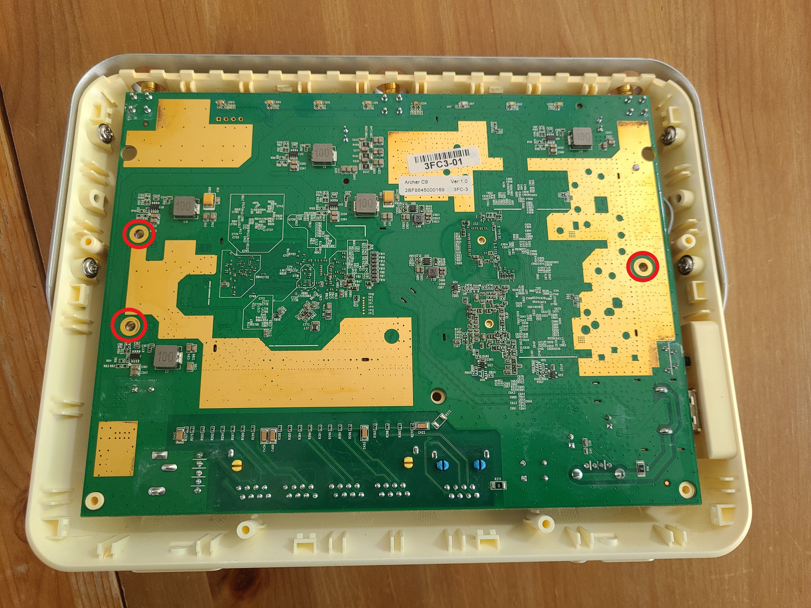

With a slight twisting motion, while being careful of the WPS and USB out port on the bottom right of the device, we can remove the motherboard. 

Now it is time to find the UART interface on the device which can be found on the top right of the board. From left to right we have 3,3V, GND, RX, TX. We *only* need to connect the TX, RX, GND pins to communicate with the device. 

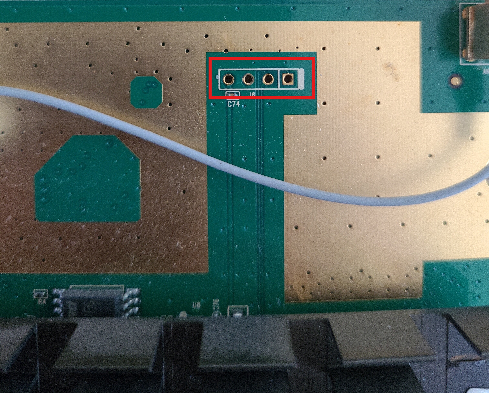

## Connecting the Raspberry PI to the Router Motherboard

Now we need to connect these to the Raspberry PI GPIO pins. To find the correct pins to use we can Google for a Raspberry PI model 2B pinout scheme. We see that we need to connect GPIO 14 (TX), 15 (RX) and GND. It is important to crossover the TX and RX pins, that is, TX on the router motherboard should connect to the RPI GPIO RX pin, and vice versa. 


This leads to the following setup. I simply used three random wires that I stripped from a ribbon wire.  The RED wire is connected to one of the GND pins on the RPI. the GREY wire (RX) is connected to the GPIO 14 (TX) on the RPI. The BROWN wire is connect to GPIO 15 (RX) on the RPI. We should now be able to connect without soldering anything. Soldering makes the process of flashing the firmware difficult anyway, because you have to connect the GND pin right after the router boot sequence starts and fiddle with it for the Raspberry PI to connect to it. 
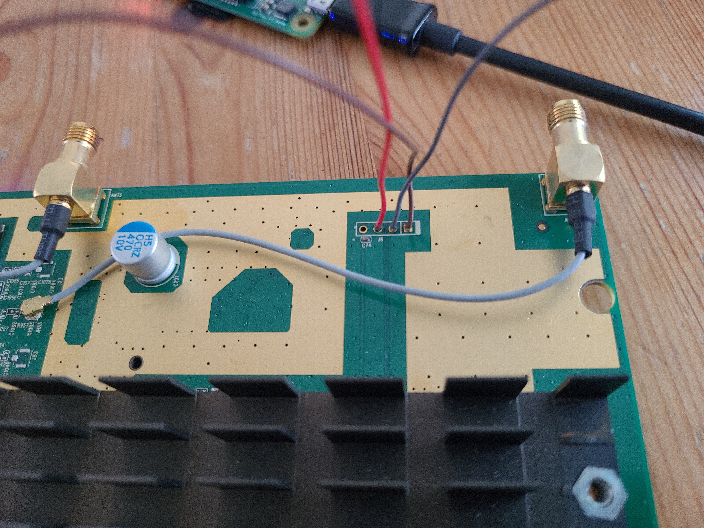
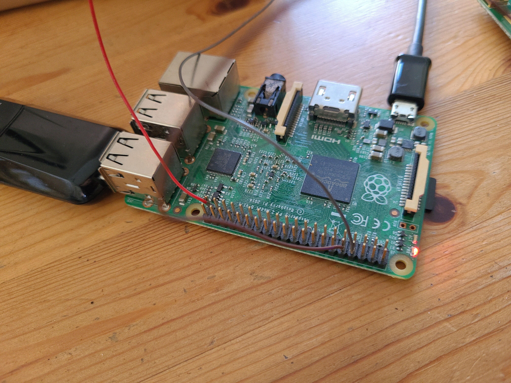


## Before Flashing the Firmware
It is important to enable the SSH and the UART interfaces before you start this process, this can be done by running the raspi-config command and following the instructions. Assign the IP *192.168.0.66* or *192.168.1.66* to your Ethernet interface so it can be accessed by the Router during flashing. 

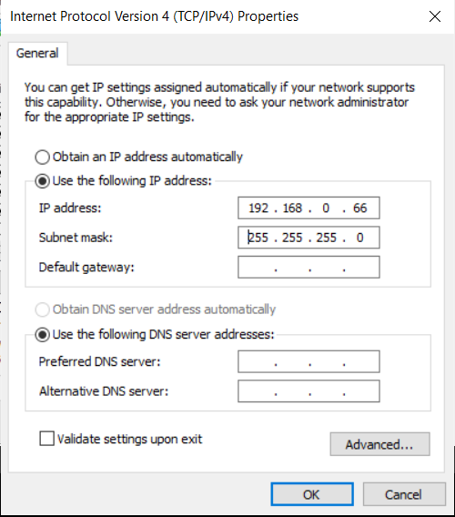

Download and extract the files 12.bin and mtd3.bin from one of the links provided by this [TP-Link Archer C9 unbricking tutorial](https://www.youtube.com/watch?v=fme7kwTkttk):
Also make sure to download [TFTPD32/64](https://pjo2.github.io/tftpd64/), point it to the directory of the firmware and set the server interface to *192.168.0.66* or *192.168.1.66*.

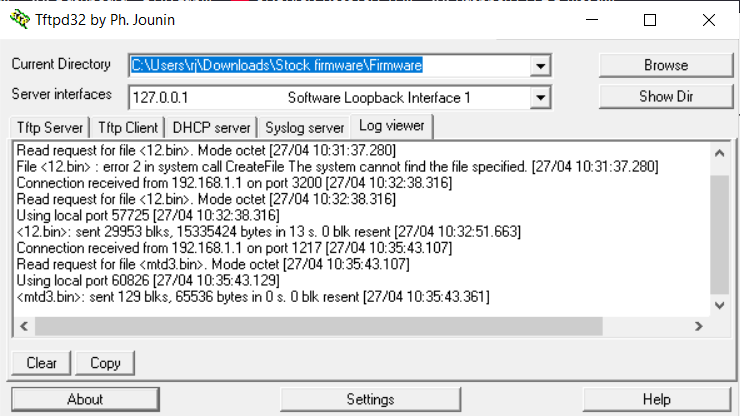

Also, keep this Archer C9 v1 [dump around](https://tplinkforum.pl/t/archer-c9-v1/8191). You might need to flash this over TFTPD after you have flashed 12.bin and mtd3.bin to restore the firmware. Put the dump in a folder and name it *archerc9v1_tp_recovery.bin*, preferrably in the same folder as the 12.bin and mdt3.bin files. 
## Flashing the Firmware

I have chosen to use an old Wifi dongle for my Raspberry PI to connect to it over Wifi, since my laptop's Ethernet port was reserved for uploading firmware to the router. The connections are as follows. The RPI is powered over USB-C by my laptop and has a Wifi dongle which I previously configured using a mouse and keyboard and the HDMI interface to connect to my Wifi. The Ethernet cable goes from the router to my laptop Ethernet port to send and receive firmware over TFTP (shown later).

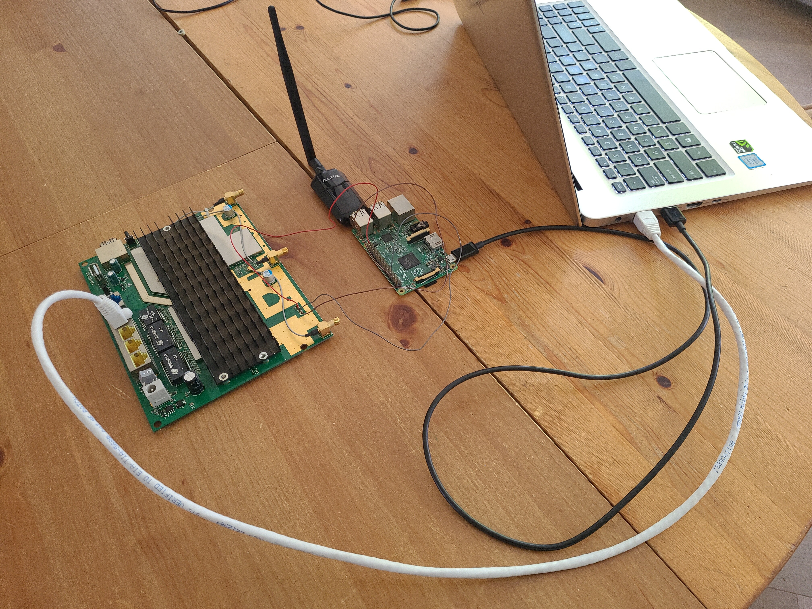

Via the Wifi connection, we can use the trusty Putty client to connect to the Raspberry PI over SSH. 

Once connected to the RPI over SSH, we need to configure a UART client to communicate with the router. I've chosen to use minicom (*sudo apt install minicom*), and configured it as follows:

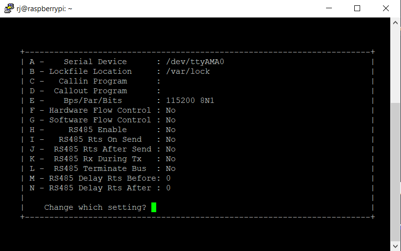

Now, turning on the router while fiddling with the GND wire, and quickly pressing CTRL+C during boot (you have only a second or 2 to do this!), we should land in the CEH console. The CEH console allows us to flash firmware, unlike the normal Busybox terminal after bootup. With TFTPD running on 192.168.x.66, issue the following commands (replacing x with the right number):

```
flash -noheader 192.168.x.66:12.bin flash0.trx 
```
And right after the programming phase is done:
```
flash -noheader -offset=0xfe0000 192.168.x.66:mtd3.bin flash0
```

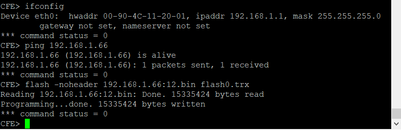
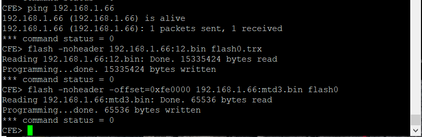

Reboot the router with the *reboot* command, browse to *192.168.0.1* or *192.168.1.1* and hopefully you will be able to connect to your router again!

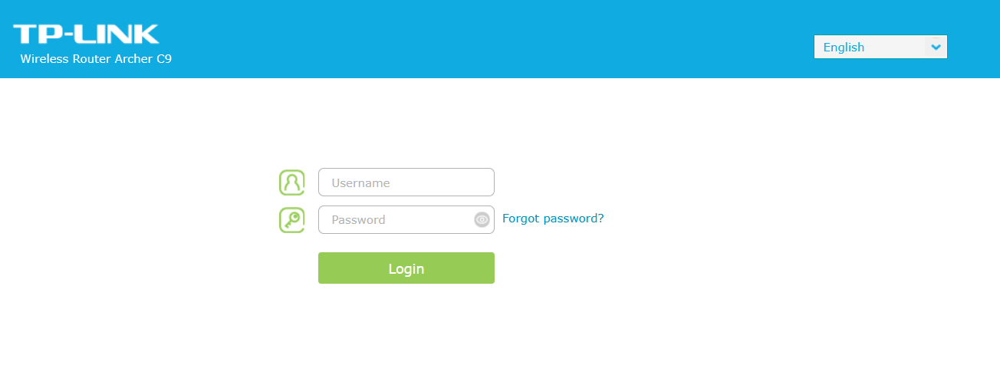
### Optional: Flashing a full firmware dump
If the above process does not work (it should work, but it didn not work for me at first) do the following. With the [full Archer C9 V1 firmware dump](https://tplinkforum.pl/t/archer-c9-v1/8191), served from TFTPD, physically shut down the router, and then press the RESET button on the router and power the router ON. If all went well, the router will automatically fetch the firmware file archerc9v1_tp_recovery.bin from TFTPD and reprogram the device. Reboot the device and pray that it works again 😁.

## Conclusion

I'm very happy that I could unbrick my TP-Link router and it now happily acts as a switch for my internet upstairs. Thank you for reading!