[Image Source](https://www.autoitscript.com/site/wp-content/uploads/2018/01/AutoIt_Featured_640x480.png)

## Introduction

If you have ever encountered AutoIT scripts in your malware reversing efforts, you know they can be nuisance to analyse and can be heavily
obfuscated. While this scripting language is as old as the 2000s and not used that frequently anymore, every now and then attackers find [new ways](https://isc.sans.edu/diary/AutoIT3+Compiled+Scripts+Dropping+Shellcodes/32542) to deliver their malware using AutoIT scripts. In this article I show how to set up some tools to make life a bit easier when dealing with
malware that is using AutoIT in their delivery chain, such as samples crypted by the [CypherIT](https://research.checkpoint.com/2019/decypherit-all-eggs-in-one-basket/) crypter.

## Tool Setup

For the purposes of this article, we will first install the latest release of AutoIT 3 release, which can be found at [this link](https://www.autoitscript.com/site/autoit/downloads/). Unzip it and install it. During installation, I use the x64 native features and set the default behavior to "Edit" .au3 scripts rather than "Run" for obvious reasons 🙃.

The AutoIT Script Editor ([SciTE](https://www.autoitscript.com/site/autoit-script-editor/downloads/)) seems to be the defacto editor for AutoIT scripts.  
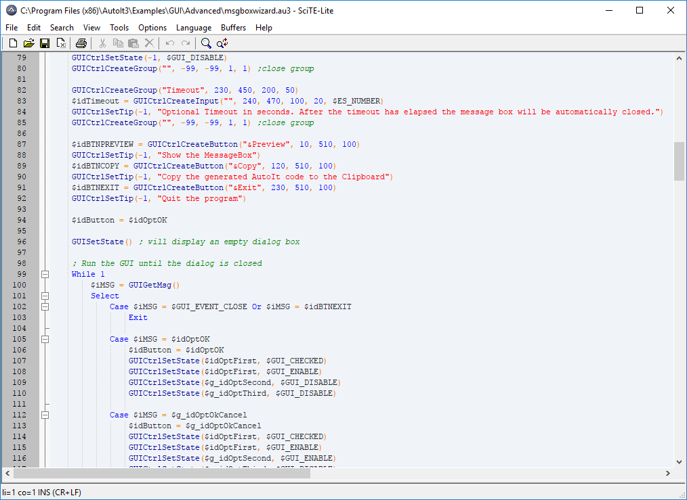 
The latest AutoIT release should include this editor by default, but if it doesn't, you can download it and install it separately from [here](https://www.autoitscript.com/site/autoit-script-editor/downloads/) under "Scite4AutoIt3 Installation" and install it in our malware analysis environment. 

Most script-specific or programming language-specific editors allow you to debug scripts directly from the default editor, but not AutoIT 😑. Hence, we need to
download the [Dbug](https://www.autoitscript.com/forum/files/file/407-dbug-another-debugger-for-autoit/) script, which is a graphical debugger for AutoIT. This will
allow us to step through the script and inspect variables. After unzipping Dbug, you should have a folder containing the debugger script itself (_Dbug.au3) and three test scripts.

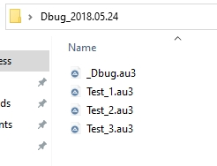

To check if everything works, double click the **Test_1.au3** script. Once it is loaded in SciTE, hit Tools -> Go or press <kbd>F5</kbd>. The debugger will break at the first line and the Dbug graphical view should pop up:

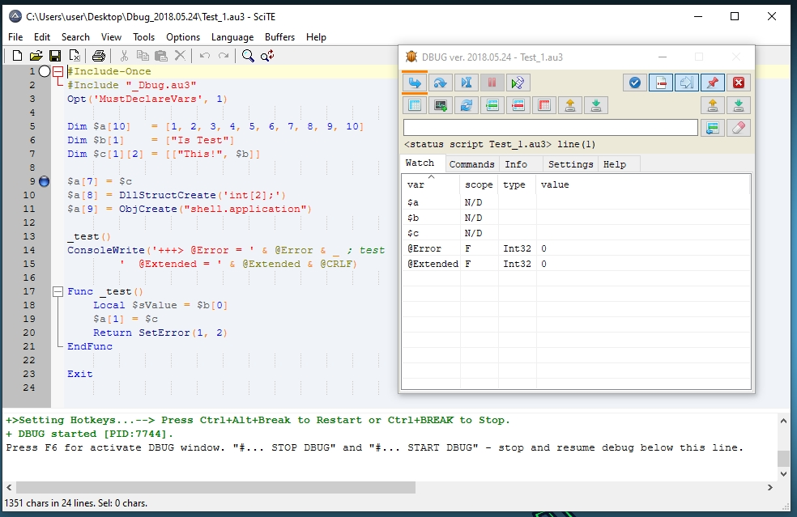

You can now set breakpoints in the script by highlighting the line you want to break on by pressing <kbd>CTRL</kbd>+<kbd>F2</kbd> or by clicking the blue checkmark button in the GUI. The breakpoints will show as blue circles next to the lines. Pressing <kbd>F5</kbd> again will run until the breakpoint, indicated by the white circle next to the line. You can then inspect the contents of the  variables in the GUI. 

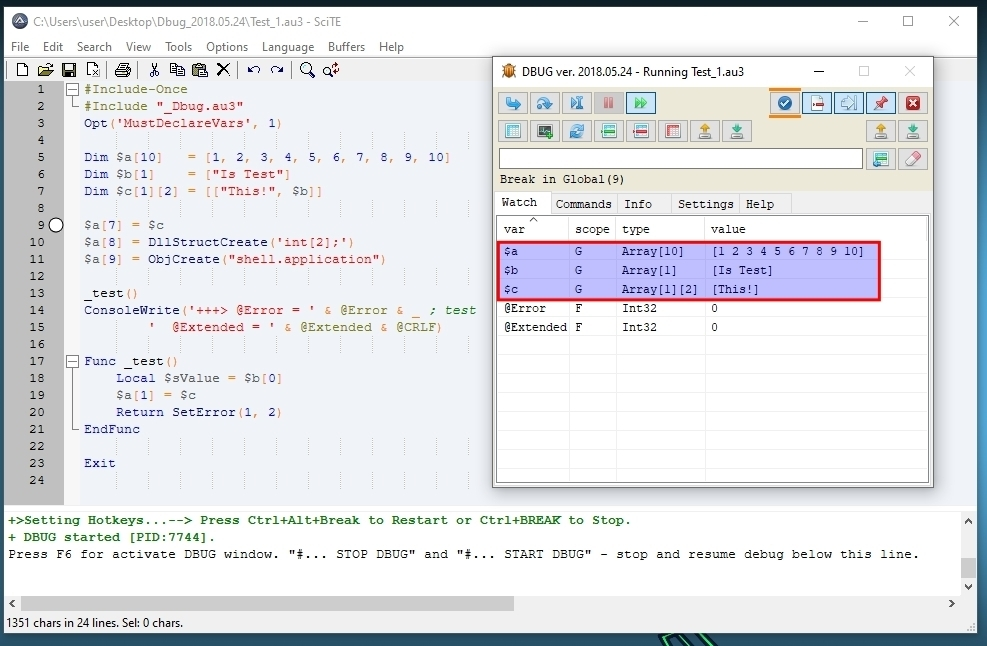

Last but not least, malware frequently delivers other stages in compiled AutoIT scripts. To decompile such scripts, two well-known tools exist: the [AutoIt-Ripper](https://github.com/nazywam/AutoIt-Ripper) script and [AutoIT Extractor](https://github.com/digitalsleuth/autoit-extractor). During one of my analyses, one of these decompilers only returned parts of the original script, so if one fails, be sure to try the other!

## Example 1: Extracting Shellcode From A QuasarRAT Sample

In a recent [blog post](https://isc.sans.edu/diary/AutoIT3+Compiled+Scripts+Dropping+Shellcodes/32542) on the SANS Internet Storm Center, Xavier Mertens found that threat actors use a new technique involving the [FileInstall()](https://www.autoitscript.com/autoit3/docs/functions/FileInstall.htm) function to deliver, among others, Quasar RAT malware. 

Let's take a closer look at the [sample](https://www.virustotal.com/gui/file/1e75512b85b8ad27966ea850b69290bc18cc010bcb4f0e1ef119b82c99ca96c0/community) with SHA256: 
1e75512b85b8ad27966ea850b69290bc18cc010bcb4f0e1ef119b82c99ca96c0. Upon inspecting the file in PE Studio, we can immediately spot that there is an AutoIT scripts in the resources:

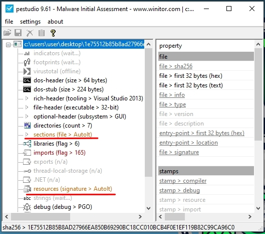

Let's proceed by dumping the script using AutoIT Extractor. Select *\>\>\>AUTOIT SCRIPT\<\<\<* and save this resource to disk in the same folder as where the **_Dbug.au3** script resides. We also dump the *inhumation* and *buncal* files to the %TEMP% folder (C:\Users\\<user\>\AppData\Local\Temp) so the script can find them. 

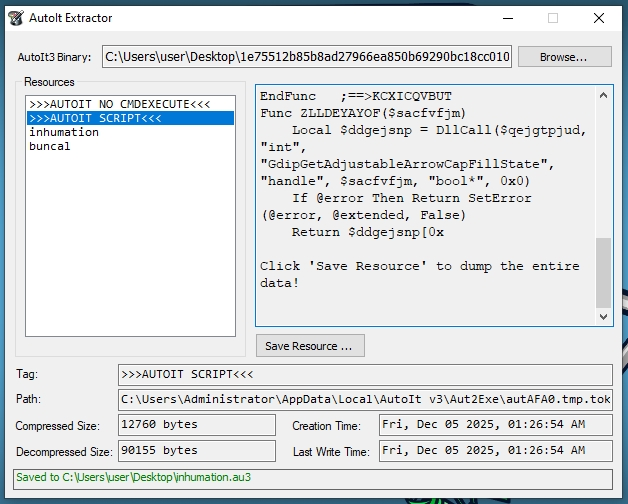

Open the script in SciTE and add `#include "_Dbug.au3"` to the top of the script.

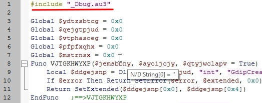

While most of the function calls in this script are heavily obfuscated, the AutoIT core functions are not, such as the FileInstall, Execute, DllCall, and DllStructSetData calls. 


A little trick to automatically set breakpoints on all the relevant calls is to search for them with <kbd>CTRL</kbd>+<kbd>F</kbd> and hit "Mark All". This will set breakpoints on all lines containing your search term!


Let us pay particular attention to the Execute calls around line 25. This call loads shellcode into the variable *$fmmksje*. Let's set a breakpoint here. 

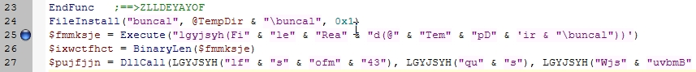

When we hit the breakpoint, take note of the *LGFYJSYH()* function which is used to deobfuscate strings. We can step into the *LGFYJSYH()* function and deobfuscate the parameter by setting a breakpoint on the return. 

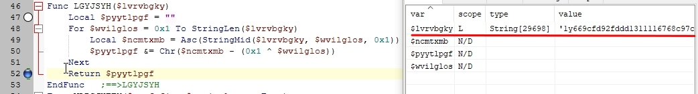

If we run the program again with <kbd>F5</kbd> you will find that the return value of *LGFYJSYH()* contains deobfuscated shellcode (this might take a while, the debugger is a bit slow):

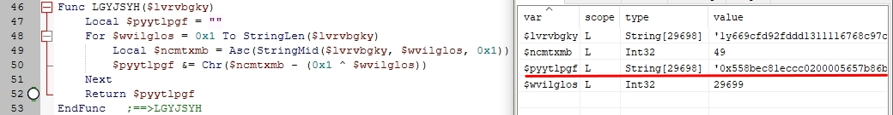

At this moment we would like to dump the shellcode for further investigation. A little annoyance with this debugger is that we can't select a variable in the Dbug GUI and copy or save it. However, we can write out the string to the console by putting the following command in the "Commands" window of the Dbug GUI. Select the line, and press <kbd>CTRL</kbd>+<kbd>Enter</kbd>.

```AutoIT
ConsoleWrite($pyytlpgf)
```
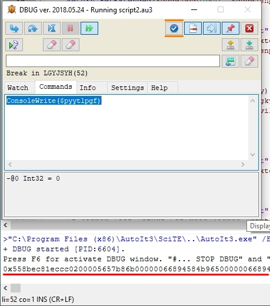

This should dump the string out to the SciTE console. We can now copy this string out and convert it to proper shellcode using Cyberchef or whatever method you prefer, and use a disassembler / decompiler such as Ghidra or IDA to further inspect the payload.

Let's move on to a sample that is a little more involved.
## Example 2: Extracting A Lumma Stealer Payload
This [article](https://securelist.com/lumma-fake-captcha-attacks-analysis/116274/) from Kaspersky explains how Lumma Stealer spreads through fake CAPTCHA pages and the ClickFix technique to ultimately deliver the stealer. After a convoluted chain of MSHTA / Powershell commands, multiple obfuscated Powershell scripts, .mp3/.mp4 files, Javascript, and some more Powershell scripts, a binary is dropped that masquerades itself as a legitimate application. This seemingly legitimate application contains an AutoIT executable to execute a malicious compiled AutoIT script.  

Let's consider [this sample](https://www.virustotal.com/gui/file/ce5dc59119d58149aaa850be86222c7b8d798f21f8e7c44fc081f7a357562068/) with SHA256: *ce5dc59119d58149aaa850be86222c7b8d798f21f8e7c44fc081f7a357562068*. 

This sample, originally named "MSPCManager.exe", masquerades as [Microsoft PC Manager](https://pcmanager.microsoft.com/en-us) but is in fact a WinRAR self-extracting archive that drops files to the TEMP folder. Let's execute it while keeping an eye on dropped files in the TEMP folder. Note how the main process spawns "Organizations.com" which SystemInformer marks as an AutoIT v3 Script. 


A couple of binary files with weird names are dropped in the %TEMP% folder ("Amplifier, Aruba, Battery" etc.) as well as an obfuscated batch script named "Prisoner.cmd". For the purposes of this article, I won't go into deobfuscating this batch script, but the aforementioned [article](https://securelist.com/lumma-fake-captcha-attacks-analysis/116274/) from Kaspersy shows a similarly deobfuscated script, as is shown below. Take note of the binary copy command (*cmd /c copy /b*) that assembles a compiled AutoIT script from the dropped binary files.

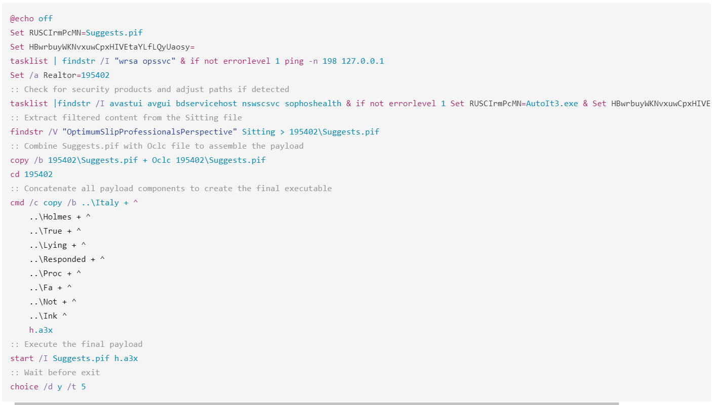

For this sample, differently named binary files are dropped, but the intention is similar. Let's execute the following command in the TEMP folder to assemble the final AutoIT script:

```bash
copy /b Usage + Characteristic + Dispatch + Aruba + Battery + Mean script.a3x
```

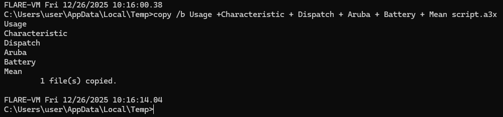

And as before, we decompile the script using AutoIT Extractor and save it next to the _Dbug.au3 file, which we include again as a header to the file. 


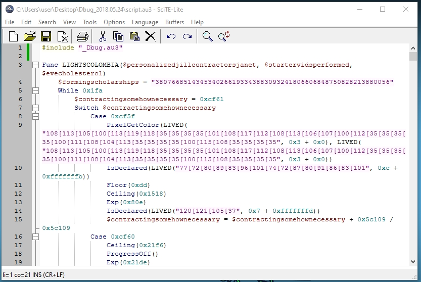

We are again confronted with a highly obfuscated AutoIT script. The *LIVED()* function is the main string deobfuscation function. Using Python, we can deobfuscate the strings to discern multiple calls. For the sake of brevity, I will not put the script here, but feel free to send me a message if you want it. 


Let's focus on the DllCalls. We will observe a DllCall to VirtualAlloc after checking the variable *$kitwritingsvtsurgeons* in an IF-statement. Let's put a breakpoint on this line, in the hope we can trace where memory is allocated and a payload is hopefully inserted. 

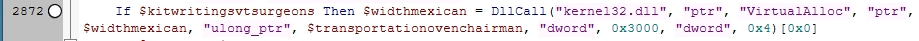

If we run the code, we'll soon find ourself stuck in this long FOR-loop that increments the variable *$spreadmandatetroutcustomersnum*. Let's comment it out to speed things up. 

```AutoIT
For $i = 0x0 To 0x1329e7f
    $spreadmandatetroutcustomersnum += 0x1 / ($i * $i)
Next
```

As additional anti-debug measures, the script exits at multiple calls to *WinClose()* like the one shown below. Use <kbd>CTRL</kbd>+<kbd>F</kbd> to search for these and hit <kbd>CTRL</kbd>+<kbd>Q</kbd> to comment them out. There are about seven calls like these.

```AutoIT
(Call("EnvGet", "COMPUTERNAME") = "tz") ? (Call("WinClose", Call("AutoItWinGetTitle"))) : (Opt("TrayIconHide", 0x1329e7f / 0x1329e7f))
```

If we rerun the script, we should be able to hit the breakpoint on the DllCall along with the variable *$kitwritingsvtsurgeons*. After breaking on this line, step into the call. Even though it is yet unexpected for a call to VirtualAlloc, we can immediately observe that the variable *$cancerstarterself* contains a Binary object, with first bytes 0x4D5A. This must be a PE-file! 

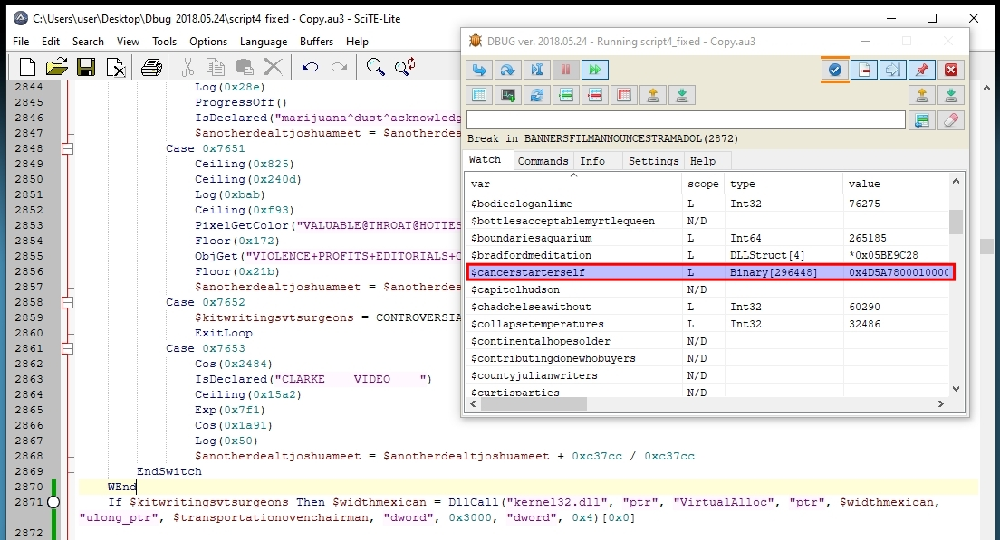

Let's use a slightly different way to dump this binary. Rather than writing it to the console, like we did before, we will add the following code right after the line where we put the breakpoint:

```
$hFile = FileOpen("dump.bin", 17)
FileWrite($hFile, Binary($<variable>))
FileClose($hFile)
```

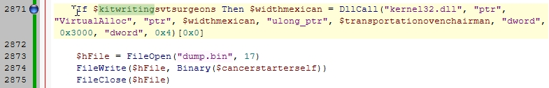

Now  run the code and let's check the dumped binary in PEStudio. Indeed, it looks like a legitimate PE-file:

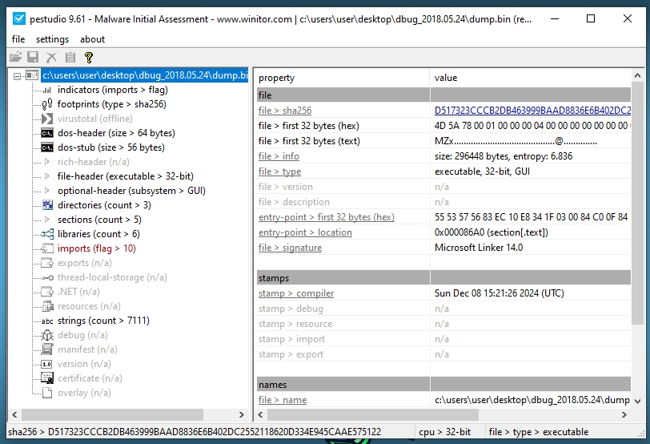

Unfortunately the hash is unknown in VT:

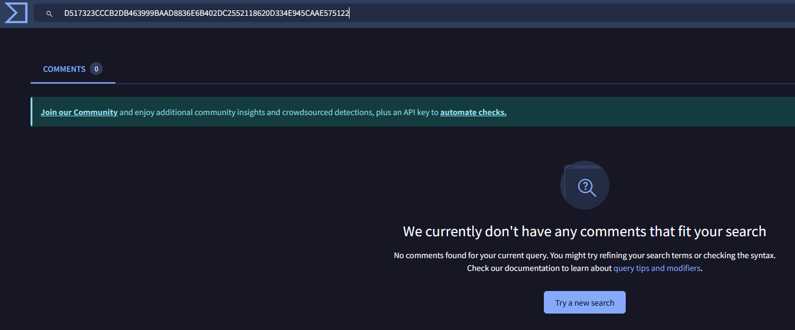

However, through dynamic analysis and config decryption we can observe multiple C2 domains that are being contacted:

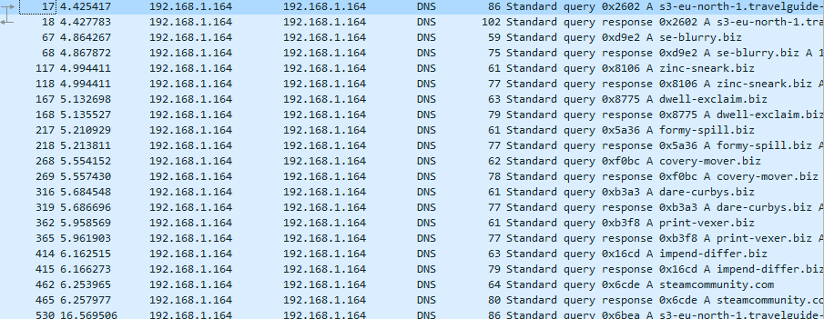

Checking these in VT shows that they are all associated with Lumma Stealer.

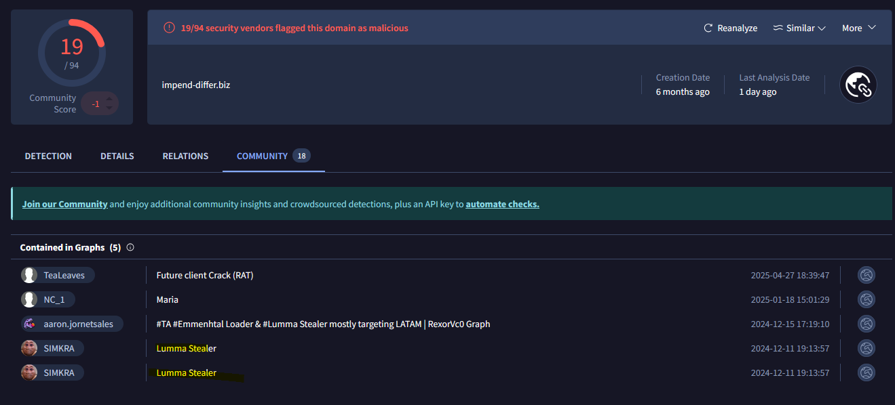
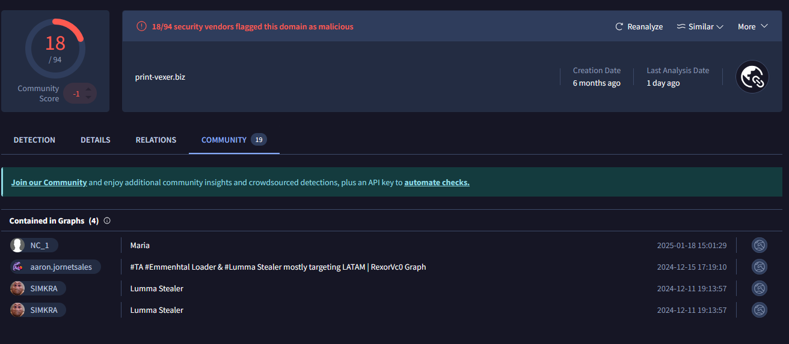

And this message box on launch is a [telltale sign](https://www.esentire.com/blog/the-case-of-lummac2-v4-0) that we are indeed dealing with Lumma Stealer.

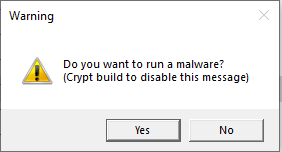

Ofcourse, as the C2-domains are already down, this sample never shows its full stealing capabilities, but in my humble opinion, we have proof enough to assert that we have extracted the final payload!
## Conclusion

The Dbug script has served me well in dealing with pesky AutoIT scripts and have made analyzing those scripts just a bit easier. I hope these tricks are useful to some of you. Thank you for reading until the end! 