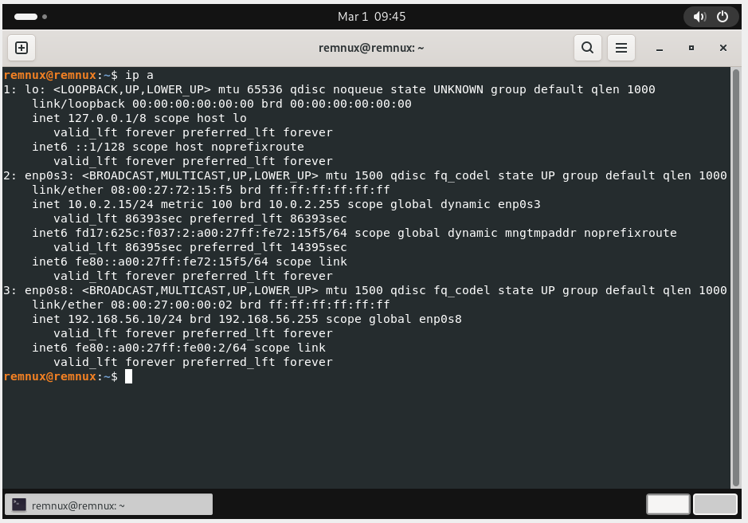
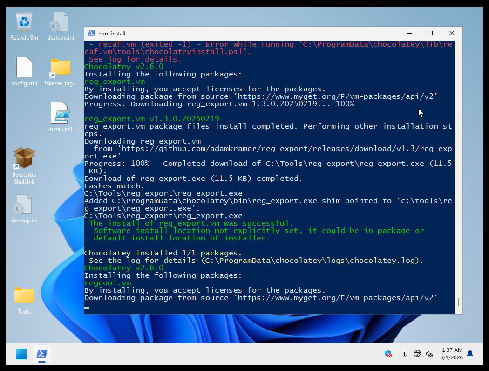

# Introduction

Setting up a malware analysis lab with FlareVM and REMnux can take hours before you even start analyzing a single binary. As a malware analyst, particularly in incident response scenarios, operational effiency is key, and botched host OS upgrades or other issues can easily destroy your carefully built malware analysis environment. 

With this in mind, I began thinking of how to take the automated installation scripts of FlareVM and REMnux a step further. After some research, Vagrant boxes, in particular the possibility to upload them to a public registry, stood out as the best way to host prebuilt VM's to get up and running again in no-time, only limited by your download speed. 

In this blog post I will provide a more visual guide on how to run the prebuilt Vagrant boxes, and to build the boxes from scratch, should you wish to customize your build. 

# Prebuilt Vagrant Boxes

The quickest way to get started is to use the prebuilt Vagrant boxes. This is particularly the case for Windows users, as Ansible cannot really be used on Windows properly to customize the boxes. The Vagrant boxes come with all the installed tools and upgrades out of the box. You can adjust VM settings by editing the corresponding Vagrantfile. 

In this post, I'm assuming you have installed Vagrant as well as the necessary utilities / plugins, for instance the VMWare Plugin ```vagrant plugin install vagrant-vmware-desktop``` and the [Vagrant VMWare Utility](https://developer.hashicorp.com/vagrant/install/vmware). 

Clone the Git repository:

```bash
git clone git@github.com:stoyky/figment.git
cd figment
```

Now depending on your preferred hypervisor, enter either the VMWare or Virtualbox directory. In this post I will mainly focus on VMWare Workstation deployment, but great care was taken to make the scripts work for both hypervisors. 

```bash
cd vagrant/vmware
```
Please review the Vagrantfile and make any configuration changes you need. Note the strict network settings and hardcoded MAC addresses. This is necessary to have consistent builds, so that the network interfaces are preconfigured with the right default gateway and DNS to point to the REMnux machine. 

The FlareVM hardcoded IP is *192.168.56.20*, whereas the REMnux hardcoded IP is *192.168.56.10*. It is therefore important to configure your hypervisor to have a host-only network with this IP range. 

For VMWware:


In Virtualbox:

*Note: you might need to enable "advanced settings" in the home window of Virtualbox to see this option.*


Review the Vagrantfile for the configuration options and make changes as needed.

```ruby
Vagrant.configure("2") do |config|
  config.vm.define "flarevm" do |flarevm|
    flarevm.vm.box = "figment/flarevm"
    flarevm.vm.hostname = "flarevm"
    flarevm.vm.guest = :windows
    flarevm.ssh.username = "admin"
    flarevm.ssh.password = "password"
    flarevm.ssh.insert_key = false
    
    flarevm.vm.network "public_network", adapter: 0, auto_config: false
    flarevm.vm.network "private_network", adapter: 1, auto_config: false

    flarevm.vm.synced_folder '.', '/vagrant', disabled: true

    flarevm.vm.provider "vmware_desktop" do |vmware|
      vmware.vmx["ethernet0.present"]        = "TRUE"
      vmware.vmx["ethernet0.connectionType"] = "nat"
      vmware.vmx["ethernet0.virtualDev"]     = "e1000"
      vmware.vmx["ethernet0.connect"]        = "connected"
      vmware.vmx["ethernet0.startConnected"] = "TRUE"
      vmware.vmx["ethernet0.displayName"]    = "nat"
      vmware.vmx["ethernet0.addressType"]    = "static"
      vmware.vmx["ethernet0.address"]        = "00:0c:29:00:00:01"
      vmware.vmx["ethernet0.pciSlotNumber"]  = "33"

      vmware.vmx["ethernet1.present"]        = "TRUE"
      vmware.vmx["ethernet1.connectionType"] = "hostonly"
      vmware.vmx["ethernet1.virtualDev"]     = "e1000"
      vmware.vmx["ethernet1.connect"]        = "connected"
      vmware.vmx["ethernet1.startConnected"] = "TRUE"
      vmware.vmx["ethernet1.displayName"]    = "hostonly"
      vmware.vmx["ethernet1.addressType"]    = "static"
      vmware.vmx["ethernet1.address"]        = "00:0c:29:00:00:02"
      vmware.vmx["ethernet1.pciSlotNumber"]  = "36"
      
      vmware.memory = "4096"
      vmware.gui    = true
    end

    flarevm.vm.provider "virtualbox" do |virtualbox|
      virtualbox.customize ["modifyvm", :id, "--nic1", "nat"]
      virtualbox.customize ["modifyvm", :id, "--nic2", "hostonly"]
          
      virtualbox.memory = "4096"
      virtualbox.gui    = true
    end
  
  end
end

```

After everything is configured correctly, spin up the box using 

```bash
vagrant up --provider=vmware --provision
```

Vagrant should automatically download the box and spin it up in your hypervisor. 

*(Virtualbox) Note: you may get an error stating that "vboxnet0" cannot be found. You can just click "change network settings" and then cancel. The NAT and host-only adapter should then remain configured correctly for host-only networking.*

Care was taken to make the builds as consistent as possible to make host-only networking work correctly. To test this,
spin up both FlareVM and REMnux. 

Let's check the REMnux settings first. Open up a console and enter `ip a`:



When they are running, go into FlareVM and check "Ethernet Settings" (Windows 10) or "Manage Network Adapter Settings", and disable the "nat" adapter. 


# Using the Packer + Ansible Templates



# Conclusion