## Introduction

Setting up a malware analysis lab with FlareVM and REMnux can take hours before you even start analyzing a single binary. As a malware analyst, particularly in incident response scenarios, operational effiency is key. Botched host OS upgrades or other issues can easily destroy your carefully built malware analysis environment, which may prevent you from quickly analysing samples in the hot phase of an incident. 

With this in mind, I started seeking ways to take the automated installation scripts of FlareVM and REMnux a step further, and to get up and running from scratch as quickly as possible. After some research, publicly hosted Vagrant boxes seemed to be the best way to host prebuilt VM's to get up and running as fast as possible.

In this blog post I will provide a more visual guide on how to run the prebuilt Vagrant boxes, and to build the boxes from scratch, should you wish to customize your build. 

## Prebuilt Vagrant Boxes

The quickest way to get started is to use the prebuilt Vagrant boxes. This is particularly the case for Windows users, as Ansible cannot really be used on Windows properly to customize the boxes. The Vagrant boxes come with all the installed tools and upgrades out of the box. You can adjust VM settings by editing the corresponding Vagrantfile. 

### The Lazy Way

If you don't care to install Vagrant, you can simply download the box file for the respective box you want to import into your hypervisor. These box files are just compressed OVF/VMX files and disk VMDK files. Take the FlareVM Windows 10 box for example:

https://portal.cloud.hashicorp.com/vagrant/discover/figment/flarevm-win10

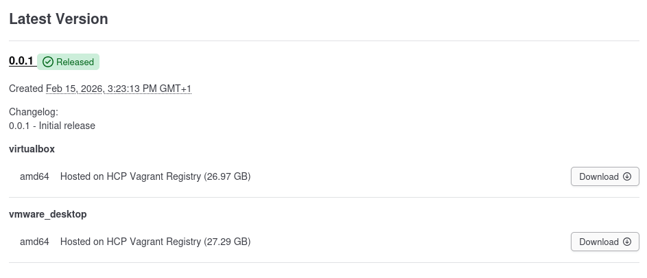

Hit the download button to download the box, and rename the file to flarevm-win10-vmware.box. Extract it twice until you are left with two folders, one containing the metadata (OVF/VMX) and one containing the disk file (VMDK). 

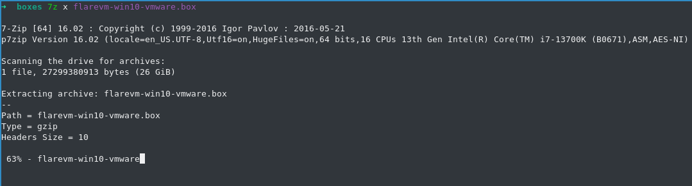

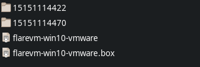

Copy the disk VMDK file to the folder containing the metadata OVF/VMX files. 

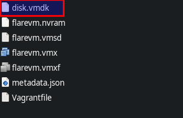

You can now simply double click the OVF/VMX file to import the VM and you should be good to go. 
### Using Vagrant
In this post, I'm assuming you have installed Vagrant as well as the necessary utilities / plugins, for instance the VMWare Plugin and the [Vagrant VMWare Utility](https://developer.hashicorp.com/vagrant/install/vmware). 

```bash 
vagrant plugin install vagrant-vmware-desktop
``` 

Let's start by ensuring the settings are correct in the hypervisor. The FlareVM hardcoded IP is *192.168.56.20*, whereas the REMnux hardcoded IP is *192.168.56.10*. It is therefore important to configure your hypervisor to have a host-only network with the range *192.168.56.0/24*. 

#### VMware

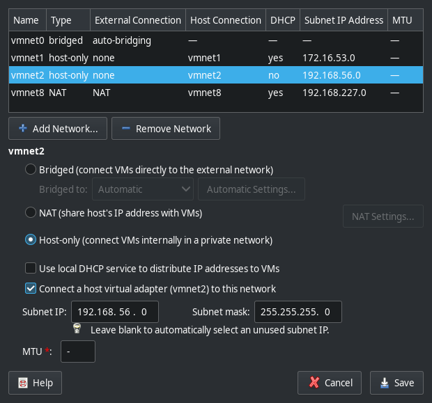

#### Virtualbox

*Note: you might need to enable "advanced settings" in the home window of Virtualbox to see this option.*

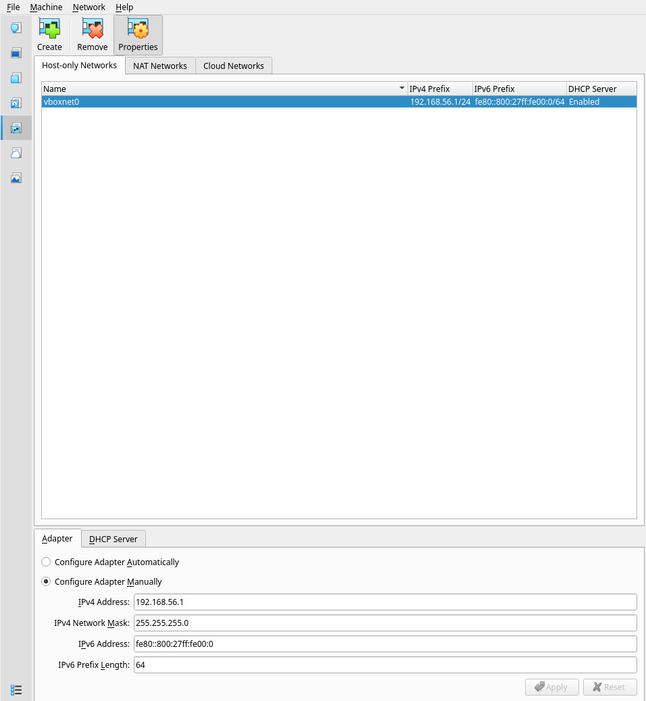


Then clone the Git repository and change directory:

```bash
git clone git@github.com:stoyky/figment.git
cd figment
```

In this post I will mainly focus on VMWare Workstation deployment, but great care was taken to make the scripts work for both hypervisors. 

### REMnux

Let's start with REMnux first.


```bash
cd vagrant/remnux
```

Review the Vagrantfile and ensure the settings are to your liking. 

```ruby
Vagrant.configure("2") do |config|
  # REMnux
  config.vm.define "remnux" do |remnux|
    remnux.vm.box = "figment/remnux"
    remnux.vm.hostname = "remnux"
    remnux.ssh.username = "remnux"
    remnux.ssh.password = "malware"
    remnux.ssh.insert_key = false  

    remnux.vm.provider "vmware_desktop" do |vmware|
      vmware.vmx["ethernet0.present"]        = "TRUE"
      vmware.vmx["ethernet0.connectionType"] = "nat"
      vmware.vmx["ethernet0.virtualDev"]     = "e1000"
      vmware.vmx["ethernet0.connect"]        = "connected"
      vmware.vmx["ethernet0.startConnected"] = "TRUE"
      vmware.vmx["ethernet0.displayName"]    = "nat"

      vmware.vmx["ethernet1.present"]        = "TRUE"
      vmware.vmx["ethernet1.connectionType"] = "hostonly"
      vmware.vmx["ethernet1.virtualDev"]     = "e1000"
      vmware.vmx["ethernet1.connect"]        = "connected"
      vmware.vmx["ethernet1.startConnected"] = "TRUE"
      vmware.vmx["ethernet1.displayName"]    = "hostonly"
      
      vmware.memory = "2048"
      vmware.gui    = true
    end

    remnux.vm.provider "virtualbox" do |virtualbox|
      virtualbox.customize ["modifyvm", :id, "--nic1", "nat"]
      virtualbox.customize ["modifyvm", :id, "--macaddress1", "080027000001"]
      virtualbox.customize ["modifyvm", :id, "--nic2", "hostonly"]
      virtualbox.customize ["modifyvm", :id, "--macaddress2", "080027000002"]
      virtualbox.customize ["modifyvm", :id, "--hostonlyadapter2", "vboxnet0"]

      virtualbox.customize ["modifyvm", :id, "--accelerate3d", "on"]
      virtualbox.customize ["modifyvm", :id, "--vram", "128"]
          
      virtualbox.memory = "2048"
      virtualbox.gui    = true
    end
  
  end
end
```

If the settings are correct, you are ready to run Vagrant up. This will download the Box and run it in your chosen hypervisor. 

```bash
vagrant up --provider=vmware_desktop --provision
```
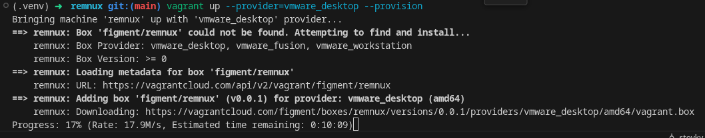

If everything went well, REMnux will pop up in your hypervisor:

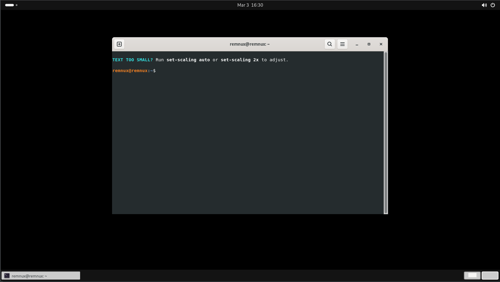

Before continuing, let's ensure the NAT adapter is disabled. Open up a console and enter:
```bash 
ip a
```

Disable the interface with the IP other than 192.168.56.10, in this case *ens33*.

```bash
sudo ip link set ens33 down
```

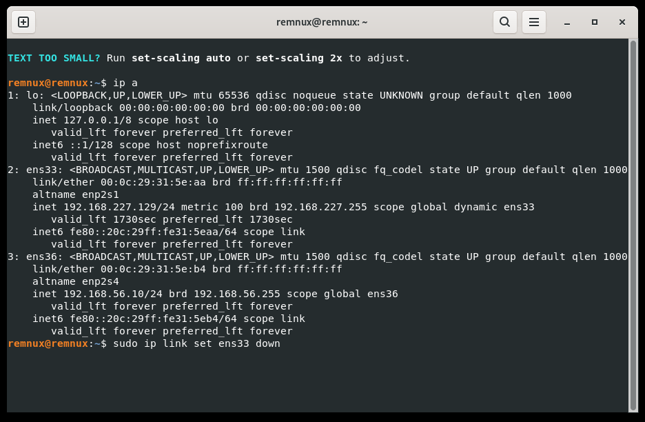

And run *ip a* again to ensure only the interface with IP 192.168.56.10 has state UP. 

Now open a terminal window and run *inetsim*. Ensure it is listening on 192.168.56.10:

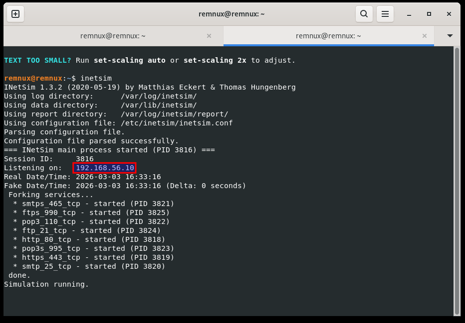

Then run FakeDNS and you should be good to go:

```bash
sudo python3 /opt/fakedns/bin/fakedns.py
```
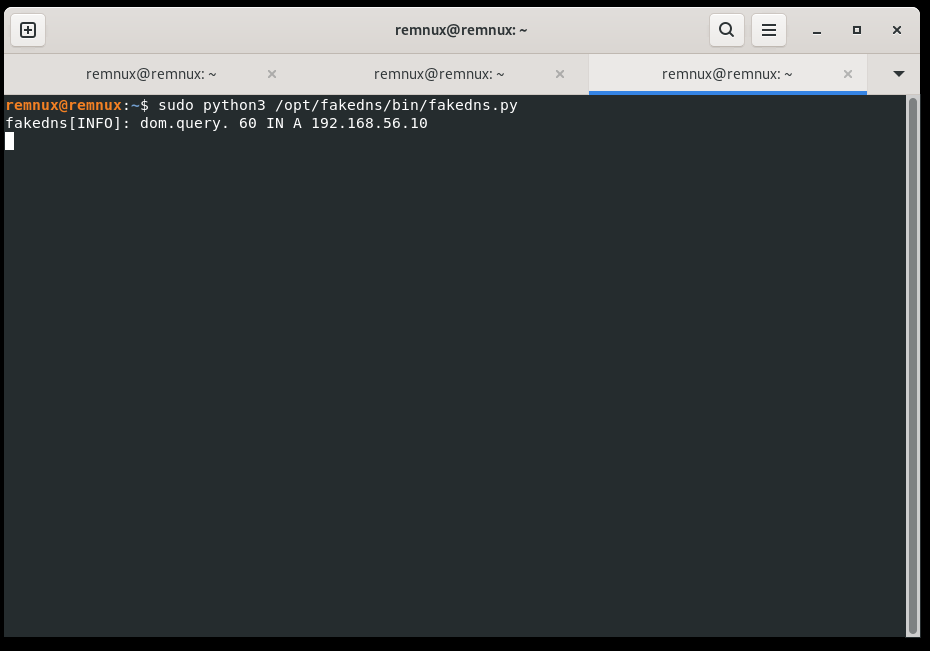

We are now ready to spin up FlareVM and test host-only connectivity!

### FlareVM
First cd into the vagrant/flarevm subfolder:

```bash
cd vagrant/flarevm
```
Please review the Vagrantfile and make any configuration changes you need. Please note the strict network settings and hardcoded MAC addresses. This is necessary to have consistent builds, so that the network interfaces are preconfigured with the right default gateway and DNS to point to the REMnux machine. 

```ruby
Vagrant.configure("2") do |config|
  # FLARE VM
  config.vm.define "flarevm" do |flarevm|
    flarevm.vm.box = "figment/flarevm-win10"
    flarevm.vm.hostname = "flarevm"
    flarevm.vm.guest = :windows
    flarevm.ssh.username = "admin"
    flarevm.ssh.password = "password"
    flarevm.ssh.insert_key = false

    flarevm.vm.synced_folder '.', '/vagrant', disabled: true

    flarevm.vm.provider "vmware_desktop" do |vmware|
      vmware.vmx["ethernet0.present"]        = "TRUE"
      vmware.vmx["ethernet0.connectionType"] = "nat"
      vmware.vmx["ethernet0.virtualDev"]     = "e1000"
      vmware.vmx["ethernet0.connect"]        = "connected"
      vmware.vmx["ethernet0.startConnected"] = "TRUE"
      vmware.vmx["ethernet0.displayName"]    = "nat"
      vmware.vmx["ethernet0.addressType"]    = "static"
      vmware.vmx["ethernet0.address"]        = "00:0c:29:00:00:01"
      vmware.vmx["ethernet0.pciSlotNumber"]  = "33"

      vmware.vmx["ethernet1.present"]        = "TRUE"
      vmware.vmx["ethernet1.connectionType"] = "hostonly"
      vmware.vmx["ethernet1.virtualDev"]     = "e1000"
      vmware.vmx["ethernet1.connect"]        = "connected"
      vmware.vmx["ethernet1.startConnected"] = "TRUE"
      vmware.vmx["ethernet1.displayName"]    = "hostonly"
      vmware.vmx["ethernet1.addressType"]    = "static"
      vmware.vmx["ethernet1.address"]        = "00:0c:29:00:00:02"
      vmware.vmx["ethernet1.pciSlotNumber"]  = "36" # (Windows 11) change to 32 to avoid hostonly NIC issues
      
      vmware.memory = "4096"
      vmware.gui    = true
    end

    flarevm.vm.provider "virtualbox" do |virtualbox|
      virtualbox.customize ["modifyvm", :id, "--nic1", "nat"]
      virtualbox.customize ["modifyvm", :id, "--macaddress1", "080027000001"]
      virtualbox.customize ["modifyvm", :id, "--nic2", "hostonly"]
      virtualbox.customize ["modifyvm", :id, "--macaddress2", "080027000002"]
      virtualbox.customize ["modifyvm", :id, "--hostonlyadapter2", "vboxnet0"]

      virtualbox.customize ["modifyvm", :id, "--accelerate3d", "on"]
      virtualbox.customize ["modifyvm", :id, "--vram", "128"]
          
      virtualbox.memory = "4096"
      virtualbox.gui    = true
    end
  
  end
end


```

After everything is configured correctly, spin up the box using 

```bash
vagrant up --provider=vmware_desktop --provision
```

Vagrant should automatically download the box and spin it up in your hypervisor. 

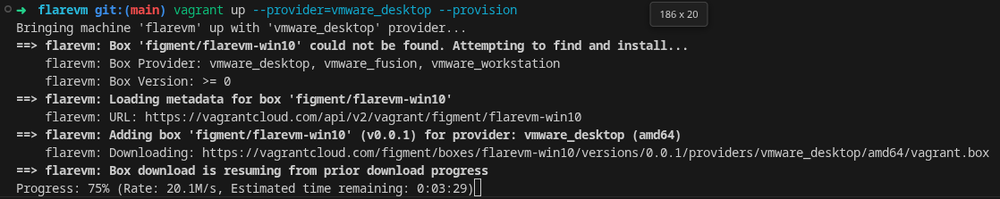

And after finishing your download, you will presented with a fully installed FlareVM 😎:

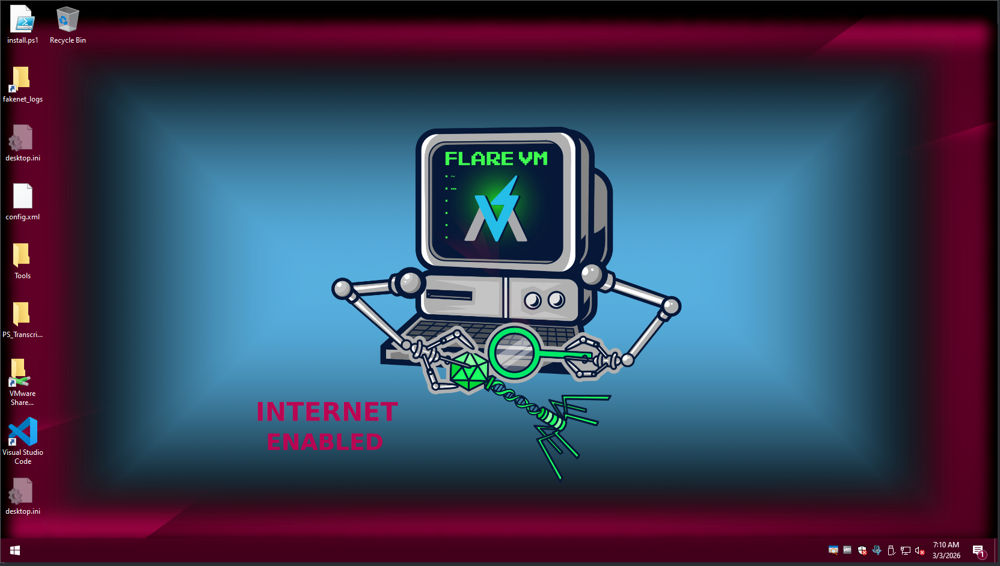

*(Virtualbox) Note: you may get an error stating that "vboxnet0" cannot be found. You can just click "Change network settings" and then OK. The NAT and host-only adapter should then remain configured correctly for host-only networking.*

#### Network Configuration

Now to ensure you can connect to the REMnux machine, let's disable the NAT adapter. 

#### Windows 10
Go to Ethernet Settings -> Change Adapter Options and disable the "nat" adapter:

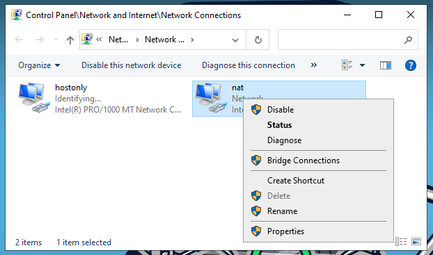

Right-click the "hostonly" -> IPv4 settings and ensure the DNS server and gateway are correctly set (these should be preconfigured):

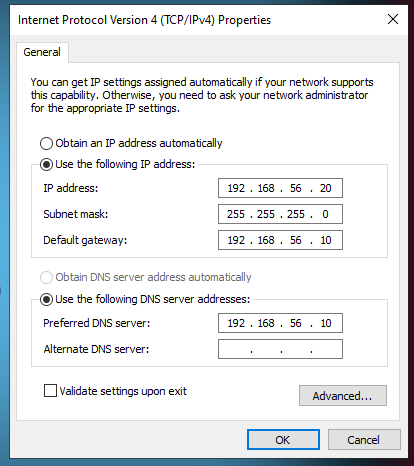

#### Windows 11
Go to "Manage Network Adapters settings" and disable the "nat" adapter. You can verify the DNS server and gateway settings by expanding the adapter and clicking "View additional properties". 
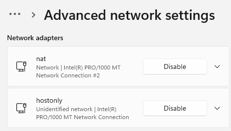
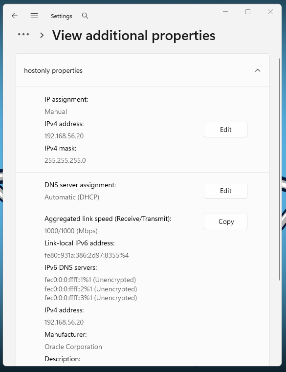

#### Testing Host-only Connectivity

Now go browse to a random testing website in Google Chrome and you will see the default INetSim page:

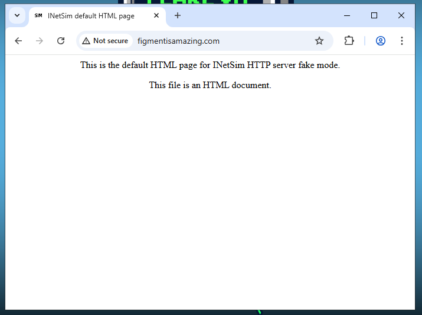

Head over to REMnux and see that the network traffic is intercepted. Great succes!

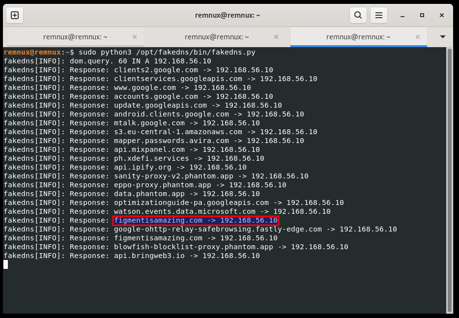

Now let's turn to the Packer + Ansible templates to see how we can customize the boxes.

## Using the Packer + Ansible Templates

If you want to customize the boxes, choose the tools you wish to install, or make any particular adjustments, use the Packer templates.
I will mainly focus on building the FlareVM box, but the principles are exactly the same for REMnux. 

The Packer templates are split into the configuration variables (*flarevm.pkrvars.hcl*) and the packer build template itself (*flarevm.pkr.hcl*) that makes use of these variables. I will omit the *flarevm.pkr.hcl* configuration for brevity. 

Consider the *flarevm.pkrvars.hcl*. The top configuration block pertains mostly to general VM settings. These have been configured with the minimum requirements in mind. It is important to set the *iso_sha256* value of the ISO file correctly in the config, and to point *iso_url* to the Windows ISO file. 

```yaml
# VM Configuration
iso_sha256     = "SHA256:b56b911bf18a2ceaeb3904d87e7c770bdf92d3099599d61ac2497b91bf190b11"
iso_url        = "assets/flarevm/Win11_24H2_English_x64.iso"
user           = "admin"
password       = "password"
cpus           = 2
memory         = 4096
vm_name        = "flarevm"
disk_size      = 60000

# Network Configuration
hostonly_ip             = "192.168.56.20"
default_gateway         = "192.168.56.10"
dns_ip                  = "192.168.56.10"
ethernet0_pcislotnumber = "33"
ethernet1_pcislotnumber = "36"

# VMWare valid MAC
mac_nat_vmware      = "00:0c:29:00:00:01"
mac_hostonly_vmware = "00:0c:29:00:00:02"

# Virtualbox valid MAC
mac_nat_virtualbox      = "080027000001"
mac_hostonly_virtualbox = "080027000002"

# FlareVM Installer Configuration 
install_args = "-password password -noWait -noChecks -noGui -noReboots -customConfig .\\custom-config.xml"

export_vagrant = true
```


You will need to download the Windows ISO beforehand, for instance from the sources below, so Packer can use them to build and provision the VMs, and the template expects the ISO to be placed in the *assets/flarevm/* folder. 

```
https://www.microsoft.com/en-us/software-download/windows10ISO
https://archive.org/details/windows-11-24h2-iso_202501
```

You may change the *user* and *password* variables, but be aware that you then need to change the autounattend file in *packer/flarevm/autounattend/autounattend.xml* as well, so that the Windows credentials are aligned correctly. 

The other configuration settings speak for themselves. They are intentionally strict so the host-only configuration is mostly preconfigured to work well. 

SSH is enabled on the VM through a FirstLogon script in the *packer/flarevm/autounattend/autounattend.xml*. The enable-ssh.ps1 script can be found in *packer/flarevm/scripts/enable-ssh.ps1* and is attached as a floppy disk image on drive letter A: for use during installation. The autounattend file also ensures that Windows installs fully unattended. 

```xml
<FirstLogonCommands>
  <SynchronousCommand wcm:action="add">
    <Order>1</Order>
    <CommandLine>powershell.exe -WindowStyle "Normal" -ExecutionPolicy "Unrestricted" -NoProfile -File "C:\Windows\Setup\Scripts\FirstLogon.ps1"</CommandLine>
  </SynchronousCommand>
  <SynchronousCommand wcm:action="add">
    <Order>2</Order>
    <CommandLine>powershell.exe -WindowStyle "Normal" -ExecutionPolicy "Unrestricted" -NoProfile -File "a:\enable-ssh.ps1"</CommandLine>
  </SynchronousCommand>
</FirstLogonCommands>
```
The Ansible playbooks can be found in *ansible/roles/flarevm/tasks/main.yml* (shortened for brevity). These tasks are used to provision the VM after initial configuration, for instance to install FlareVM tools and guest additions. 

```yaml
...

- name: Create Flare installer task
  community.windows.win_scheduled_task:
    name: FlareInstallerTask
    actions:
      - path: powershell.exe
        arguments: "-NoProfile -ExecutionPolicy Bypass -Command \"& { cd 'C:\\Users\\{{ user }}\\Desktop'; .\\install.ps1 {{ install_args }} }\""
        working_directory: "C:\\Users\\{{ user }}\\Desktop"
    triggers:
      - type: registration
    username: '{{ user }}'
    password: password
    logon_type: interactive_token
    run_level: highest
    state: present

- name: Run the Flare installer task
  win_command: schtasks /run /tn FlareInstallerTask
...
```
To choose the tools you want to install in FlareVM, please adjust the *custom-config.xml* file in *ansible/roles/flarevm/files/custom-config.xml*:

```xml
...
<packages>
  <package name="internet_detector.vm"/>
  <package name="010editor.vm"/>
  <package name="7zip.vm"/>
  <package name="advanced-installer.vm"/>
  <package name="angr.vm"/>
  <package name="apimonitor.vm"/>
...
```

These are the most relevant parts of the Packer template and build process. All that is left now is to run it. To make this as easy as possible, I wrapped the commands in the Makefile in the top-level directory of the figment folder.

Assuming you start from the top-level of the figment directory, the following steps can be taken to build the VMs. 
First create a venv and install Python requirements (i.e. Ansible).
```
python -m venv .venv
source .venv/bin/activate
pip install -r requirements.txt
```

Then run 
```bash
make clean
make flarevm-vmware
```

If all goes well, Packer should start building the project, placing temporary VM files in *temp/*.

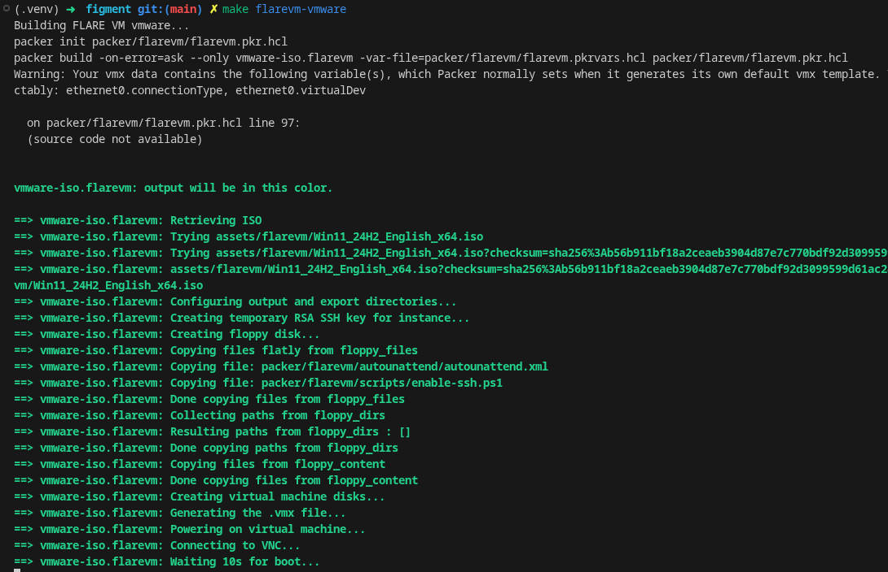

When the SSH enable Powershell script has been run, Packer should be able to connect over SSH and start provisioning the image using Ansible:

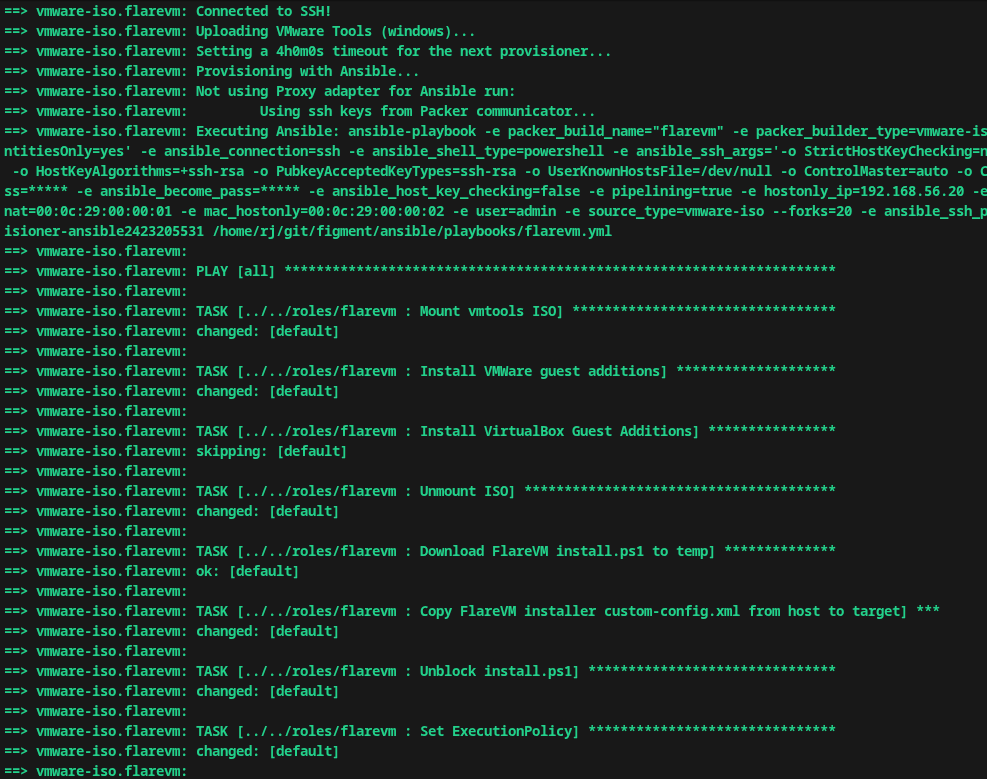

Soon enough, your hypervisor should pop up to install Windows unattended:

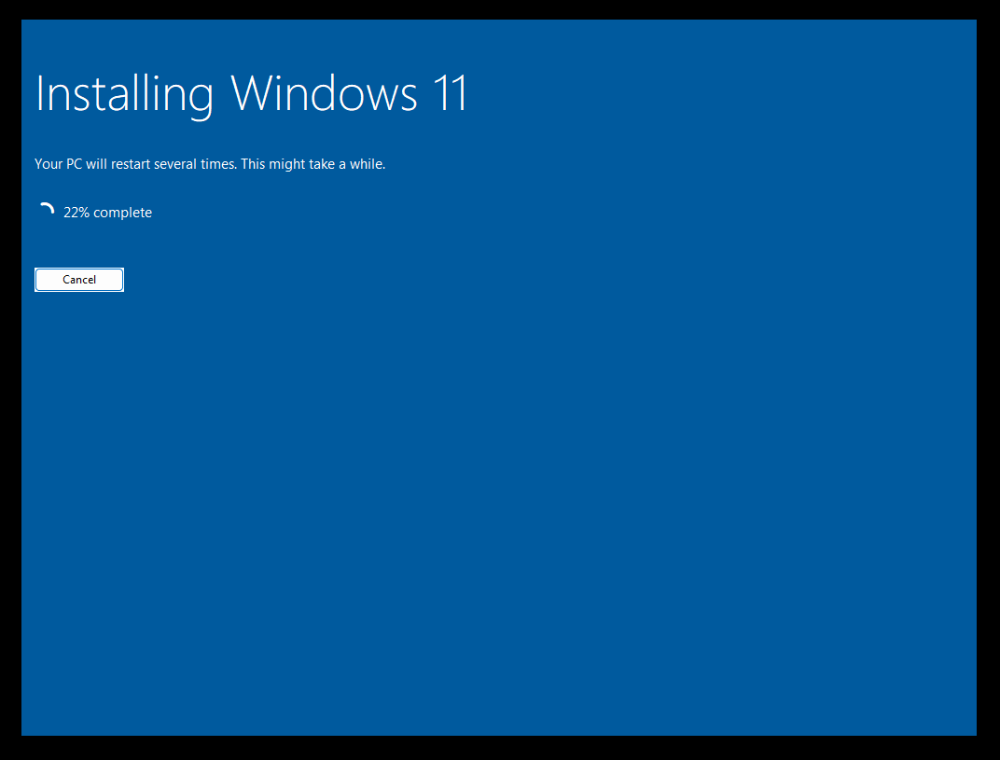

And when the FlareVM installer has been copied over and is executed, you can keep track of the installation process:

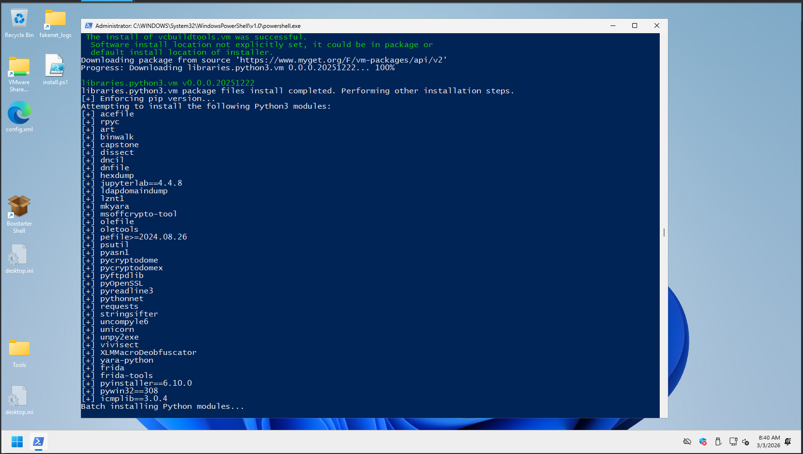

When the installation has finished, Ansible will automatically reboot the machine. You can review which packages failed to install in the console output. 

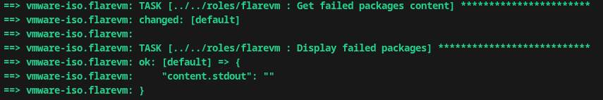

Finally, the machine will be gracefully halted by Packer and the Vagrant post-processor will take over, to produce the final Vagrant boxes. These boxes will be placed in the *boxes/* subfolder, provided you set *export_vagrant* to true in the Packer variables file. 

## Conclusion
Thank you for sticking with me until the end! I really hope the Vagrant boxes are useful to you and save you some valuable analyis time.
Life is too short to be spent on setting up lab environments! Please head on over to the [Github repo](https://github.com/stoyky/figment) and accelerate your malware analysis workflow today!