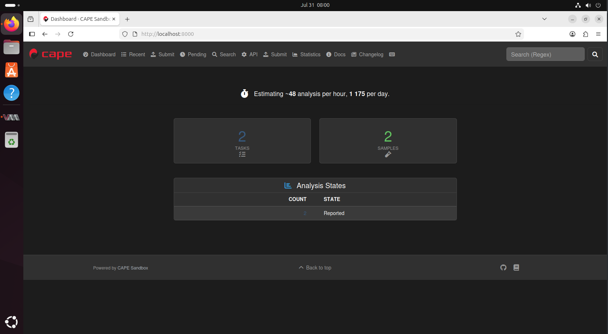
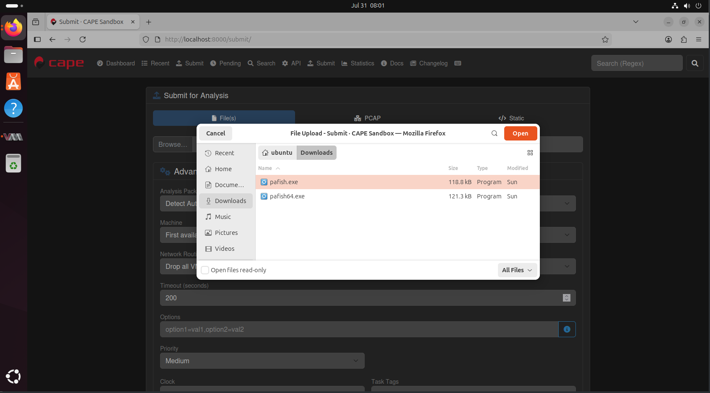
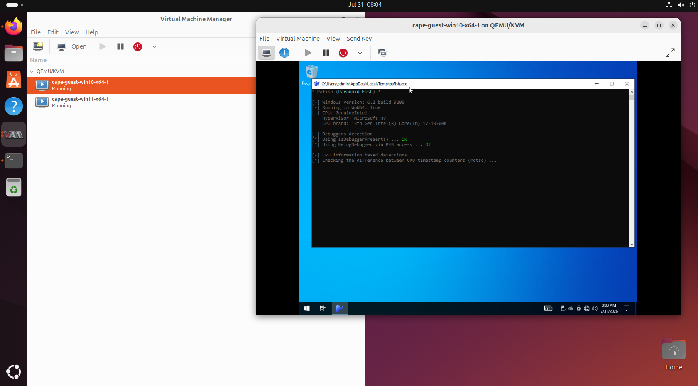
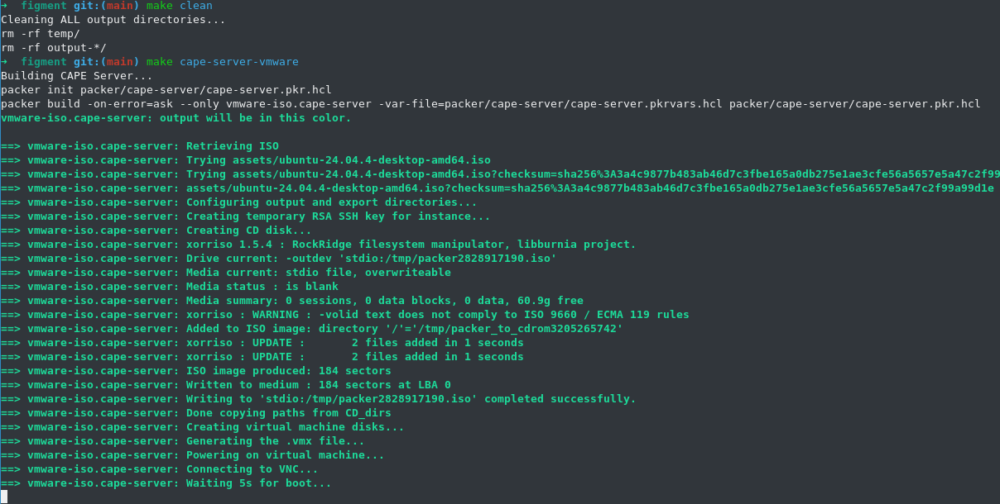
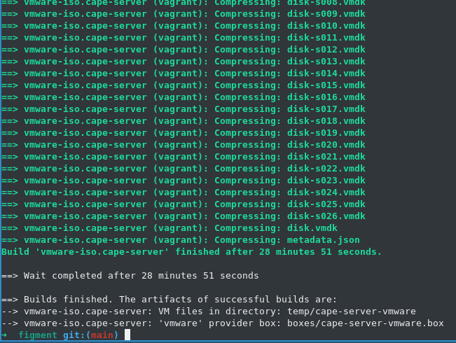
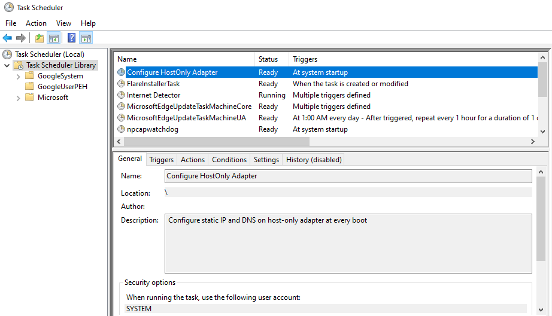

## Introduction

After releasing the prebuilt FlareVM and REMnux boxes (see my [previous blog post](http://www.remyjaspers.com/blog/figment/)), I immeditately started thinking of other targets to automate and to make available for the broadest set of systems. The first thing that came to mind was building a base image of [CAPEv2 Sandbox](https://capev2.readthedocs.io). The second thing that I considered was also adding QEMU/KVM builds for those people who are not running VMWare Workstation / VirtualBox. Apart from that I'm running a Proxmox homelab and would like to run these boxes, so it's a win win situation :smile:. 

With those two goals in mind, I started working on a major update for my project. At this moment, all FlareVM and REMnux boxes have been updated to their latest versions, FlareVM supports both Win10 and Win11, and all targets support QEMU as the hypervisor. In this post, I will elaborate on how to setup the CAPEv2 Sandbox and to get a base installation up as fast as possible. 

Note that the CAPEv2 box has only the minimal configuration necessary to get a base installation up and running, you can tweak the rest of the configuration as you desire. I wanted this installation to be minimalistic, as everyone has their own preferences. Let's dive in!

## Using Vagrant

The preferred way is to use Vagrant to get these boxes up and running as quickly as your download speed permits. I will demonstrate this with the VMWare Desktop provider, but the process is similar for Vitualbox and QEMU. 

I’m assuming you have installed Vagrant as well as the necessary utilities / plugins, for instance the VMWare Plugin and the Vagrant VMWare Utility.

```bash
vagrant plugin install vagrant-vmware-desktop
```

Then clone the Git repository and change directory to vagrant/cape-server:

```bash
git clone git@github.com:stoyky/figment.git
cd figment/vagrant/cape-server
```

Review the Vagrant settings and ensure they are to your liking:

```hcl
Vagrant.configure("2") do |config|
  # cape-server
  config.vm.define "cape-server" do |cape_server|
    cape_server.vm.box = "figment/cape-server"
    cape_server.vm.hostname = "cape-server"
    cape_server.ssh.username = "ubuntu"
    cape_server.ssh.password = "password"
    cape_server.ssh.insert_key = false 

    cape_server.vm.provider "vmware_desktop" do |vmware|
      vmware.vmx["ethernet0.present"]        = "TRUE"
      vmware.vmx["ethernet0.connectionType"] = "nat"
      vmware.vmx["ethernet0.virtualDev"]     = "e1000"
      vmware.vmx["ethernet0.connect"]        = "connected"
      vmware.vmx["ethernet0.startConnected"] = "TRUE"
      vmware.vmx["ethernet0.displayName"]    = "nat"

      vmware.vmx["ethernet1.present"]        = "TRUE"
      vmware.vmx["ethernet1.connectionType"] = "hostonly"
      vmware.vmx["ethernet1.virtualDev"]     = "e1000"
      vmware.vmx["ethernet1.connect"]        = "connected"
      vmware.vmx["ethernet1.startConnected"] = "TRUE"
      vmware.vmx["ethernet1.displayName"]    = "hostonly"
      
      vmware.memory = "8192"
      vmware.gui    = true
      vmware.cpus   = 4
    end

    cape_server.vm.provider "virtualbox" do |virtualbox|
      virtualbox.customize ["modifyvm", :id, "--nic1", "nat"]
      virtualbox.customize ["modifyvm", :id, "--macaddress1", "080027000001"]
      virtualbox.customize ["modifyvm", :id, "--nic2", "hostonly"]
      virtualbox.customize ["modifyvm", :id, "--macaddress2", "080027000002"]
      virtualbox.customize ["modifyvm", :id, "--hostonlyadapter2", "vboxnet0"]

      virtualbox.customize ["modifyvm", :id, "--accelerate3d", "on"]
      virtualbox.customize ["modifyvm", :id, "--vram", "128"]
          
      virtualbox.memory = "8192"
      virtualbox.gui    = true
      virtualbox.cpus   = 4
    end

    cape_server.vm.provider "libvirt" do |libvirt, override|
      libvirt.mgmt_attach    = false
      libvirt.nested = true 
      libvirt.cpu_mode = "host-passthrough"
      libvirt.cpus = 4

      override.vm.synced_folder ".", "/vagrant", disabled: true
      
      override.vm.network "forwarded_port",
        guest: 22,
        host: 2223,
        auto_correct: true

      override.vm.network "private_network",
        type: "dhcp",
        libvirt__model_type: "e1000",
        libvirt__network_name: "default",
        mac: "52:54:00:00:00:03"

      override.vm.network "private_network",
        type: "dhcp",
        libvirt__model_type: "e1000",
        libvirt__network_name: "hostonly",
        mac: "52:54:00:00:00:04"

      libvirt.memory = 8192
    end
  
  end
end
```

By default, all Vagrant boxes receive 8GB of RAM and 4 CPU's. You might need to tweak these settings for the hypervisor you are using and the host system you are running the server on. By default, the *cape-server* deployment contains 2 nested VMs for dynamic analysis; a Windows 10 and Windows 11 under KVM running the CAPEv2 agent. In the next section I will show how to build your own cape-server boxes using Packer, where you have the freedom to choose the number of VMs for analysis (or none at all, if you are not nesting the VMs). 

Running this box should be as simple as:

```bash
vagrant up --provider=vmware_desktop --provision
```

The video below shows a sped-up timelapse of this command setting up the box. After the box is up, login with **ubuntu:password**, and then browse to 

```bash
localhost:8000
```

to access the CAPEv2 Web GUI. 



Navigate to the Submit tab to submit testing malware. The testing malware Pafish / Pafish64 can be found in the ~/Downloads folder under the home directory:

```bash
/home/ubuntu/Downloads/
```



After uploading succeeds, open up **virt-manager** so you can inspect the nested VMs that are running for dynamic analysis. If you upload in quick succession, both the Windows 10 and 11 machines will come up to analyze the samples. After the analysis has finished, you can review the analysis results in the Web GUI.



A timelapse video of this process can be found below:

<video controls width="100%">
  <source src="https://github.com/stoyky/stoyky.github.io/raw/refs/heads/master/content/blog/figment2/vid/figment_final_lossless.mp4" type="video/mp4">
  Your browser does not support the video tag.
</video>

## Using the Packer Template

The Packer templates are provided to ensure you can build CAPE yourself. First review the most important parts: 

```bash
cape-server.pkr.hcl 
```
and
```bash
cape-server.pkrvars.hcl
``` 

under figment/packer/cape-server/.

In the main Packer config cape-server.pkr.hcl you can change the settings of the VM:

```hcl
source "vmware-iso" "cape-server" {
  cd_files             = ["packer/cape-server/cloud-init/user-data", "packer/cape-server/cloud-init/meta-data"]
  cd_label             = "cidata"
  output_directory     = "temp/cape-server-vmware"
  iso_url              = var.source_path_vmware
  iso_checksum         = var.checksum_vmware
  vm_name              = var.vm_name
  display_name         = var.display_name
  ssh_username         = var.ssh_username
  ssh_password         = var.ssh_password
  ssh_timeout          = var.ssh_timeout
  network_adapter_type = "e1000"
  disk_size            = 102400
  memory               = 16384
  cpus                 = 4

  vhv_enabled      = true
  shutdown_timeout = "30m"
  shutdown_command = "sudo shutdown -h now"
  boot_wait        = "5s"
  boot_command = [
    "<wait>",
    "e<wait>",
    "<down><down><down><end>",
    " autoinstall ds=nocloud-net;s=file:///cdrom/",
    "<f10>"
  ]

  vmx_remove_ethernet_interfaces = false
  skip_compaction                = true
  headless                       = false

  vmx_data = {
    "ide1:0.present"        = "TRUE"
    "ide1:0.startConnected" = "TRUE"
  }

}
```

The Packer config contains a mechanism to automatically install nested VMs. 

```hcl
# Source Image Paths
source_path_vmware = "assets/ubuntu-24.04.4-desktop-amd64.iso"
temp_path_vmware     = "temp/cape-server/cape-server.vmx"
checksum_vmware = "SHA256:3a4c9877b483ab46d7c3fbe165a0db275e1ae3cfe56a5657e5a47c2f99a99d1e"

source_path_virtualbox = "assets/ubuntu-24.04.4-desktop-amd64.iso"
checksum_virtualbox = "SHA256:3a4c9877b483ab46d7c3fbe165a0db275e1ae3cfe56a5657e5a47c2f99a99d1e"

source_path_qemu = "assets/ubuntu-24.04.4-desktop-amd64.iso"
checksum_qemu = "SHA256:3a4c9877b483ab46d7c3fbe165a0db275e1ae3cfe56a5657e5a47c2f99a99d1e"

# VM Identity
vm_name      = "cape-server"
display_name = "cape-server"

# SSH / Boot Settings
ssh_username = "ubuntu"
ssh_password = "password"
ssh_timeout  = "20m"
boot_wait    = "30s"

# CAPE Settings
cape_commit              = "e451de454137e0d44ab1ce1f72eae2e2bccfa78a"
cape_nested_virt         = true
cape_machinery           = "kvm"
cape_machinery_interface = "virbr1"

cape_guests = [
  {
    name              = "cape-guest-win10"
    platform          = "windows"
    arch              = "x64"
    replicas          = 1
    hostonly_offset   = 101
    mac_base_hostonly = "52:54:00:10:20"
    mac_base_nat      = "52:54:00:20:10"
  },
  {
    name              = "cape-guest-win11"
    platform          = "windows"
    arch              = "x64"
    replicas          = 1
    hostonly_offset   = 151
    mac_base_hostonly = "52:54:00:20:30"
    mac_base_nat      = "52:54:00:30:20"
  }
]

# Guest Host-Only Network
guest_hostonly_subnet          = "192.168.55.10/24"

# VMware PCI Slots
eth0_pcislot_vmware = "33"
eth1_pcislot_vmware = "36"

# VirtualBox PCI Slots
eth0_pcislot_virtualbox = "3"
eth1_pcislot_virtualbox = "8"

eth0_pcislot_qemu = "2"
eth1_pcislot_qemu = "3"

# VMWare valid MAC
mac_nat_vmware      = "00:0c:29:00:00:03"
mac_hostonly_vmware = "00:0c:29:00:00:04"

# Virtualbox valid MAC
mac_nat_virtualbox      = "080027000003"
mac_hostonly_virtualbox = "080027000004"

mac_nat_virtualbox_norm      = "08:00:27:00:00:03"
mac_hostonly_virtualbox_norm = "08:00:27:00:00:04"

# QEMU valid MAC
mac_nat_qemu      = "52:54:00:00:00:03"
mac_hostonly_qemu = "52:54:00:00:00:04"

# Export Settings
export_vagrant = true
```

Some important settings are:

- *cape_commit* : You can pin the build to a specific commit hash to ensure consistent builds for this particular version of CAPE
- *cape_nested_virt*: This determines whether KVM will be installed and whether you want to use nested Virt
- *cape_machinery*: Specify the machinery here (KVM by default)
- *cape_machinery_interface*: Specify the virtual bridge interface here that you wish to use for the machinery

Finally, by changing the settings below, you can specify the types of guests you want (for now only cape-guest-win10 and cape-guest-win11). 

**Note**: I have experimented with older OS versions such as Windows 7, as well as with Linux, but no success on the current commits. I will try again in due time. 

You can specify the settings and number of replicas to increase throughput of the VMs. These will be copied to the cuckoo.conf file. The *mac_base_hostonly* and *mac_base_nat* will be used to automatically assign network interfaces to these VMs. Specify the *hostonly_offset* to ensure there is no overlap when adding multiple replicas close on the same network range. 
```hcl
cape_guests = [
  {
    name              = "cape-guest-win10"
    platform          = "windows"
    arch              = "x64"
    replicas          = 1
    hostonly_offset   = 101
    mac_base_hostonly = "52:54:00:10:20"
    mac_base_nat      = "52:54:00:20:10"
  },
  {
    name              = "cape-guest-win11"
    platform          = "windows"
    arch              = "x64"
    replicas          = 1
    hostonly_offset   = 151
    mac_base_hostonly = "52:54:00:20:30"
    mac_base_nat      = "52:54:00:30:20"
  }
]
```

Note that considerable effort has been made into assigning consistent network interfaces for these machines. This is necessary to ensure connectivity between the machines. If you have better suggestions for how to go about this, I would love to hear from you! Please raise a Git issue and let us have a discussion!

Finally, building the box should be as simple as navigating back to the root folder and creating a venv:

```bash
python -m venv .venv
source .venv/bin/activate
pip install -r requirements.txt
```

Then issuing the following make commands, optionally with the debug flag for easier debugging:

```bash
make clean
make <debug> cape-server-<vmware_desktop/virtualbox/qemu>
```



Then Packer will start building the artifacts.
The main VM files will end up in the */temp* folder under the figment root folder. You can import these back into your hypervisor. You may find the resulting Vagrant boxes in the */boxes* folder.



Note how I was able to also build the VM in *under 30 minutes*. Can't beat that, right?

### Troubleshooting

Should you have any issues with uploading samples or analysis VMs that won't spin up, please review the log output of the cape user for more information.

```bash
journactl -f -u cape
```

This will provide helpful information. For instance, the default free disk space configuration is quite stringent by default and may prevent you from analyzing samples:

```bash
INFO: max_vmstartup_count for BoundedSemaphore = 5
Jul 31 08:02:45 cape-server poetry[10253]: 2026-07-31 08:02:45,768 [lib.cuckoo.core.scheduler] INFO: Waiting for analysis tasks
Jul 31 08:02:45 cape-server poetry[10253]: 2026-07-31 08:02:45,768 [lib.cuckoo.common.cleaners_utils] ERROR: Not enough free disk space! (Only 49347 MB!). You can change limits it in cuckoo.conf -> freespace
```

The config files can be found under

```bash
/opt/CAPEv2/conf/
```

After you have changed the config files, be sure to save the changes and restart the cape processes:

```bash
sudo systemctl restart cape*
```

This will restart all cape services. The proper expected state after restarting is something like this:

```bash
Jul 31 08:12:08 cape-server poetry[11161]: /usr/bin/tcpdump
Jul 31 08:12:08 cape-server poetry[11119]: 2026-07-31 08:12:08,465 [lib.cuckoo.core.machinery_manager] INFO: Using MachineryManager[kvm] with max_machines_count=10
Jul 31 08:12:08 cape-server poetry[11119]: 2026-07-31 08:12:08,466 [lib.cuckoo.core.scheduler] INFO: Creating scheduler with max_analysis_count=unlimited
Jul 31 08:12:08 cape-server poetry[11119]: 2026-07-31 08:12:08,482 [lib.cuckoo.core.machinery_manager] INFO: Loaded 2 machines
Jul 31 08:12:08 cape-server poetry[11119]: 2026-07-31 08:12:08,503 [lib.cuckoo.core.machinery_manager] INFO: max_vmstartup_count for BoundedSemaphore = 5
Jul 31 08:12:08 cape-server poetry[11119]: 2026-07-31 08:12:08,504 [lib.cuckoo.core.scheduler] INFO: Waiting for analysis tasks
```

## FlareVM Feature: Reset Network Settings using Scheduled Task

Now back to FlareVM and REMnux. To have consistency in network connectivity between FlareVM and REMnux, the choice was made to hardcode the network inteface MAC addresses for the host-only network. This ensures the FlareVM IP/gateway and REMnux IP are in sync and are able to connect out of the box. While REMnux stays consistent across reboots, I noticed subtle issues where FlareVM would lose the assigned IP after a reboot. 

To fix this, a Scheduled Task is now automatically run on boot that searches for the MAC address of the host-only network interface and sets the IP correctly. You can always run this scheduled task yourself to reset the settings if the interface loses its IP address for any reason, either through the GUI or the command line. 

```bash
schtasks.exe /run /tn "Configure HostOnly Adapter"
```

Or open Start -> Task Scheduler -> Task Scheduler Library -> "Configure HostOnly Adapter"




## Conclusion
Thank you for taking the time to read this through. I'd love to hear from you if this project has been helpful to you!
Have a nice day!