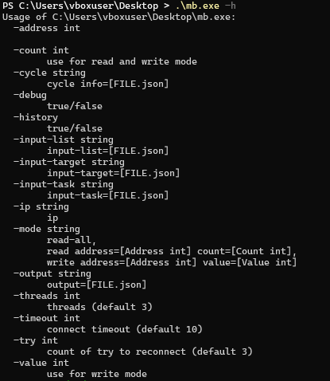
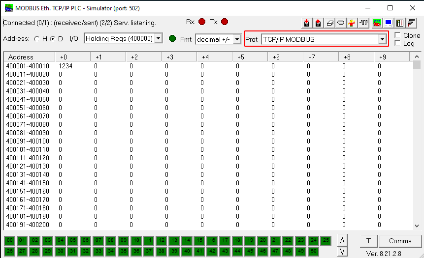
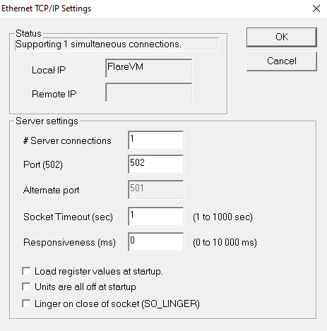
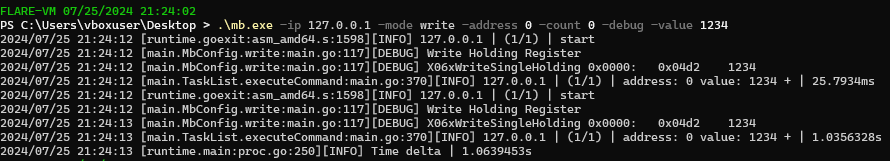
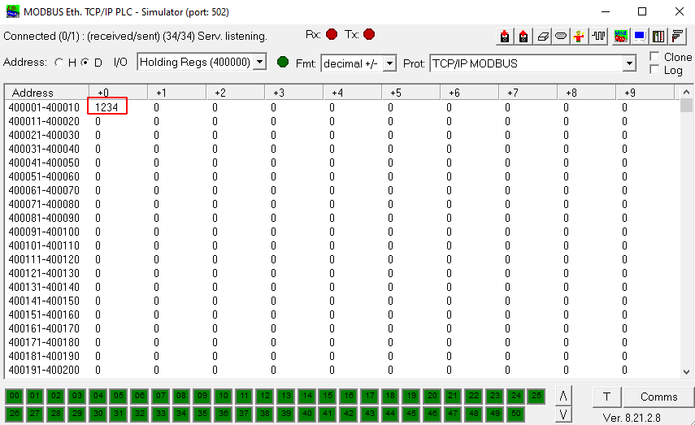
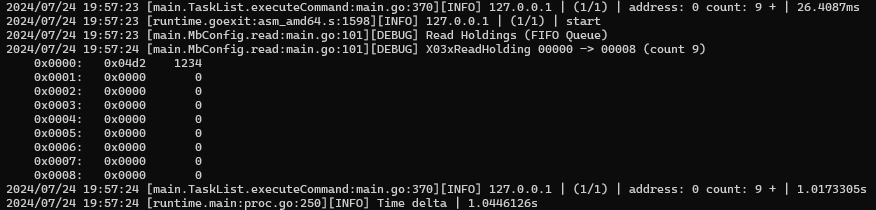
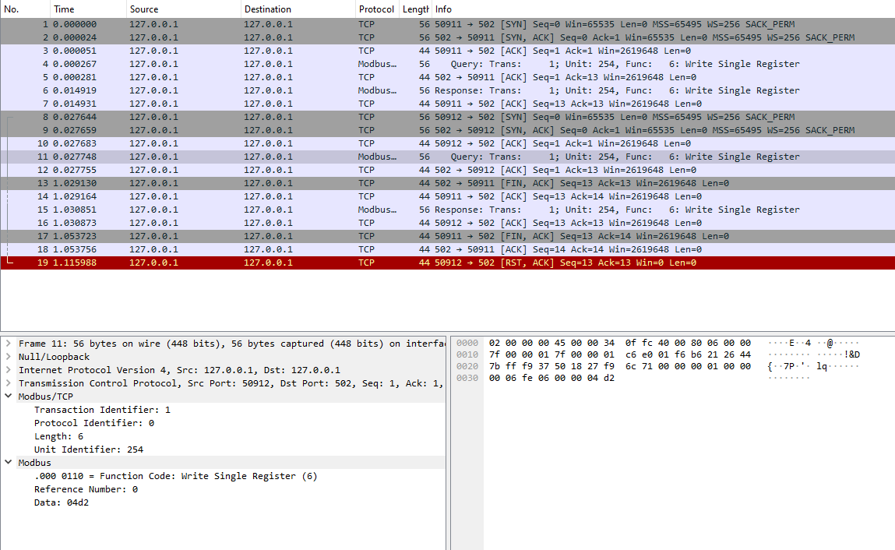
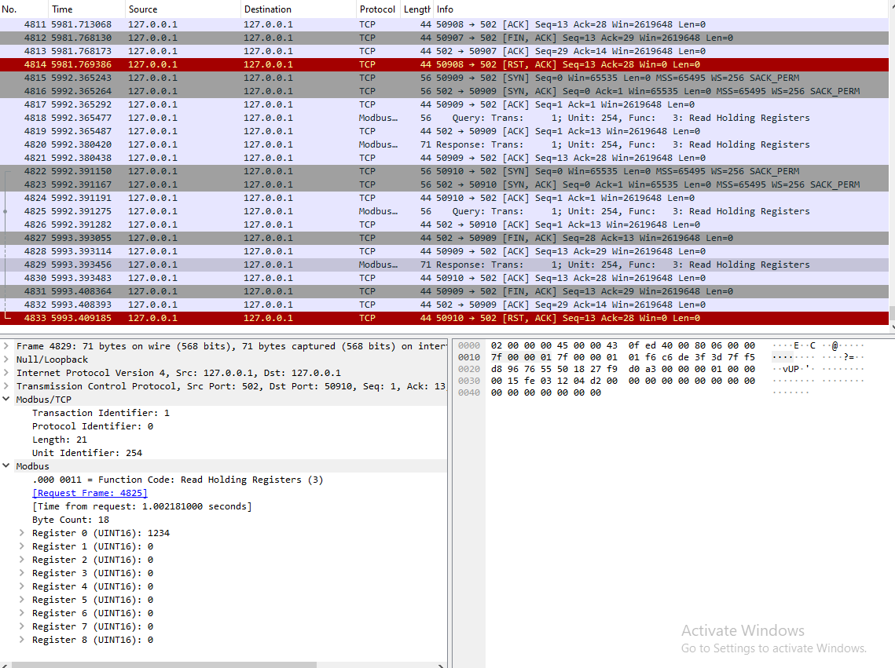

A short functional analysis of the FrostyGoop ICS malware

[Image Source](https://medium.com/@lithiumnetworks/new-ics-malware-frostygoop-targeting-critical-infrastructure-99b274725772)

## Introduction
Dragos has published a [report](https://hub.dragos.com/hubfs/Reports/Dragos-FrostyGoop-ICS-Malware-Intel-Brief-0724_.pdf) on a new strain of malware dubbed FrostyGoop, which specifically ICS/OT systems. This is currently the ninth ICS focused malware, following the likes of Triton, Industroyer1/2, Havex, Stuxnet, PIPEDREAM/INCONTROLLER, and so forth. While compiled for the Windows system, it can control ICS systems by transmitting data over the Modbus protocol, which is widely used in industrial environments. Although it has only been observed targeting [ENCO](https://ecopower-eu.com/en/enco-control/) controllers (used in central heating, boiler plants, reading meters etc.), it might target other ICS systems that employ the Modbus protocol. 

The [real world impact](https://therecord.media/frostygoop-malware-ukraine-heat) of this malware should not be underestimated, as it has been used in an attack in Ukraine in January 2024, where it left 600 households without heating and hot water in the midst of frosty temperatures. Lets analyse this malware and see how it operates. 

 ## Lab Setup

 In order to contain potential threats, I'm using [FlareVM](https://github.com/mandiant/flare-vm), a dedicated Windows 10 VM for malware analysis. 
 
## Static analysis

 A sample of FrostyGoop can be found on [MalwareBazaar](https://bazaar.abuse.ch/) (search for tags:frostygoop) to investigate further:

| File name  | mb.exe                                                     |
|------------|------------------------------------------------------------------|
| First seen | 2021-03-01 13:32:17 UTC                                          |
| SHA256     | 5d2e4fd08f81e3b2eb2f3eaae16eb32ae02e760afc36fa17f4649322f6da53fb |
| File size  | 3'699'200 bytes                                                    |
| Mime type  | application/x-dosexec                                            |
| Packed     | No                                                               |
| Architecture| 64-bit | 
| Language | Go |

The malware is written in the Go language, which makes analysis quite cumbersome. Since the binary does not perform any obviously malicious operations (other than transmitting Modbus), I will focus mostly on the *operation* of the malware. If more samples are available, I might focus more on the inner workings of the malware. 

## Functions

FrostyGoop operates via command line arguments, or a JSON file that provides it with the commands to execute. As far as is seen, it mostly consists of a simple wrapper around [this Go Modbus library](https://github.com/rolfl/modbus). Running it with the -h argument shows the various commands that are available:



Some of the commands that are relevant:
| command | purpose |
|-------| -------|
|-address|The address to write to used to either read or write values to the Modbus appliance. |
|-debug|Shows extra information when transmitting Modbus messages|
|-ip |Target IP of the Modbus appliance that we wish to send commands to|
|-mode|"-mode read-all" reads all registers <br> "-mode read 1 2" reads values from address 1 at position (count) 2 <br> "-mode write 3 4" writes values to address 3 at position (count) 4 |
|-output|Allows for outputting the Modbus responses to JSON format|
|-threads (default 3)|Number of threads to run the malware in|
|-timeout (default 10)|Allows to set the timeout value for reads/writes
|-try (default 3)| Number of tries to reconnect if connection fails|
|-value| Necessary for writing values to the Modbus appliance|

You may wonder, how are we going to test this? Luckily we can simply simulate behavior by using a Modbus slave simulator, such as [ModRSsim2](https://sourceforge.net/projects/modrssim2/), and avoid the trouble of buying the necessary equipment. Start this software and make sure it is in TCP mode, with default port 502:



With the following configuration:



Now execute the following command, to set Holding Register 400001 to the value 1234:

```
.\mb.exe -ip 127.0.0.1 -mode write -address 0 -count 0 -debug -value 1234
```

The expected output is as follows:



Note how register 40001 has been changed:



Likewise, we can read from the device, where *count* indicates the number of register values to read:

```
.\mb.exe -ip 127.0.0.1 -mode read -address 0 -count 9 -debug
```

Expected console output:



While you are at it, you can run Wireshark on the local loopback adapter to inspect the Modbus messages as they fly by:

Writing: (0x04d2 = 1234)



Reading:


Other than the aforementioned features, this malware does not exhibit any other malicious behavior. 
## Other samples

In the meantime, two other [samples](https://bazaar.abuse.ch/browse.php?search=tag%3Afrostygoop) have surfaced on MalwareBazaar:

[Link to sample 1, "read-all-mb.exe"](https://bazaar.abuse.ch/sample/a63ba88ad869085f1625729708ba65e87f5b37d7be9153b3db1a1b0e3fed309c/) <br>
[Link to sample 2, "modbus.exe"](https://bazaar.abuse.ch/sample/2fd9cb69ef30c0d00a61851b2d96350a9be68c7f1f25a31f896082cfbf39559a/)

Investigation of these binaries shows that the 2fd9cb69ef30c0d00a61851b2d96350a9be68c7f1f25a31f896082cfbf39559a or "modbus.exe" seems to be an earlier version of the malware, which exposes fewer parameters (missing -cycle, -input-list, -input-target, -input-task, -timeout, -try). It seems to miss the functionality of automatically parsing Modbus commands from a JSON file. Unfortunately, I have yet been unable to determine how to structure such a file. 

## Yara Rule

Thanks to Florian Roth (@cyb3rops / Neo23x0) a Yara rule is available to scan for this sample:

```
rule MAL_Go_Modbus_Jul24_1 {
   meta:
      description = "Detects characteristics reported by Dragos for FrostyGoop ICS malware"
      author = "Florian Roth"
      reference = "https://hub.dragos.com/hubfs/Reports/Dragos-FrostyGoop-ICS-Malware-Intel-Brief-0724_.pdf"
      date = "2024-07-23"
      modified = "2024-07-24"
      score = 75
      hash1 = "5d2e4fd08f81e3b2eb2f3eaae16eb32ae02e760afc36fa17f4649322f6da53fb"
   strings:
      $a1 = "Go build"

      $sa1 = "github.com/rolfl/modbus"

      $sb1 = "main.TaskList.executeCommand"
      $sb2 = "main.TargetList.getTargetIpList"
      $sb3 = "main.TaskList.getTaskIpList"
      $sb4 = "main.CycleInfo" fullword
   condition:
      filesize < 30MB
      and (
         $sa1
         and 3 of ($sb*)
      )
      or 4 of them
}
```


## Conclusion
As you might imagine, being able to send Modbus messages to PLCs that control critical functions such as heating may be disastrous and may lead to real world impact. 

Many hypotheses could be the developed with regards to this malware. The lack of sophistication may suggest opportunistic behavior, where the threat actors had a large window of opportunity to perform reconnaissance on the network. Perhaps they learned to send the right commands on the spot, reverse engineered the ENCO controller datasheet, or learned from previous attacks on ENCO controllers [exposed on the internet](https://alhasawi.medium.com/how-to-find-and-probe-enco-plcs-on-the-internet-just-like-frostygoop-malware-3546ba7dfce4) (yikes!).  Regardless, if attackers breach your networks through an internet-exposed access point and are able to pivot directly towards the industrial control systems, you have larger security hygiene issues to take care of.

I will try to keep this post updated as I continue researching this strain of malware. Thanks for reading, and if you want to know more or share insights, feel free to drop me a message on X (@st0yky).
