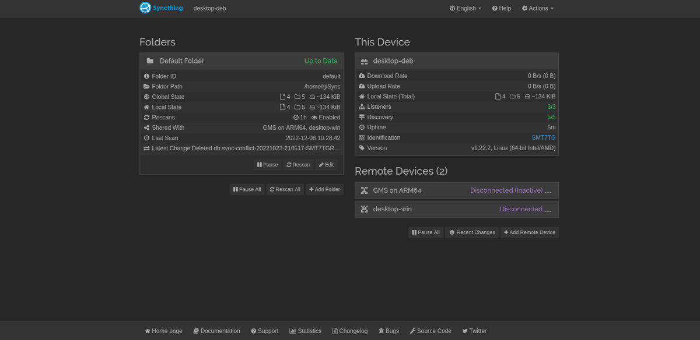

## Introduction

Password managers such as [LastPass](https://www.lastpass.com/nl) and [Bitwarden](https://bitwarden.com/) 
(personal favorite) are awesome. My main reasons to use them are:

1. They allow me to generate extremely strong passwords
2. My passwords are accessible on all devices
3. Having an overview of all my accounts allows me to delete accounts that I no longer use
   
Unfortunately, even the most secure cloud-stored password managers
such as LastPass are sometimes struck by [cyber attacks](https://blog.lastpass.com/2022/11/notice-of-recent-security-incident/). 
If you are a security-conscious individual, you might not feel at ease by a third party storing
your full set of passwords in the cloud, with no visibility into where they go, how safely they are stored, and
who has access to them. If you want to learn about alternatives, please read on!

## KeePassXC as Alternative

The main issue with using offline password managers such as [KeePass 2](https://keepass.info/) are that
they do not provide any service for synchronizing password databases out-of-the-box. While there are some
very good (unofficial) plugins for KeePass that provide this functionality, again this requires trust in the
authors who write the plugins. Additionally, I really love the great password auto-fill functionality
of Bitwarden, which is not provided by KeePass 2.  

Luckily, [KeePassXC](https://keepassxc.org/) is a great, and [KeePassDX for Android](https://www.keepassdx.com/), actively developed alternative that does come
with password auto-fill functionality. It has all the features of KeePass 2, with a prettier UI, and
built-in browser integration. In my day to day use, I feel that this password manager is a good replacement for Bitwarden.
The only thing left to take care of is to synchronize password databases between devices.

## Password Database Synchronization

Moving from Bitwarden to KeePassXC means that you lose the ability to synchronize password databases
between devices. This is where a little gem of a utility comes in named: [SyncThing](https://syncthing.net/)!
The name suggests what the tool does, and the site explains it even better:

> Syncthing is a continuous file synchronization program. It synchronizes files between two or more computers in real time, safely protected from prying eyes. Your data is your data alone and you deserve to choose where it is stored, whether it is shared with some third party, and how it's transmitted over the internet.

The tool can be installed on Android, Windows and Linux, which perfectly fits my usecase.

## SyncThing Setup

Installing SyncThing is really easy, for Windows, you can install [SyncTrayzor](https://github.com/canton7/SyncTrayzor/releases/).
For Linux you can install from source. If you are running a Debian-based distro, you can follow these [instructions](https://apt.syncthing.net/) to install
prebuilt packages.
Setting it up on Android is as easy as installing the app from the [Google Play Store](https://play.google.com/store/apps/details?id=com.nutomic.syncthingandroid).

If you have installed SyncThing on all your devices, synchronizing is as easy as loading up the Web UI and pointing it at the folder
you wish to continuously synchronize between devices: 

Put your password database file "*.kdbx" in this folder (/home/rj/Sync/ in my case) and you are all set! You can easily add new devices through this Web UI,
by clicking the "Add Remote Device". The interface will reflect the synchronization status so you can check whether your folder
is synchronized at each moment.

## Conclusion

By synchronizing your KeePass databases this way, you can get rid of the cloud services and retain ownership
of your passwords. If you are a little bit security paranoid like myself, you will find comfort in knowing
that your passwords are only stored locally on your devices. 