## Introduction

For a while I have been playing around with an OpenCTI deployment as homelab using Docker. However, when it comes to container orchestration I always wanted to have a good reason to play around with Kubernetes and now felt like spinning up a single-node local OpenCTI instance for development purposes. As I encounter Splunk a lot in my work, I wanted to learn how to integrate OpenCTI and Splunk. Tearing down and spinning up Docker containers by hand whenever any of my experiments fail is not particularly efficient. So, instead, let us deploy an OpenCTI and Splunk instance, orchestrated by Kubernetes. This way, we can learn to configure OpenCTI, develop or customize connectors, and also get a feeling for how to integrate OpenCTI with Splunk to consume IOC's and receive sightings!

## Minikube + Docker Engine
For the containerization backend, I chose to use Docker Engine. Depending on your platform (I'm on Debian 12), follow the guide [here](https://docs.docker.com/engine/install). For learning and development purposes I chose Minikube as it seemed to be the best out of all alternatives. For installation instructions, see [this page](https://minikube.sigs.k8s.io/docs/start/?arch=%2Flinux%2Fx86-64%2Fstable%2Fbinary+download). Also, make sure you install [Helm](https://helm.sh/docs/intro/install/) to simplify deployment of the charts. 

For  the sake of brevity, I will not go into installing Docker, Minikube or Helm as this process is pretty straightforward. Once Minikube is installed, make sure to start it and specify Docker as the driver:

```bash
minikube start --driver=docker
```

After a while, you should hopefully see that Minikube has been started succesfully:

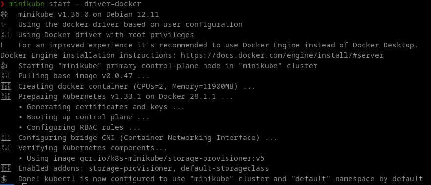

All your pods should be in the Running state

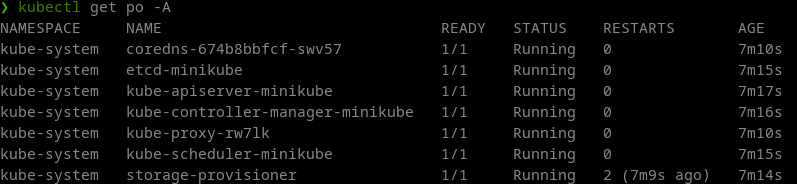

### Optional: Run Kubernetes Dashboard
To have a nice overview of the cluster, I like to use the Kubernetes dashboard. It can be installed, started and accessed as follows:

```bash
minikube dashboard
```

If you forgot the URL, run the following:

```bash
minikube dashboard --url
```


## Deploying OpenCTI
The OpenCTI Helm charts can be found [here](https://github.com/devops-ia/helm-opencti). Before deployment, make sure to read the installation instructions [here](https://github.com/devops-ia/helm-opencti/blob/main/charts/opencti/docs/configuration.md)! We need to at least configure a basic *env* block, and replace some "release-name" values in the values file! Ofcourse, we also want to enable persistence such that we can store some data in the Elasticsearch backend. I'm using the following *values.yaml* file to override the defaults. These settings have been optimized for a cluster with very limited resources, so increase the values where you see fit, or remove them to have Kubernetes handle them automatically. 

```yaml

env:
  # APP OPENCTI
  APP__ADMIN__EMAIL: admin@admin.io
  APP__ADMIN__PASSWORD: changeme
  APP__ADMIN__TOKEN: <insert random UUID here>
  APP__BASE_PATH: "/"
  APP__GRAPHQL__PLAYGROUND__ENABLED: false
  APP__GRAPHQL__PLAYGROUND__FORCE_DISABLED_INTROSPECTION: false
  NODE_OPTIONS: "--max-old-space-size=8096"
  PROVIDERS__LOCAL__STRATEGY: LocalStrategy
  # MINIO
  MINIO__ENDPOINT: opencti-minio
  MINIO__PORT: 9000
  MINIO__ACCESS_KEY: user
  MINIO__SECRET_KEY: changeme
  MINIO__USE_SSL: false
  # ELASTICSEARCH
  ELASTICSEARCH__URL: http://opencti-elasticsearch:9200
  # RABBITMQ
  RABBITMQ__HOSTNAME: opencti-rabbitmq
  RABBITMQ__PORT_MANAGEMENT: 15672
  RABBITMQ__PORT: 5672
  RABBITMQ__USERNAME: user
  RABBITMQ__PASSWORD: changeme
  # REDIS
  REDIS__HOSTNAME: opencti-redis-master
  REDIS__PORT: 6379
  REDIS__MODE: single
  # METRICS AND HEALTHCHECK
  APP__TELEMETRY__METRICS__ENABLED: true
  APP__HEALTH_ACCESS_KEY: changeme

elasticsearch:
  enabled: true

  extraEnvVars:
    - name: ES_JAVA_OPTS
      # Important to tune for larger deployments
      value: "-Xms1g -Xmx1g"

  sysctlImage:
    enabled: false

  # You can choose to have a separate master and data ES node, per the defaults
  master:
    masterOnly: false
    replicaCount: 1
    persistence:
      enabled: true
      # Define the Persistent Volume Chain size for storing ES data default for other components (redis, minio etc.) is 8Gi
      size: "100Gi"
    # If you don't specify this, Kubernetes will automatically set them for you
    resources:
      requests:
        memory: "2Gi"
      limits:
        memory: "2Gi"
  data:
    # To have only one combined ES master + data node
    replicaCount: 0
  ingest:
    replicaCount: 0
  coordinating:
    replicaCount: 0
      

minio:
  enabled: true
  mode: standalone
  auth:
    rootUser: user
    rootPassword: changeme

  persistence:
    enabled: true


rabbitmq:
  enabled: true
  replicaCount: 1
  clustering:
    enabled: false

  auth:
    username: user
    password: changeme
    erlangCookie: changeme

  persistence:
    enabled: true

# Needed to access the server, depending on your configuration
ingress:
  enabled: true
  className: ""
  hosts:
    - host: localhost
      paths:
        - path: /
          pathType: Prefix
      backend:
        service:
          name: opencti-server
          port: 
            number: 80
  tls: []

```

Before we can deploy the Chart, we have to add this repo:

```
helm repo add opencti https://devops-ia.github.io/helm-opencti
helm repo update
```

Now, issue the following command to deploy OpenCTI. We are providing the values defined above to configure the deployment.
Sometimes it is necessary to specify the *--version* flag to make sure all components (core and connectors) run the same version of the OpenCTI platform,
i.e. 6.7.0. To check which Helm chart release coincides with which version of OpenCTI, check the [Github releases](https://github.com/devops-ia/helm-opencti/releases). This flag ensures no pods start running together with different versions of the platform. You can choose any name for your deployment release,
but I'm just going with *opencti*.

```
helm install -f values.yaml <RELEASE_NAME> opencti/opencti --version 1.11.5
```

After a good 5-10 minutes, OpenCTI will be fully ready. On my setup, the worker pod usually starts last, and is a good indicator that the platform is up and running. 

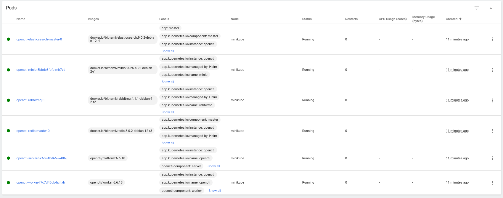

To access OpenCTI, we need to port-forward the opencti-server pod, as such:

```
kubectl port-forward <opencti-server pod name>  8080:4000
```

If all went well, OpenCTI will now be accessible on *http://localhost:8080*:

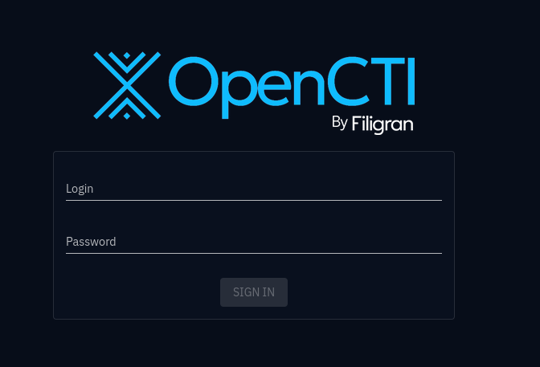

## Deploying Connectors

To get some useful data in, we can choose form a plethora of [connectors](https://github.com/OpenCTI-Platform/connectors), provided by OpenCTI or the community. Let's try to add the default [OpenCTI connector](https://github.com/OpenCTI-Platform/connectors/tree/master/external-import/opencti) that populates the platform with some data about sectors, organizations and locations. To this end, we specify an additional *connectors.yaml* file that holds all the connector configurations, with the following content:

**TIP: You don't need to specify the OPENCTI_URL and OPENCTI_TOKEN environment variables, the Helm Chart takes care of this!**

```YAML
connectors:
- name: opencti
  enabled: true
  replicas: 1
  image:
    repository: opencti/connector-opencti
  env:
    CONNECTOR_ID: "<insert random UUID>"
    CONNECTOR_NAME: "OpenCTI Datasets"
    CONNECTOR_SCOPE: "markingdefinition,identity,location"
    CONNECTOR_UPDATE_EXISTING_DATA: "true"
    CONNECTOR_RUN_AND_TERMINATE: "false"
    CONNECTOR_LOG_LEVEL: "error"
    CONFIG_SECTORS_FILE_URL: "https://raw.githubusercontent.com/OpenCTI-Platform/datasets/master/data/sectors.json"
    CONFIG_GEOGRAPHY_FILE_URL: "https://raw.githubusercontent.com/OpenCTI-Platform/datasets/master/data/geography.json"
    CONFIG_COMPANIES_FILE_URL: "https://raw.githubusercontent.com/OpenCTI-Platform/datasets/master/data/companies.json"
    CONFIG_REMOVE_CREATOR: "false"
    CONFIG_INTERVAL: 7 # In days
  resources:
    requests:
      memory: 128Mi
    limits:
      memory: 128Mi

```

Now upgrade the existing release with the added connectors (while keeping the original values):

```bash
helm upgrade -f values.yaml -f connectors.yaml opencti opencti/opencti --version 1.11.3
```

The new connector pod will appear after a while:

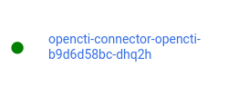

You can also check the status in OpenCTI to ensure some work is being done:

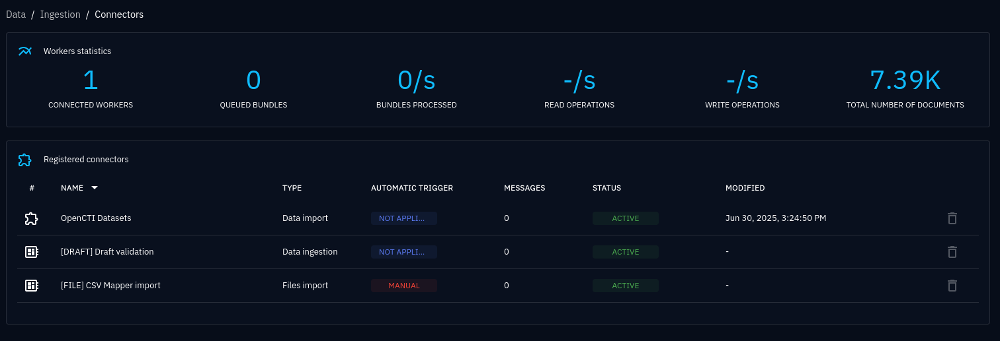

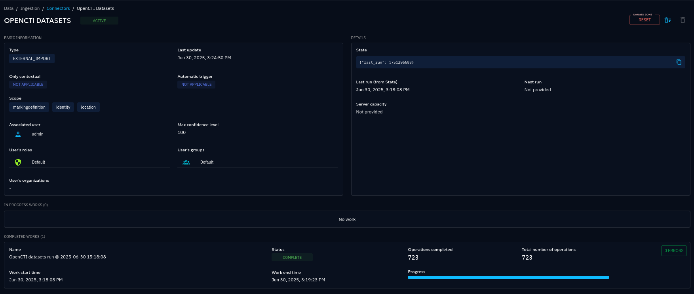

While we're incorporating connectors, let's also add some indicators from ThreatFox by adding the *connector-threatfox*, which will
simply download indicators from a publicly hosted CSV file. We add this to the previously mentioned *connectors.yaml*, which already contains the OpenCTI connector. 

```yaml
- name: threatfox
  enabled: true
  replicas: 1
  image:
    repository: opencti/connector-threatfox
  env:
    CONNECTOR_ID: <insert random UUID here>
    CONNECTOR_NAME: "Abuse.ch | ThreatFox"
    CONNECTOR_SCOPE: "ThreatFox"
    CONNECTOR_LOG_LEVEL: "error"
    THREATFOX_CSV_URL: "https://threatfox.abuse.ch/export/csv/recent/"
    THREATFOX_IMPORT_OFFLINE: "true"
    THREATFOX_CREATE_INDICATORS: "true"
    THREATFOX_INTERVAL: "3" # In days, must be strictly greater than 1
    THREATFOX_IOC_TO_IMPORT: "ip:port,domain,url" # List of IOC types to import
  resources:
    requests:
      memory: 128Mi
    limits:
      memory: 128Mi
```
Again, upgrade the deployment:

```bash
helm upgrade -f values.yaml -f connectors.yaml opencti opencti/opencti --version 1.11.3
```
Check that the connector gets registered and that the workers start ingesting data:


We should now get some indicators in the platform:

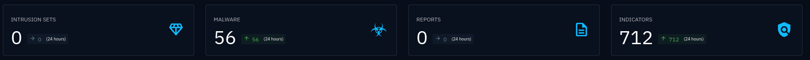

### Bonus: Customizing Connectors

Downloading connectors from an existing repo is great, but sometimes you need to troubleshoot the connector or modify the connector to suit your needs. For this to work, we need to be able to build our own connectors and push them to the Docker registry. 

As an example, we clone the [OpenCTI connectors repo](https://github.com/OpenCTI-Platform/connectors/tree/master/external-import) locally and add some modifications to the ThreatFox connector. Go into the *connectors > external-import > threatfox > src* subfolder and modify main.py:

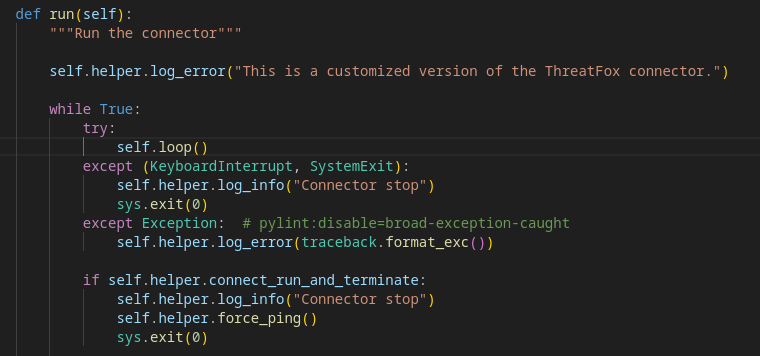

To have this connector available for a Helm upgrade, we have to build the image and push it to the Docker registry. It is important to append the current OpenCTI version to the connector tag of your choosing, as the Helm Chart needs / expects this:

```bash
docker build -t connector-threatfox-custom:6.6.18 connectors/external-import/threatfox  
```

Modify *connectors.yaml* accordingly:

```bash
  ...

- name: threatfox-custom
  enabled: true
  replicas: 1
  image:
    repository: connector-threatfox-custom
  env:
    CONNECTOR_ID: <insert random UUID>
    CONNECTOR_NAME: "Abuse.ch | ThreatFox"
    CONNECTOR_SCOPE: "ThreatFox"

  ...
```

Re-issue an upgrade:

```bash
helm upgrade -f values.yaml -f connectors.yaml opencti opencti/opencti --version 1.11.3
```

Sometimes you need to tear down the connectors first before upgrading again:

```bash
helm upgrade -f values.yaml opencti opencti/opencti --version 1.11.3
```

If you get Image pull errors, consult [this page](https://minikube.sigs.k8s.io/docs/handbook/pushing/). You might need to run the following command in your current terminal. 

```bash
eval $(minikube docker-env)
```

If all went well and the connector pod runs smoothly, issue the following command to get the logs and check whether your customization worked:

```bash
kubectl logs <pod name>
```

Or check the Kubernetes Dashboard:

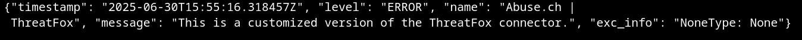

We can modify the code and rebuild the connector for development. Deletion of the pod will pull the new image with the modifications.

```bash
kubectl delete -n default pod <pod name>
```

## Deploying Splunk
Now that OpenCTI is up and running, including some data to start off with, we can deploy Splunk to test the integration. Luckily, Splunk Operator makes this as easy as running the following Helm Chart to deploy Splunk in a new namespace. See [this guide](https://github.com/splunk/splunk-operator/blob/main/docs/README.md) to get started. 

```bash
kubectl apply -f https://github.com/splunk/splunk-operator/releases/download/2.8.0/splunk-operator-namespace.yaml --server-side
```
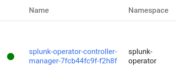

Next, we need to actually deploy a Splunk instance:

```bash
cat <<EOF | kubectl apply -n splunk-operator -f -
apiVersion: enterprise.splunk.com/v4
kind: Standalone
metadata:
  name: s1
  finalizers:
  - enterprise.splunk.com/delete-pvc
EOF
```

To access the web interface, we once again need to port-forward to open port 8000

```bash
kubectl port-forward <splunk s1 pod name> 8000 -n splunk-operator
```

To find the admin password, we need to perform some [additional steps](https://github.com/splunk/splunk-operator/blob/main/docs/Examples.md#reading-global-kubernetes-secret-object). Run this command to find the admin password:

```bash
kubectl get secret <secret name>  -o go-template='{{range $k,$v := .data}}{{printf "%s: " $k}}{{if not $v}}{{$v}}{{else}}{{$v | base64decode}}{{end}}{{"\n"}}{{end}}' --namespace splunk-operator
```

You will get the following output, and need to use the password entry to login at *localhost:8000* with admin:password. 
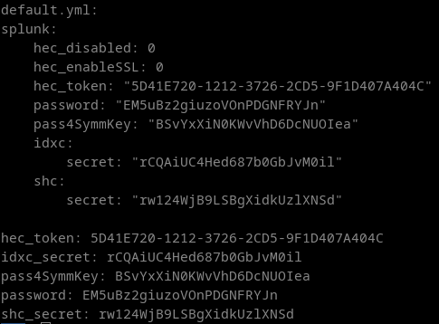
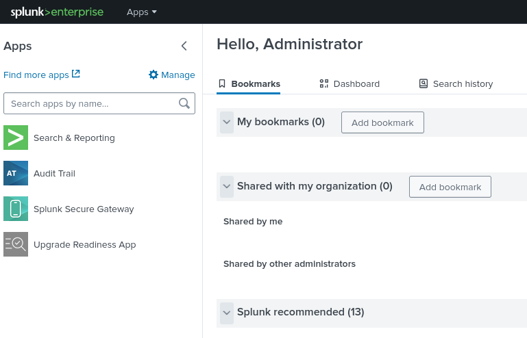

Congratulations, we now have OpenCTI and Splunk up and running. Time to integrate the two!

## Deploying Splunk OpenCTI Add-On
Before you install the OpenCTI Add-On from the Splunk Apps Browser, we need to make a minor adjustment such that it accepts an HTTP URL rather than only HTTPS in the configuration. First, clone the add-on from [this Github repo](https://github.com/OpenCTI-Platform/splunk-add-on). 

In the *TA-opencti-add-on > bin* folder, edit *TA_opencti_add_on_rh_settings.py*. We need to modify the regex used to validate the OpenCTI instance URL. Around line 100, replace "http" with "https". 

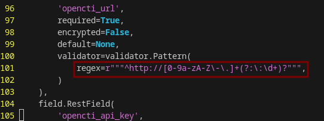

Once we are done, zip or tar the TA-opencti-add-on folder and head over to the *Splunk apps > manage apps > install app from file*, upload the zip file and restart Splunk. 

**Note: after you restart Splunk, you might need to re-enable the port-forward to port 8000!** 

### Sending indicators from OpenCTI to Splunk
Before we start configuring the add-on we need to enable data sharing in OpenCTI. Go to *Data > Data sharing* and add a new stream. For development purposes, I'm just going to make it public. Make sure to *start* the stream and copy the *stream ID*. Head back over to Splunk and go to *Apps > OpenCTI Add-On for Splunk > Inputs* and add a new input. Configure it with the stream ID you just copied. 

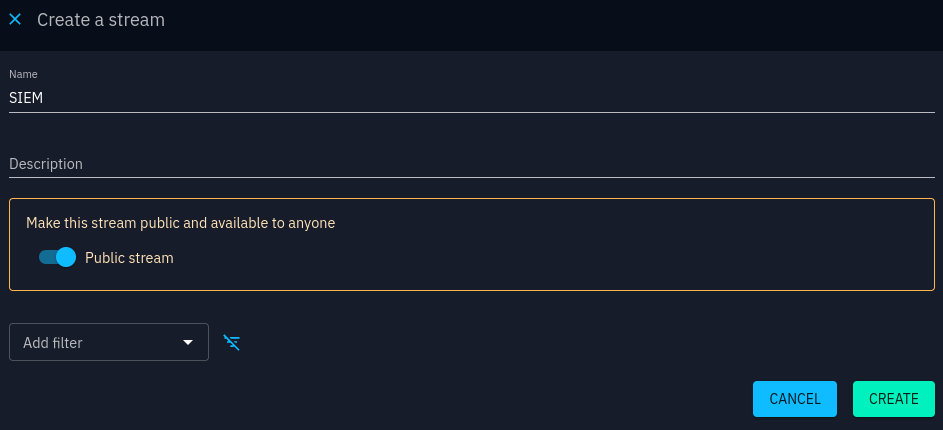

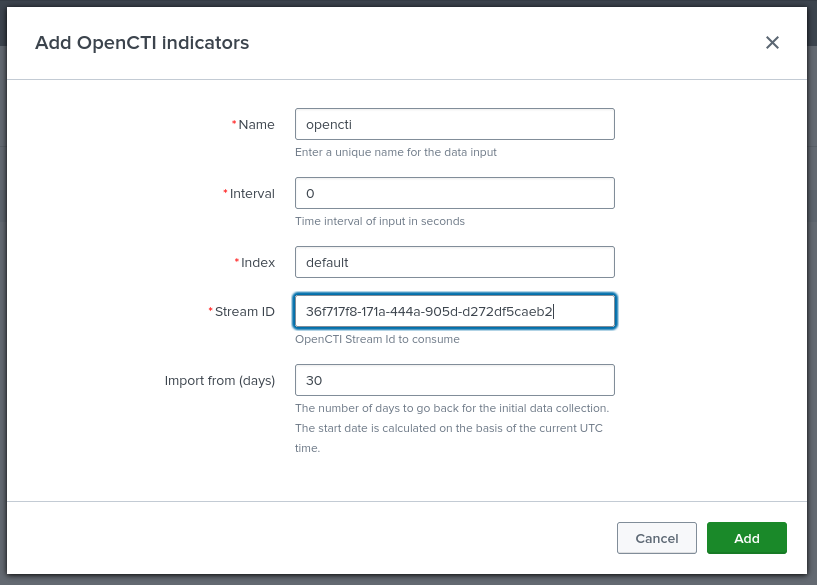

Now get the OpenCTI Server internal IP by issuing:

```bash
kubectl get pods -o wide
```
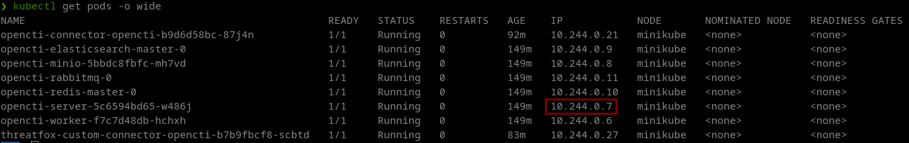

Go back to *Apps > OpenCTI Add-On for Splunk > Configuration > Add-on Settings* and set the OpenCTI URL to http://\<pod ip address>:4000. 
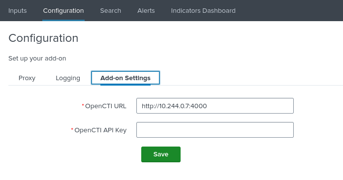

Retrieve your OpenCTI API key from your Profile page:
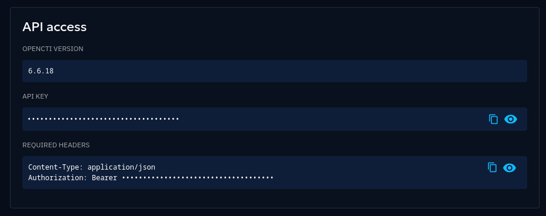

Hopefully, you will quickly see indicators appearing in the Add-On Indicator Dashboard, showing that the integration works!

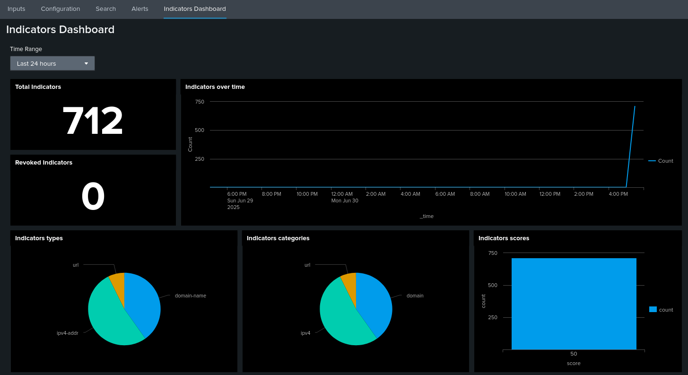

If you have issues ingesting OpenCTI data into the Add-on, check the error logs. The source name comes from the Input name that was previously configured (*opencti* in this instance). You can also go to *Inputs > open input dropdown > "Show (input name) input events"*, which will run the following search. 

```bash
index=_internal source=*opencti* | sort _time
```

### Sending sightings from Splunk to OpenCTI
To create some sort of feedback loop, we can also send back sightings (incidents) to OpenCTI whenever an indicator has been observed in the logs. This allows to further investigate the sighting in the TIP, capture trends,  or in the case of a false-positive hit, remove the indicator to clean up the outgoing feed. We can test this mechanism as follows. 

In Splunk go to *settings > Searches, reports and alerts > New Alert*. We will create a simple alert with the following search, on a Cron schedule of once per minute "* * * * *":


```
| makeresults
| eval url="baddomain.com", description="This is a very bad domain, please investigate"
```

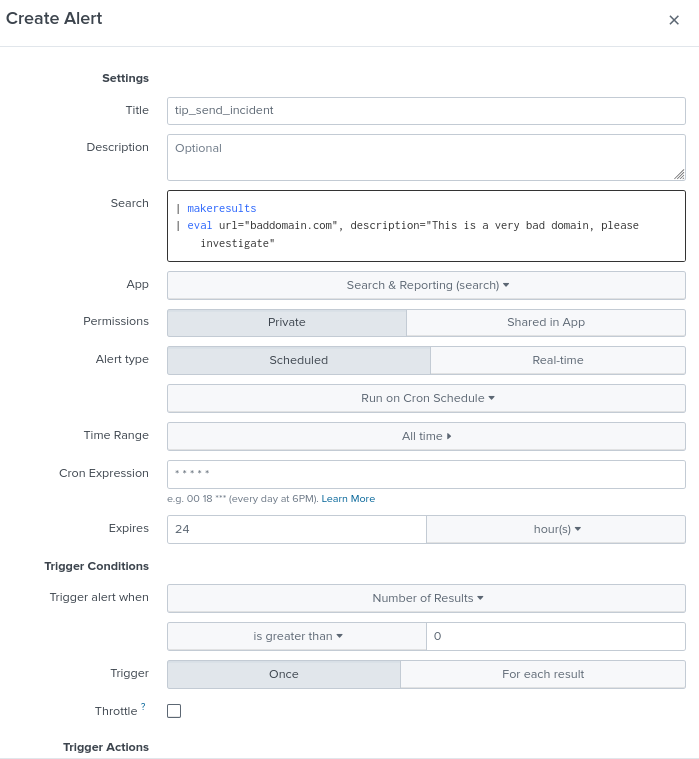

Under Trigger Actions add "OpenCTI - Create Incident" with the following settings:

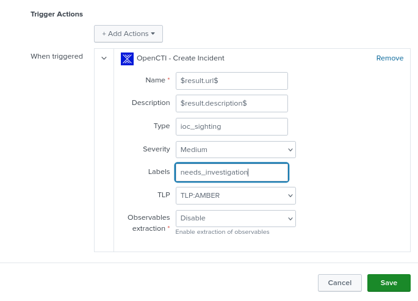


**Warning:** To make the $result.fieldname$ syntax work, avoid the use of [Splunk Transforming commands](https://docs.splunk.com/Splexicon:Transformingcommand) in your search, for if you use these, the action silently fails and no incidents will be sent!


Now head over to OpenCTI *Events > Incidents* and check out the newly created incidents!

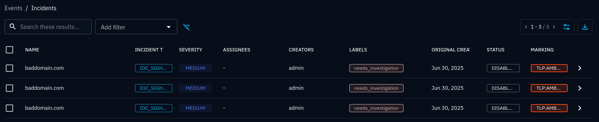

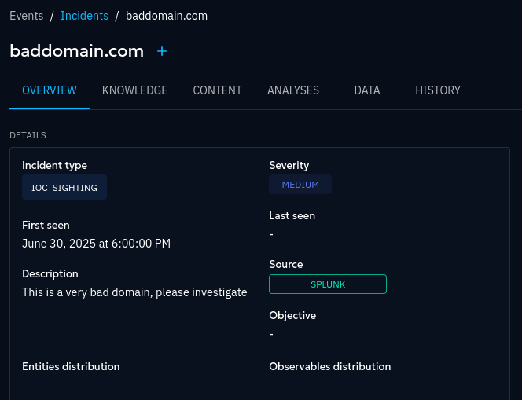

Happy developing!

## Conclusion

Kubernetes is great for experimenting and quickly setting up labs like these. Seeing how smoothly two platforms integrate like this makes me very happy.

That's it for now, thanks for sticking with me until the end, and as always,
please do not hesitate to contact me with any questions. 