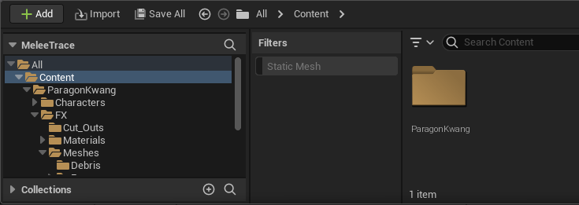

## Introduction

I have long been interested in modding and game development, which started with building mods for the Call of Duty series
of first person shooters. I could fiddle with the horrible modding tools for hours on end
to import new weapons, animations, character and vehicle models because who wouldn't be interested in driving 
a Lamborghini in a second world war themed game? I know I do :satisfied:. 

Soon after making cosmetic changes, I felt I needed to dive deeper, and I started
learning the Call of Duty scripting language. The lack of documentation and the horrendous
syntax made for a steep and admittedly painful learning curve. This actually spurred me
to take up C programming and basically started my interest in learning to program. 

The last years I have been working on multiple game prototypes in Unreal Engine, ranging
from first person shooters to real-time strategy games, because my interest in game development never faded. 
Whenever I encounter some cool game mechanic such as building / inventory systems in RPG's, I try to recreate them 
in C++ (instead of the visual programming "Blueprints") for maximum performance. For one game prototype,
I recreated an accurate melee mechanic that I observed in the first-person sword fighting game "Mordhau":



I implemented this and was surprised how little code was actually needed to create such a cool game mechanic!

## Project setup

To follow along with this article, you need to have Unreal Engine 5 installed with Visual Studio. Next,
create a "Blank" game project based on C++, I am calling it "MeleeTrace":


Since we need a character that yields a sword or another melee object, I chose to import the free asset
from the Unreal marketplace called "Kwang" which is a fully animated melee character from
the discontinued game Paragon:


Add the content from this project to your project (select the 4.27 version, as UE5 isn't supported yet). 
Confirm that your project now contains the "ParagonKwang" folder with the necessary assets in the content
browser:



After you have done this you are all set to start configuring the character.

## Character setup

Since we need to add some code to an already existing character, we need to create a new C++ class. 
Go to the top menu, select Tools > New C++ class and create a new class that inherits from the "Character" class, 
click next and call it MeleeCharacter:


If all went well Visual Studio should pop up with the class you just created. Before we can add code to this
class, we need to reparent the character we already have in the game. Search in the content drawer for 
"AnimationTestMap" and open this. It will present you with an empty map only containing the Kwang character.
Hitting the left mouse button will start some attacking animations on the Kwang character so you can see
how it looks:


Select the character in the viewport and hit "Edit KwangPlayerCharacter". In the top bar, go to "Class Settings":


In the right pane, make sure to set the "MeleeCharacter" class as the parent of this character:


While you are at the event graph of the KwangPlayerCharacter, make a connection from the SwitchOnInt 0 node to the
third animation (the node that plays PrimaryAttack\_C\_slow\_montage). This is to make sure the character plays only
a single animation, which is nice for testing:


This should be it for the character setup.

## MeleeTrace code

Add the following code to the "MeleeCharacter.h" header file. These are function declarations and variables we will
need to reference in the code. Make sure these are "public", not private nor protected, as we will need access
to them later:


```C
void MeleeTrace();                  # Main code routine to perform tracing
TArray<FVector> MeleeTracePrevious; # Array holding previous tick position of the trace
TArray<FVector> MeleeTraceCurrent;  # Array holding current tick position of the trace
TArray<FHitResult> WallHit;         # FHitResult to determine what we need to do if the trace hits collision
bool bMeleeBlocked;                 # Bool to check whether melee is currently blocked
```

The following code snippet is the code that needs to be added to the MeleeCharacter.cpp implementation code:


The first part of the code gets a reference to the player controller, since we need a reference
to it to determine where to apply collision.
```C
void AMeleeCharacter::MeleeTrace() {	
	APlayerController* PC = UGameplayStatics::GetPlayerController(GetWorld(), 0);
	if (PC && !bMeleeBlocked) {
		FCollisionQueryParams TraceParams(FName(TEXT("WeaponTrace")),
			false,
			PC
		);
```
The following code sets up the necessary arrays of vectors for the melee traces. 
We get references to the *FX_weapon_base* and *FX_weapon_tip* sockets that are
already present in the character skeletal mesh of the Kwang character. This
determines between which two points we want to start tracing. We need this so
that the line traces precisely follow the motion of the melee weapon. 
We push the first vector for tracing so that at least a single trace is made.
The MeleeVectorDirection is normalized so that we can determine the direction
of the vectors between the base and the tip of the weapon to trace between.
```C
		TArray<FVector> MeleeTrace;
		FVector MeleeTraceBottom = GetMesh()->GetSocketLocation("FX_weapon_base");
		FVector MeleeTraceTop = GetMesh()->GetSocketLocation("FX_weapon_tip");
		FVector MeleeVectorDirection = MeleeTraceTop - MeleeTraceBottom;
		float MeleeVectorLength = MeleeVectorDirection.Size();

		MeleeVectorDirection.Normalize();

		MeleeTracePrevious.Push(MeleeTraceBottom);
		MeleeTracePrevious.Push(MeleeTraceTop);

		MeleeTrace.Push(MeleeTraceBottom);
		MeleeTrace.Push(MeleeTraceTop);

```
Ofcourse we wish to trace more than a single line trace to increase the accuracy
of the melee swinging motion for when it collides with objects or other characters.
Here we define that we want 10 more traces, spread over the length of the character's
sword.
```C
		for (int i = 0; i < MeleeVectorLength; i += 10) {
			MeleeTracePrevious.Push(MeleeTraceBottom + MeleeVectorDirection * i);
			MeleeTrace.Push(MeleeTraceBottom + MeleeVectorDirection * i);
		}
```
Additionally we wish to perform line traces for each point on the sword
to query for any collision we may encounter. The *FHitResult::GetFirstBlockingHit()* function
can be used to break whenever we encounter the first collision (otherwise we get collisions
from all traces, which is often not what we want). Finally, the *DrawDebugLine()* function
will draw some debug lines to visualize the motion of the line traces.
```C
		if (MeleeTrace.Num() > 0) {
			for (int i = 0; i < MeleeTrace.Num(); i++) {
	
				GetWorld()->LineTraceMultiByObjectType(
					WallHit,
					MeleeTracePrevious[i],
					MeleeTrace[i],
					FCollisionObjectQueryParams::AllStaticObjects,
					TraceParams
				);

				MeleeTracePrevious[i] = MeleeTrace[i];

				if (FHitResult::GetFirstBlockingHit(WallHit)) {
					WallHit.Empty();
					MeleeTracePrevious.Empty();
					bMeleeBlocked = true;
					break;
				}

        DrawDebugLine(
					GetWorld(),
					MeleeTracePrevious[i],
					MeleeTrace[i],
					FColor::Red,
					false,
					0.2f,
					0,
					1.0f
				);
			}
		}
	}
}
```

## Custom animation notifications in C++
Now, we could call this MeleeTrace() function at every tick which would start
tracing all movement of the sword infinitely. Ofcourse this is computationally expensive,
inaccurate, and unnecessary. To do this, we can create custom [Animation Notifications](https://docs.unrealengine.com/4.27/en-US/AnimatingObjects/SkeletalMeshAnimation/Sequences/Notifies/). 

The basic premise of Animation Notifications is that we can make animations in a game
drive certain events. These are perfect in this instance, where we want to control
precisely how long we want to trace the motion of the character. Running MeleeTrace()
for the entire duration of the animation will often be too imprecise. Let's add a new class (the last one, I promise) 
that inherits from the "Animation Notify State" class so that we can implement these in C++. 


Call this class "MeleeAnimNotifyState":


Now add the following code to the MeleeAnimNotifyState.h header:

```C
#pragma once

#include "CoreMinimal.h"
#include "Animation/AnimNotifies/AnimNotifyState.h"
#include "MeleeAnimNotifyState.generated.h"

UCLASS()
class MELEETRACE_API UMeleeAnimNotification : public UAnimNotifyState
{
	GENERATED_BODY()

	virtual void BranchingPointNotifyBegin(FBranchingPointNotifyPayload& BranchingPointPayload) override;
	virtual void BranchingPointNotifyTick(FBranchingPointNotifyPayload& BranchingPointPayload, float FrameDeltaTime) override;
	virtual void BranchingPointNotifyEnd(FBranchingPointNotifyPayload& BranchingPointPayload) override;
	
};
```
The following code needs to be added to the MeleeAnimNotifyState.cpp implementation:

```C
#include "MeleeAnimNotifyState.h"

#include "MeleeCharacter.h"
#include <Runtime/Engine/Classes/Kismet/GameplayStatics.h>

void UMeleeAnimNotification::BranchingPointNotifyBegin(FBranchingPointNotifyPayload& BranchingPointPayload)
{
	NotifyBegin(BranchingPointPayload.SkelMeshComponent, BranchingPointPayload.SequenceAsset, BranchingPointPayload.NotifyEvent ? BranchingPointPayload.NotifyEvent->GetDuration() : 0.f);
}

```
The following code determines what needs to be done at every game tick, as long as the animation notification plays out.
We get a reference to our MeleeCharacter, run MeleeTrace() for every notification tick and send a notification to the SkeletalMeshComponent.
```C
void UMeleeAnimNotification::BranchingPointNotifyTick(FBranchingPointNotifyPayload& BranchingPointPayload, float FrameDeltaTime)
{
	AMeleeCharacter* MeleeChar = Cast<AMeleeCharacter>(UGameplayStatics::GetPlayerCharacter(BranchingPointPayload.SkelMeshComponent->GetWorld(), 0));

	if (MeleeChar && !MeleeChar->bMeleeBlocked) {
		MeleeChar->MeleeTrace();
		NotifyTick(BranchingPointPayload.SkelMeshComponent, BranchingPointPayload.SequenceAsset, FrameDeltaTime);
	}
	else {
		NotifyEnd(BranchingPointPayload.SkelMeshComponent, BranchingPointPayload.SequenceAsset);
	}
}
```
When the animation notification ends, we do some cleanup to empty out the vectors that were used in the
tracing, and notify the SkeletalMeshComponent that the animation has ended.
```C
void UMeleeAnimNotification::BranchingPointNotifyEnd(FBranchingPointNotifyPayload& BranchingPointPayload)
{
	AMeleeCharacter* MeleeChar = Cast<AMeleeCharacter>(UGameplayStatics::GetPlayerCharacter(BranchingPointPayload.SkelMeshComponent->GetWorld(), 0));
	if (MeleeChar) {
		MeleeChar->MeleeTracePrevious.Empty();
		MeleeChar->MeleeTraceCurrent.Empty();
		MeleeChar->bMeleeBlocked = false;
	}

	NotifyEnd(BranchingPointPayload.SkelMeshComponent, BranchingPointPayload.SequenceAsset);
}
```

## Setting up the animation notifications

Finally we got to the fun part: setting up the animation notifications in the actual animations.
Go to the content drawer and open the "PrimaryAttack\_C\_slow_Montage". Under the "Notifies" track,
add a new notification track. Then right click on the track, add "Anim Notify State" and select our
"Melee Anim Notification". Extend it for as long as you wish the MeleeTrace() to trace for during
the animation. One important part left! In the right "Details" pane, make sure to switch the "Montage
Tick Type" from "Queue" to "Branching Point". Save the montage and return to the main viewport.

## Conclusion

Start the game because it is time to view the accurate melee tracing in all its glory:


Loot at him go, what a legend!