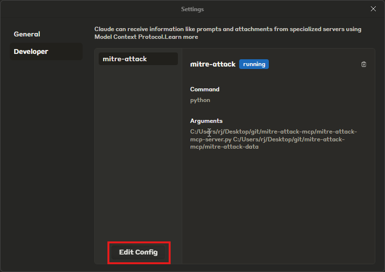
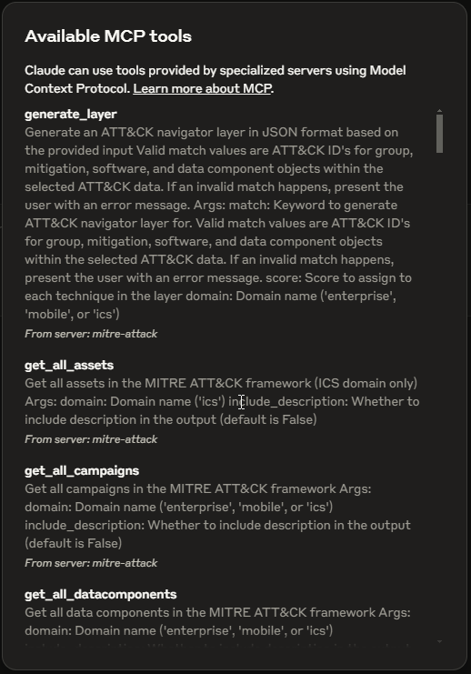
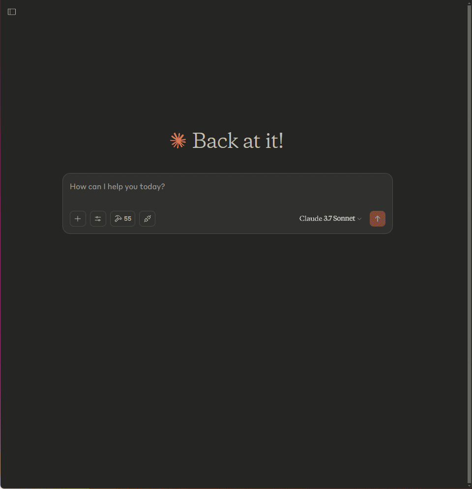
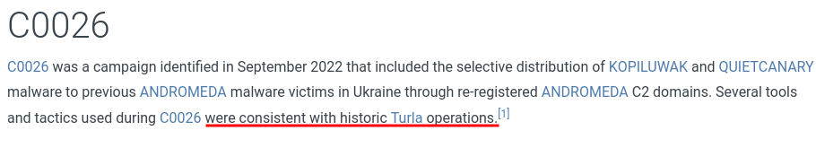
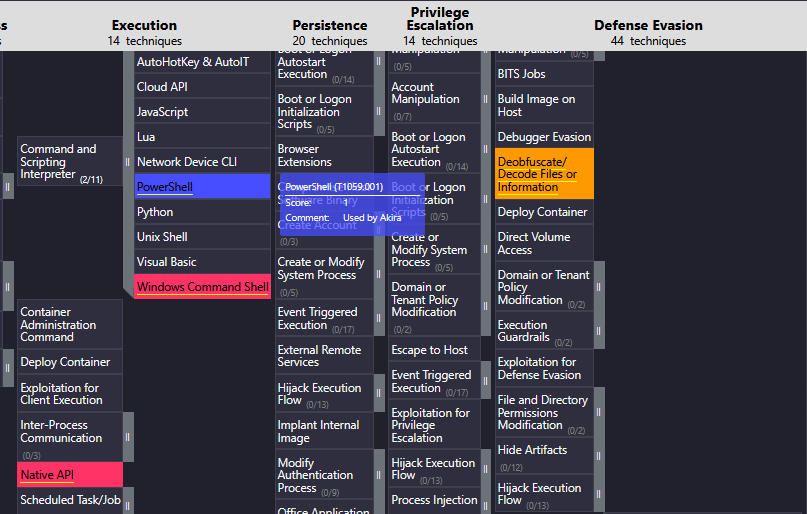
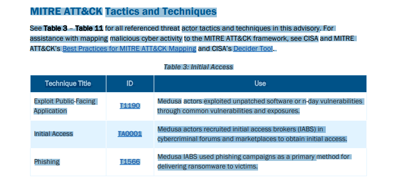
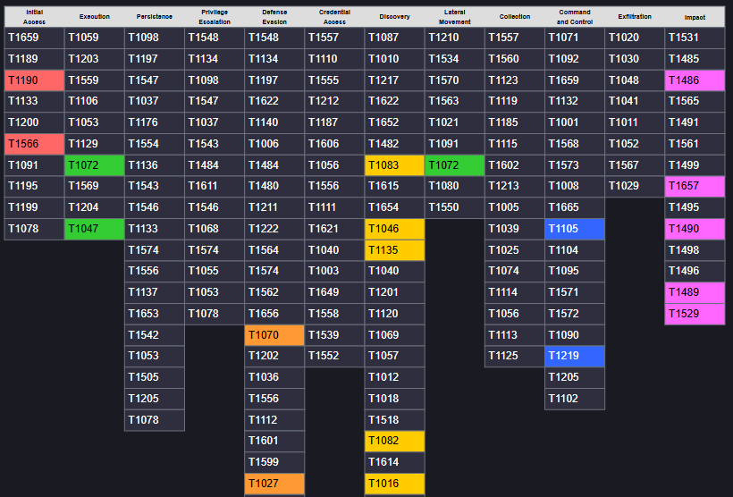
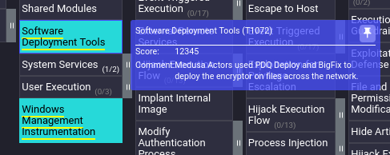

Supercharging LLMs with the MITRE ATT&CK knowledgebase.


## Introduction

In this article, I will showcase my project of building a Model-Context Protocol (MCP) server for the [MITRE ATT&CK](https://attack.mitre.org/) knowledge base of adversary tactics and techniques. This MCP server provides 50+ tools (wrappers around the [MITRE ATT&CK Python library](https://github.com/mitre-attack/mitreattack-python)) to extract all sorts of information from MITRE ATT&CK, so that you can query the knowledge, do some data mining, or automatically generate [ATT&CK Navigator](https://mitre-attack.github.io/attack-navigator/) layers to speed up your workflows. 

### Model-Context Protocol
The [Model-Context Protocol](https://www.anthropic.com/news/model-context-protocol) (MCP), developed by [Anthropic](https://www.anthropic.com/) (the team behind Claude AI) is all the rage right now, as it supercharges LLMs by providing context awareness through integrations with external tools, API's and databases.

> The Model Context Protocol (MCP) is a programming interface that enables developers to create context-aware AI applications by defining how large language models interact with external systems and data sources. MCP establishes standardized ways to represent various data types when communicating with language models, manages conversation history and session state, and provides mechanisms for connecting LLMs to external tools, databases, and APIs. This allows AI models to access information and perform actions beyond their pre-trained capabilities.

The concept of agents and tools that invoke external API's to supply an LLM with accurate and up-to-date information (beyond their training data) is nothing new. However, MCP standardizes the concepts and streamlines these to provide a universal standard to connect AI systems to external data sources. The great thing about MCP tools is that models such as Claude are very good at inferring what tools and which parameters to use for a given query.

Being impressed by projects that use MCP to aid in reverse-engineering tasks, such as [GhidraMCP](https://github.com/LaurieWired/GhidraMCP) and [IDA Pro MCP](https://github.com/mrexodia/ida-pro-mcp), I decided to create a server for the threat intelligence community, a [MITRE ATT&CK MCP Server](https://github.com/stoyky/mitre-attack-mcp).  

### MITRE ATT&CK
The MITRE ATT&CK provides a knowledge base for adversarial tactics, techniques and procedures (TTP's). It enables the cyber security offensive and defensive community to speak a common language in terms of adversary capabilities. 

> [MITRE ATT&CK®](https://attack.mitre.org/) is a globally-accessible knowledge base of adversary tactics and techniques based on real-world observations. The ATT&CK knowledge base is used as a foundation for the development of specific threat models and methodologies in the private sector, in government, and in the cybersecurity product and service community.

Let me show how to set up the MCP server with ClaudeAI and some use cases that this server enables. 

## Setup
I have mainly tested this with the [Claude AI Desktop](https://claude.ai/download) app on Windows 11, and also with the [Debian Claude Desktop](https://github.com/emsi/claude-desktop) app on Debian 12. Once more LLMs start properly supporting MCP, I will experiment more and update the code. 

### Installation steps
1. git clone https://github.com/stoyky/mitre-attack-mcp
2. cd mitre-attack-mcp
3. pip install -r requirements.txt
4. Add the below example config to your claude_desktop_config.json file:

```JSON
{
  "mcpServers": {
    "mitre-attack": {
      "command": "python",
      "args": [
        "C:/Users/rj/Desktop/git/mitre-attack-mcp/mitre-attack-mcp-server.py",
        "C:/Users/rj/Desktop/git/mitre-attack-mcp/mitre-attack-data"
      ]
    }
  }
}
```
The Claude AI Desktop config is commonly found at
```
C:\Users\[YourUsername]\AppData\Roaming\Claude\claude_desktop_config.json
# or
C:\Users\[YourUsername]\AppData\Local\AnthropicClaude\claude_desktop_config.json
```
Alternatively, go to the Claude AI Desktop app, go to File > Settings > Developer > Edit Config



The MCP server takes two arguments, one for the script itself, and one for where the MITRE ATT&CK data will be stored. The MCP automatically downloads the latest version of the MITRE ATT&CK enterprise, ICS and mobile JSON files to this path if they are not found there. Adjust these to the correct paths on your system.


If all goes well, you should now have around 50 mitre-attack tools available for use in the Claude AI Desktop app. 



## Use Cases
Now let's look at some use cases for this MCP server, to see what it is capable of answering. *Note: the GIFs may take a while to load*. 
### General question answering
The following question is provided to see if Claude can infer what the "ShellTea" malware is 

> What do you know about ShellTea malware?

and what tools it uses to find the right malware in the knowledge base. Notice how it uses the *get_software_by_alias* tool to find the right malware (the main alias is [PUNCHBUGGY](https://attack.mitre.org/software/S0196/)). Claude also infers that it is attributed to the [FIN8](https://attack.mitre.org/groups/G0061/) group by the *get_object_by_content* tool. 


### Finding Specifics
Some campaigns have references in their description that suggest overlap with certain threat actor groups, but might not be explicitly attributed to them. 
Let's provide the following question to check what campaigns might be implicitly linked to [Turla](https://attack.mitre.org/groups/G0010/):

> What campaign has overlap with Turla activity, even though it is not explicitly attributed in MITRE ATT&CK?

By invoking tools such as *get_groups_by_alias* and *get_all_campaigns* it was able to find campaign [C0026](https://attack.mitre.org/campaigns/C0026/)

We can check that this seems to be correct from the campaign description, and verify that Turla was not officially attributed to this campaign in MITRE:

### Generating ATT&CK Navigator layers
Now comes the fun part. Generating Navigator layers for the TTP's employed by actors might be a chore when doing it manually. The *generate_layer* tool can be used to generate Navigator layers automatically! Let's see what techniques overlap between the Akira and Babuk ransomware strains by asking the following:

> Generate a navigator layer that shows techniques of Akira ransomware and Babuk ransomware and which techniques they have in common. Give both a score of 1 and 3 when they overlap. Highlight the overlapping techniques and provide a downloadable JSON file in the preview. 


The layer is generated automatically, with scores applied, comments about which group uses which techniques and different colors are applied to the techniques used by Akira, Babuk, and those that overlap. Nice 😎! Let us load the generated JSON file in the ATT&CK Navigator:

 

### Generating layers from unstructured TTP data

Claude already has a strong innate ability to recognize TTP's in unstructured data. When it doesn't know for sure, it uses the MCP tools to generate the correct answer. Let us see how well it does on unstructured TTP data from a recent CISA Advisory on the [Medusa Ransomware](https://www.cisa.gov/sites/default/files/2025-03/aa25-071a-stopransomware-medusa-ransomware.pdf). Let's scroll to the section where the TTP's are listed, and copy them.



Let's paste this data into the query and ask the following:

> Extract TTPs from the pasted text and generate a layer where each TTP has score 12345 and where each TTP has a unique color per tactic.


This leads us to the following generated matrix, which contains the TTP's exactly as listed.



And as an added bonus, it places comments as to how each technique is used by the Medusa ransomware:



Quite impressive! By the way, if you were wondering how I generated the chaotic rainbow layer as is shown in the cover image for this article, I prompted Claude with:

> Generate a layer where all the techniques are colored in rainbow colors

And it did just that 😏.
## Conclusion


Please give this MCP server a try to see what you can do with it. If you encounter any problems or have suggestions for additional features, do not hesitate to raise an issue on [Github](https://github.com/stoyky/mitre-attack-mcp). Cheers!