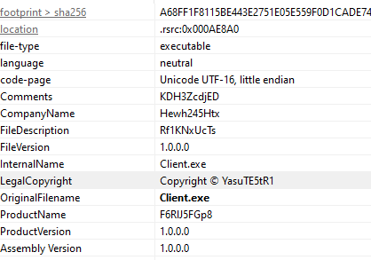
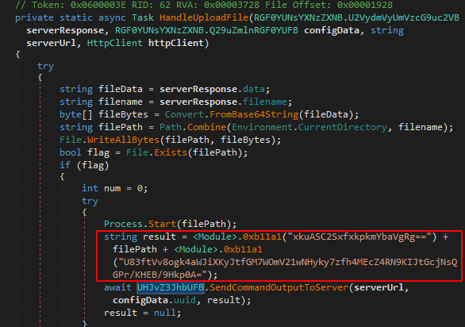
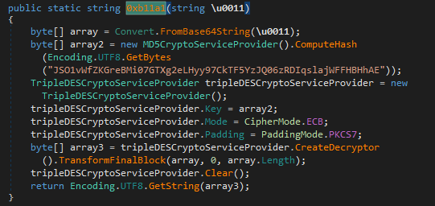
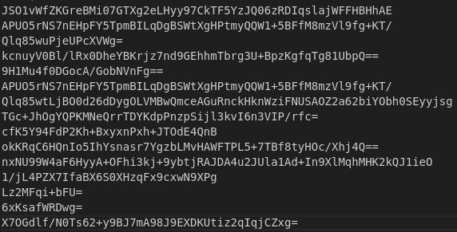
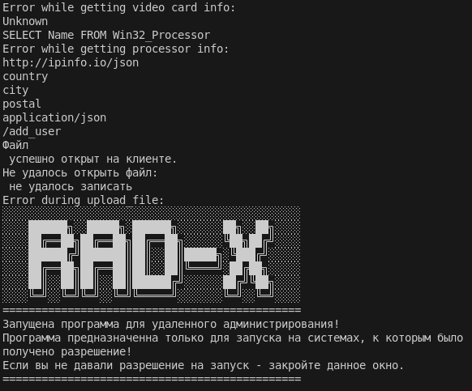
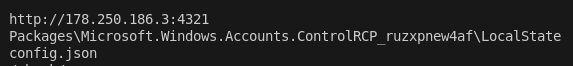
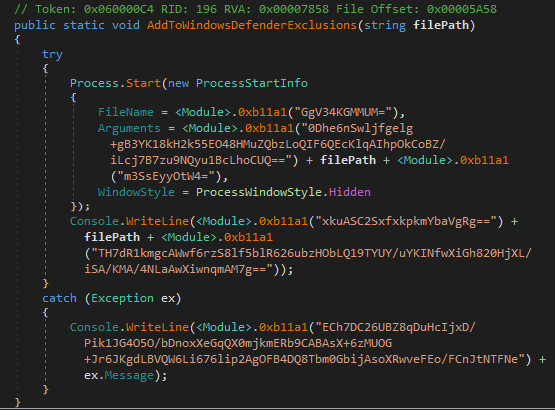
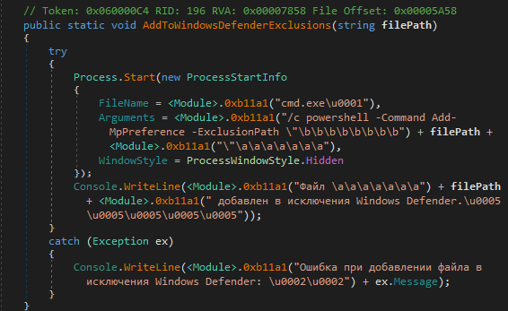

Writing a string decrypter for an obfuscated RAT during a CTF challenge.

[Image Source](https://www.freepik.com/free-ai-image/futuristic-style-possum-wearing-armor_94941490.htm#fromView=search&page=1&position=18&uuid=2a7451d4-cee6-4371-8156-b1bd1845e987)

## Introduction

During a recent CTF event I came across a great malware reverse engineering challenge for the following sample:

| File name  | Client.exe                                                     |
|------------|------------------------------------------------------------------|
| First seen | 2023-11-07 13:21:29 UTC                                      |
| SHA256     |  c2c1901d52b02bba9ec081c64436c6002c6550ebf185c89af79567381455de1a  |
| File size  | 704.00 KB                                                 |
| Mime type  | application/x-dosexec                                            |
| Packed     | No                                                               |
| Architecture| 64-bit | 
| Language | Microsoft .NET |

A short analysis in PEStudio shows that the malware is written in .NET and that the tooling that is used is "costura .NET loader". The version information contains "Copyright © YasuTE5tR1" in the LegalCopyright information. At various places, the strings in the binary seem to be obfuscated:



## Analysis

My favourite tool to analyze .NET binaries is dnSpy. After loading the binary I'm click through to the entry point of the malware. Immediately we are confronted with several modules and functions that give away the function of this malware. 

There is a *Grabber* module and various functions such as *WalletsGrabber*, *TelegramGrabber*, *CaptureScreenshotsAsync*, *RunCommandInConsole*, *SendCommandOutputToServer*. We are most likely dealing with a RAT, or at the very least an infostealer. The first function we encounter when scrolling through Main() is *HandleUploadFile()*:



Throughout the code, many calls to the function *0xb11a1* are observed, which dynamically decrypts the given Base64 encoded strings. 



Clicking through this function, we hit the jackpot right away. This function provides the encryption key, the encryption mode and the encoding functions to decrypt the strings that are observed in the binary. To decrypt the strings in this binary and get a better understanding of it, we need to:

1. Dump the strings in the binary
2. Base64 decode the strings
3. Compute the MD5 hash of the encryption key
4. Decrypt the given string with 3DES in ECB mode. 

Let's write a small Python script to perform these tasks. For the Triple DES encryption I'm using the *pyDes* module:

```Python
import sys
import pyDes
import base64
import hashlib

key = "JSO1vWfZKGreBMi07GTXg2eLHyy97CkTF5YzJQ06zRDIqslajWFFHBHhAE"

def decrypt(cipher):
    try:
        cipher_dec = base64.b64decode(cipher)

        hash = hashlib.md5()

        hash.update(bytes(key, 'UTF-8'))
        crypto = pyDes.triple_des(hash.digest(),pyDes.ECB)
        decrypted_str = crypto.decrypt(cipher_dec).decode("utf-8")

        return decrypted_str
    except:
        pass

if __name__ == "__main__":
    file1 = open('strings.txt', 'r')
    lines = file1.readlines()

    for line in lines:
            decrypt(line)
```

This script takes in the dumped strings *strings.txt*, and decrypts the strings line by line. So we go from this:



To this:



If we review the output, we immediately learn some facts about the malware, such as that we are likely dealing with the [RAD-X stealer](https://www.virustotal.com/gui/file/c2c1901d52b02bba9ec081c64436c6002c6550ebf185c89af79567381455de1a/details) and that the code contains many Cyrillic strings, as well as an IP that is likely used in C2 communication:



Luckily this was enough to earn the points for this challenge 😎, but let's take this a step further.

## Cleaning up the original binary

Decrypting the strings is nice, but it would be even nicer if we could replace the encrypted strings in the binary to make it more readable. Luckily, reverse engineer [Abdallah Elshinbary](https://twitter.com/_n1ghtw0lf?lang=en) (a.k.a. n1ghtw0lf) has already written a generic [.NET string decryptor](https://n1ght-w0lf.github.io/tutorials/dotnet-string-decryptor/) template. I stripped this code down and used it as inspiration to patch the strings in the original binary. The following script was created:

```Python
import os
import sys
import clr
import pefile

import sys
import pyDes
import base64
import hashlib

# Add dnlib reference
dnlib_dll_path = os.path.join(os.path.dirname(__file__), "dnlib")
clr.AddReference(dnlib_dll_path)

# Import dnlib modules
import dnlib
from dnlib.DotNet import *
from dnlib.DotNet.Emit import OpCodes
from dnlib.DotNet.Writer import ModuleWriterOptions

path = dnlib_dll_path = os.path.join(os.path.dirname(__file__), "sample")

mod = dnlib.DotNet.ModuleDefMD.Load(path)

key = "JSO1vWfZKGreBMi07GTXg2eLHyy97CkTF5YzJQ06zRDIqslajWFFHBHhAE"

def decrypt(cipher):
    try:
        cipher_dec = base64.b64decode(cipher)

        hash = hashlib.md5()

        hash.update(bytes(key, 'UTF-8'))
        crypto = pyDes.triple_des(hash.digest(),pyDes.ECB)
        decrypted_str = crypto.decrypt(cipher_dec).decode("utf-8")

        return decrypted_str
    except:
        pass

if __name__ == "__main_":
    for type in mod.Types:
        for method in type.Methods:
                try:
                    for instrIdx, instr in enumerate(method.Body.Instructions):
                        if instr.OpCode == OpCodes.Ldstr:
                                    result = decrypt(instr.Operand)
                                    method.Body.Instructions[instrIdx].Operand = result
                except:
                    pass
                                
    options = ModuleWriterOptions(mod)
    options.Logger = dnlib.DotNet.DummyLogger.NoThrowInstance

    mod.Write(path + "_cleaned", options)
```
This script iterates through the binary and replaces all *ldstr* (load string) instructions and their operands with their decrypted equivalent. We immediately observe that this script already cleans up many of the encrypted strings and makes reverse engineering much less tedious. We go from this:



To this:



## Conclusion
I had a blast during this CTF, and want to thank the colleagues who hosted it. Cheers!


