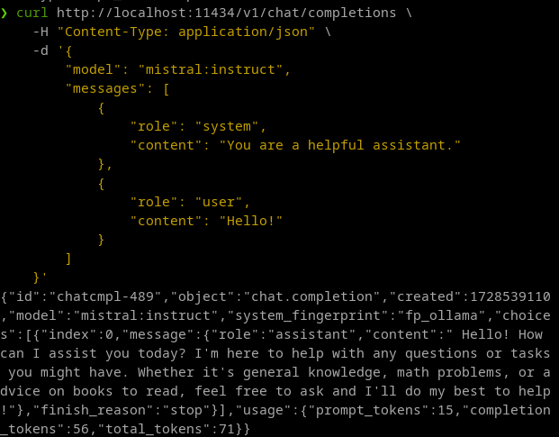

Setting up OpenCTI and the Ask AI service, with a cloud or locally served LLM.

## Introduction

Cyber Threat Intelligence analysts are continuously confronted with a massive amount of new reports 
that are sourced from various intelligence feeds. Threat intelligence platforms (TIP) facilitate the streamlining of such feeds and 
provides a platform to automatically correlate information (mostly in the form of STIX objects). Moreover, it allows
analysts to collaborate and build operational workflows to effectively analyse all the incoming information. In this regard, [OpenCTI](https://github.com/OpenCTI-Platform/opencti) is an open-source TIP that seems to have gained much traction in recent years. Apart from the basic features that any TIP should have, 
OpenCTI provides extensive dashboarding options, automation through playbooks, and ...:drum: drum roll :drum:... *AI features*.

In this article I show how to make use of those (still beta!) AI features, in particular how to set up the [*Ask AI*](https://docs.opencti.io/latest/usage/ask-ai/) service with a cloud
hosted and locally hosted large language model (LLM). Increased AI integration into TIPs is a very exciting development and facilitates numerous use cases, such as stated
in OpenCTI's documentation:


> Ask AI can assist you for writing better textual content, for example better title, name, description and detailed content of Objects.
>
>    - Fix spelling & grammar: try to improve the text from a formulation and grammar perspective.
>    - Make it shorter/longer: try to shorten or lengthen the text.
>    - Change tone: try to change the tone of the text. You can select if you want the text to be written for Strategic (Management, decision makers), Tactical (for team leaders) or Operational (for technical CTI analysts) audiences.
>    - Summarize: try to summarize the text in bullet points.
>    - Explain: try to explain the context of the subject's text based on what is available to the LLM.

Currently OpenCTI supports **OpenAI** and **MistralAI** LLM's out of the box. In this article I focus mostly
on working with MistralAI. However, especially when self-hosting, all the models (at least those that Ollama supports),
should work fine. 

*Note: I'm assuming you have set up a basic dockerized OpenCTI instance as is described [here](https://docs.opencti.io/latest/deployment/installation/)*.
*Preferably, you have uploaded a report to test the Ask AI function, or connected a connector such as AlienVault or RiskIQ to the instance to ingest some reports.*

## Host Setup
- OpenCTI version: 6.2.18
- OS: Debian 12
- CPU: Intel i7-13700k
- GPU: Nvidia RTX 2070
- RAM: 48 GB

## Option 1: Cloud Hosted with MistralAI's Le Plateforme

Let's start with the cloud hosted option.

1. First sign up for an account for Le Plateforme here: [https://auth.mistral.ai/ui/registration](https://auth.mistral.ai/ui/registration).
2. Then, sign in on the console: [https://console.mistral.ai/](https://console.mistral.ai/)
3. Go to API keys and create a new API key. 


Add the following to your OpenCTI *docker-compose.yml* file under the opencti configuration options:

```YAML
...
opencti:
    image: opencti/platform:6.2.18
    environment:
        ...
      - AI__ENABLED=true 
      - AI__TYPE=mistralai
      - AI__ENDPOINT=https://api.mistral.ai/
      - AI__MODEL=open-mistral-7b
      - AI__TOKEN={YOUR MISTRALAI API KEY}
...
```

You simply need to enable AI, use type of *mistralai* (alternatively *openai*), set the correct endpoint, and specify the model you wish to use,
in my case *open-mistral-7b*. A list of available models can be found [here](https://docs.mistral.ai/getting-started/models/models_overview/). Once you've added this to the
configuration, redeploy the instance with ``` docker-compose up -d ```. 

To check if your instance succesfully connects to the endpoint, in the OpenCTI interface go to Settings -> Parameters and check if the *CUSTOM MISTRALAI* field is highlighted in green. If you hover over the field, you will see the model you have in use, i.e. custom mistralai - open-mistral-7b. 


Now head over to a report of your choosing and test it out:


Indeed, it starts creating a report for you :smiley:.


I hope it goes without saying that it is ill-advised to upload TLP:RED content to a cloud instance such as MistralAI's Le Plateforme.
For maximum control over your sensitive data, you can self-host an LLM of your choosing, as is shown next. 

## Option 2: Self-hosted with Ollama

To setup OpenCTI and connect it to a locally hosted LLM, we can use [Ollama](http://www.ollama.com).
For a guide on how to start Ollama (and your preferred LLM) in a docker container, follow [this guide](https://ollama.com/blog/ollama-is-now-available-as-an-official-docker-image). 
Be aware that you need quite powerful hardware to get reasonable inference times. 

To run Ollama dockerized, issue the following commands on your host:

### CPU only
```
docker run -d -v ollama:/root/.ollama -p 11434:11434 --name ollama ollama/ollama
```

### With NVIDIA GPU support
```
docker run -d --gpus=all -v ollama:/root/.ollama -p 11434:11434 --name ollama ollama/ollama
```

### Running a model in the container
For a list of available models, see [this list](https://ollama.com/library).
```
docker exec -it ollama ollama run mistral:instruct
```

To check if you can send a prompt to your Ollama docker instance, issue the following command:

```
curl http://localhost:11434/v1/chat/completions \
    -H "Content-Type: application/json" \
    -d '{
        "model": "mistral:instruct",
        "messages": [
            {
                "role": "system",
                "content": "You are a helpful assistant."
            },
            {
                "role": "user",
                "content": "Hello!"
            }
        ]
    }'
```

If all went well, your mistral LLM will return an answer: 



Finally, adjust your docker-compose.yml file to the following, and bring it back up with the docker-compose command:

```YAML
...
opencti:
    image: opencti/platform:6.2.18
    environment:
        ...
        - AI__ENABLED=true 
        - AI__TYPE=mistralai
        - AI__ENDPOINT=http://172.17.0.1:11434
        - AI__MODEL=mistral:instruct
        - AI__TOKEN=none
...
```
If all went well, you can now utilize the Ask AI function in the same way as you would with the cloud hosted LLM.

*Note 1: Setting the endpoint this way is probably not recommended, but this is for testing purposes only. Do **not** use this configuration
in a production setting.*

*Note 2: Sometimes connection issues arise between OpenCTI and the Ollama docker. Please carefully check your docker networking
configuration. If all else fails, drop into a shell on your OpenCTI docker (docker exec -it {container id} sh) and try to ping
the Ollama docker at {IP}:11434. If you cannot connect, chances are you need to adjust your network settings.*

## Conclusion

I can already imagine the potential for the AI integration feature, such as summarizing reports from a container to form
the basis for CTI products such as end-of-week reports, trend reports, or other products. Hopefully Filigran (the organization behind OpenCTI)
keeps their promise to introduce retrieval augmented generation (RAG). This would allow us to query OpenCTI's knowledgebase and make larger
and deeper inferences about the threat intel stored in the platform, rather than merely relying on the information provided in the prompt.