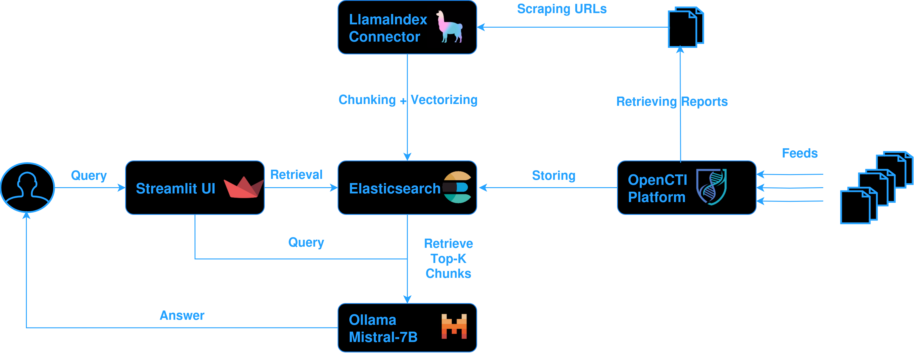
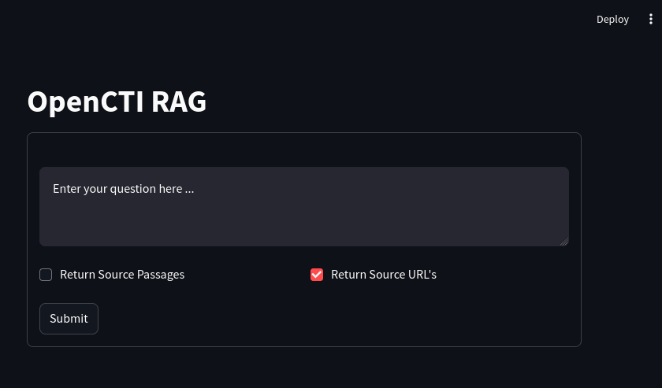
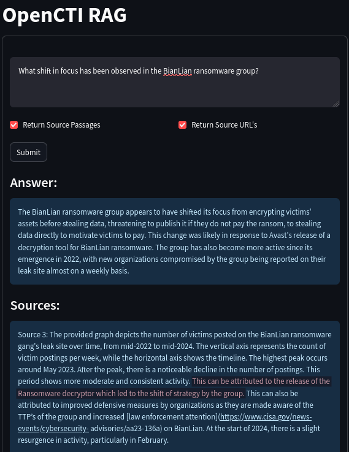
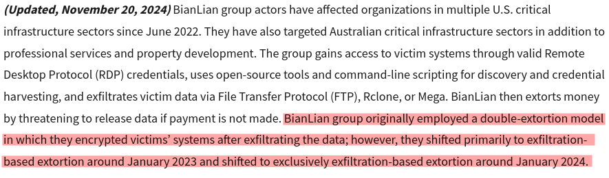
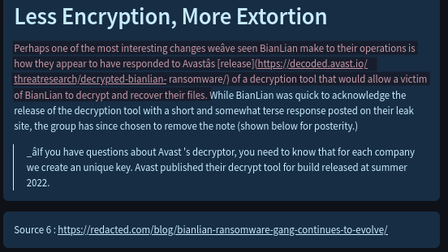
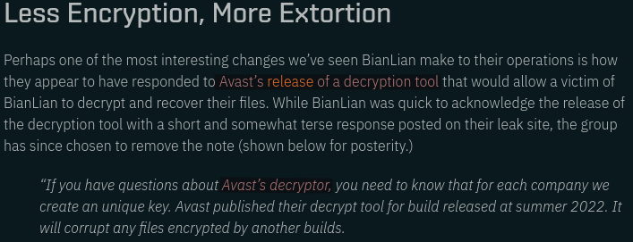

Creating a Question Answering system with a LLM and Retrieval Augmented Generation (RAG).

## Introduction

*Note: I'm assuming you have set up a basic dockerized OpenCTI instance as is described [here](https://docs.opencti.io/latest/deployment/installation), as well as a dockerized Ollama instance in the same network with Mistral-7B as is shown in [part 1](https://www.remyjaspers.com/blog/opencti_llm/) of these blog posts.*
*Preferably, you have accumulated quite some reports through a connector such as AlienVault or RiskIQ.*

In my previous blog post I showed how to set up an Ollama instance that serves a locally hosted Mistral-7B model and then connected this instance to OpenCTI to leverage the Ask AI feature. 

In this post I will show how I built a proof-of-concept Retrieval Augmented Generation (RAG) system that uses OpenCTI as a knowledge base for question answering (QA) purposes. This system allows a threat intel analyst to ask questions over all reports that have been ingested in the OpenCTI instance. As far as I am aware, OpenCTI's Ask AI feature does not allow for RAG yet but I am confident that it will be implemented in the (near) future 💪⌛.

## What is Retrieval Augmented Generation (RAG)?
RAG is a technique that improves the ability of LLM's to generate text or answer questions. Without RAG, LLM's answer questions solely based on knowledge that they gathered during training. RAG allows the system to quickly search through a large database of up-to-date cybersecurity information, like fresh threat reports from OpenCTI. It then generates answers based on this data, which helps grounding answers in truth and making them as relevant as possible. Moreover, RAG systems allow to return the sources that were used to generate an answer to check the credibility of the answers. Let us begin by reviewing the building blocks of the system.

## Overview of the QA system
When I started out with building this system, I had three main goals:
- Allow an analyst to ask questions over OpenCTI reports through a simple user interface
- Add source traceability to the answers so that analysts can check their credibility by reviewing the sources (paragraphs/source URL's) used to compile the answer
- All of the building blocks are Dockerized, so they can be easily started, stopped, and scaled at will. 

The figure above shows how the building blocks interact with one another. The most important part is the LlamaIndex OpenCTI connector, which preprocesses the reports so that they can be queried later. Central to the system is the Elasticsearch instance that OpenCTI uses already as its database. OpenCTI pulls the reports down from various feeds through connectors. These reports are stored in the Elasticsearch database with their short description and external reference URL's. 

The LlamaIndex Connector pulls down reports from the OpenCTI platform and scrapes their URLs to download information from the source web page, it then vectorizes this information and stores the vectors in Elasticsearch in a separate index. 

Threat intel analysts wishing to ask questions over the OpenCTI reports are able to do so through the StreamLit UI. The StreamLit app forwards the users' query to the Ollama-hosted LLM, which compiles an answer using the Top-K most relevant chunks.

### LLamaIndex Connector
Assuming that the OpenCTI instance already contains quite some reports, we still need to obtain the full content of the reports for maximum information gain (rather than only relying on their short description) by scraping the external reference URL's of the reports. 

To this end, an OpenCTI external import connector was created based on the provided [connector templates](https://github.com/OpenCTI-Platform/connectors/tree/master/templates/external-import). Upon initialization of the connector, the connector scrapes the [MITRE ATT&CK](https://attack.mitre.org/groups/) threat actor group pages to establish some ground truth in our QA system. After establishing ground truth information, this connector uses the [OpenCTI Python Client](https://github.com/OpenCTI-Platform/client-python) and runs every 30 minutes to fetch new reports since the last run of the connector, so that we can build up our knowledge base.  

The [LlamaIndex](https://docs.llamaindex.ai/en/stable/) Python framework is used to scrape the URLs using the [SimpleWebPageReader](https://docs.llamaindex.ai/en/stable/examples/data_connectors/WebPageDemo/) and to vectorize and chunk their contents. For the vectorization, I have experimented with direct Ollama vectorization (painfully slow) but ultimately settled for [HuggingFace Local Embeddings](https://huggingface.co/) which was much faster. 

After the vectorization and chunking step, we insert the chunks into the OpenCTI [Elasticsearch](https://www.elastic.co/elasticsearch) database into a new index. Luckily, Elasticsearch happily accepts vectors as well as normal documents. After all, why would we spin up a new Elasticsearch instance when we can just reuse the existing one :grin:? 

As the connector keeps loading chunks into ElasticSearch, we still need a user interface to interact with the locally hosted LLM and to ask questions over the reports. This is where StreamLit comes in.

### StreamLit UI
[StreamLit](https://streamlit.io/) is a modular framework that allows to quickly prototype UI's for AI apps such as chatbots, question answering systems, and for other data science visualizations. It took just a few lines of code to create a [chat interface](https://docs.streamlit.io/develop/tutorials/llms/build-conversational-apps) to query the system.

The StreamLit app also uses the LlamaIndex framework under the hood to connect to the Elasticsearch vector store and the Ollama Docker. The StreamLit app forwards the users' query to the LLM running in the Ollama Docker, retrieves the Top-K most relevant passages from the source reports from which it compiles an answer for the user. 

The best results for gathering the most relevant chunks were obtained with a [Hybrid Retrieval](https://docs.llamaindex.ai/en/stable/examples/vector_stores/ElasticsearchIndexDemo/#hybrid-retrieval) strategy which combines dense retrieval and keyword search. To enable retrieval of source paragraphs for answers, I used the [CitationQueryEngine](https://docs.llamaindex.ai/en/stable/examples/query_engine/citation_query_engine/). Getting the source traceability right was one of the most important and difficult parts, but LlamaIndex made this a lot easier. Ofcourse, we wish to verify whether the system answers truthfully without hallucinating.

Before turning to LlamaIndex, this entire project was coded with [LangChain](https://www.langchain.com/), but the results were never satisfactory. Unfortunately, the previous implementation suffered a lot from hallucination and poor source traceability. LlamaIndex and its CitationQueryEngine abstracts away a lot of the details that had to be implemented manually in LangChain. 

With the LlamaIndex connector and the StreamLit UI in place, let us show how the QA system responds to a user query.

## Results
Suppose we are interested in the BianLian ransomware group and their shift in focus over the years. Let us see if and how the QA system manages to answer the question *"What shift in focus has been observed in the BianLian ransomware group?"*.

The system understood from the ingested reports that the release of a decryptor for the ransomware by Avast has made BianLian shift from double-extortion to a modus operandi of exfiltration-based extortion. Note how the system returns the relevant passages from which it learned that this is the case, which includes a link to the [CISA advisory](https://www.cisa.gov/news-events/cybersecurity-advisories/aa23-136a) that it took into account when answering the question:

However, the shown passage does not mention anything about *who or which company* released the decryptor. The fact that Avast released the decryptor is mentioned in another source:

There is clear evidence that the system pieced together bits of information form multiple sources. Since we have the source URL, we can confirm this fact, and read more about the evolution of the BianLian group at the provided [source URL](https://redacted.com/blog/bianlian-ransomware-gang-continues-to-evolve/):

## Conclusion
This is just one of the infinitely many questions you can ask about your reports, but hopefully it gives a glimpse of what this system is capable of. This system also allows to compile summaries on threats of interest, list reports that are relevant to your threat profile, the possibilities are endless. There is something magical 🪄 about LLM's that showcase the ability to piece together information from multiple reports. 

If you wish to play with this system, the project can be found on [Github](https://github.com/stoyky/opencti_rag). If you have any questions or suggestions, do not hesitate to connect with me. Cheers!