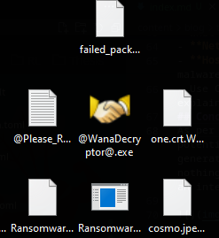

## Introduction

[TCM Academy](https://academy.tcm-sec.com/) is a great resource for learning cyber security concepts. 
Their noble goal is to offer top-notch cyber security courses, taught
by great teachers, with a price that is affordable for everyone. 
Their slogan is:
>Want to learn how to hack things without breaking the bank? We've got you covered.

I can absolutely vouch for their course [Practical Malware Analysis and Triage](https://academy.tcm-sec.com/p/practical-malware-analysis-triage).
Matt Kieley is an amazing teacher whose enthusiasm shines through all his lectures. 

In this article, I will be looking at the "Bossfight" challenge of PMAT, where the goal
is to dissect the elusive piece of ransomware Wannacry, a name that instills fear
in the hearts of all cyber security specialists. 

[https://github.com/HuskyHacks/PMAT-labs/tree/main/labs/4-1.Bossfight-wannacry.exe](https://github.com/HuskyHacks/PMAT-labs/tree/main/labs/4-1.Bossfight-wannacry.exe)

## Static Analysis

We begin by using our trusty static analysis tools PEStudio and FLOSS to gather information
about the executable and potentially interesting strings, respectively. The SHA256 hash of the
sample under consideration is:
```
SHA256: 24D004A104D4D54034DBCFFC2A4B19A11F39008A575AA614EA04703480B1022C
```


Looking at the output of PEStudio, there are some noteworthy things besides the hashes.
First the description states "Microsoft Disk Defragmenter", which is likely to throw off 
people who are doing a preliminary analysis of the software, thinking that it is Microsoft's
own disk defragmentation software. By further naming the version "lhdfrgui.exe", it might
appear at first glance to be legitimate, as "dfrgui.exe" is the actual name of Microsoft's
Disk Defragmentation binary. 

We use FLOSS to get an idea of the interesting strings in this binary, limiting the search to strings of length 10. Scrolling from the bottom up, we immediately notice an interesting looking URL:

```
hxxp[:]//www.iuqerfsodp9ifjaposdfjhgosurijfaewrwergwea.com
```
Which might be a callback URL or a C2 domain. We also observe various references to cryptographic primitives which might indicate the encryption schemes being used:
```
Microsoft Enhanced RSA and AES Cryptographic Provider
```
Looking further at potentially interesting imports in the IAT table, we observe crypto-related API calls:


As well as calls to InternetOpen, CreateFile and other calls that indicate that files are
being created, sent and encrypted. These might prove good breaking points during dynamic analysis. Now we move on to the dynamic analysis to ellicit more interesting behavior from this piece of malware. 


## Dynamic Analysis

As per usual, we fire up REMnux with an INetSim listener to listen for potential DNS requests, HTTP requests or other traffic that the binary generates. After a quick snapshot of the VM we detonate the binary and... nothing happens. Or did we miss it? Switching over to Wireshark in REMnux we observe an interesting HTTP GET request:


Intuitively this looks like a callback domain. It looks like the malware fails
to detonate as long as a connection can be made to this URL. So, we disable
INetSim and try again, and indeed we wanna cry:




Looking at ProcMon we see that a file named "tasksche.exe" is written to the Windows folder, perhaps this is a persistence mechanism? We also observe a bunch of WriteFile operations to a particular directory:


In the observed directory, files are dropped that are used by Wannacry to further compromise the system:


In addition, a plethora of TCP connections are observed:


Ofcourse we are immediately observing host-based indicators such as the ransomware note, all files being encrypted with the WNCRY extension, as well as the friendly handshake decryptor. Let's revert back to a predetonated state
and investigate this more thoroughly.

Let's fire up Cutter to find out more about the killswitch mechanism. No time is wasted and we immediately set breakpoints on the main and InternetOpenA calls to see if we can intercept a ppssible callback
to the callback domain. Interestingly, not far into the main function, we observe the URL


Looking at the graph visualization, there are two flows for this function. The left function calls other functions, whereas the other seems to return directly. It is likely that the left path is executed on a succesful callback connection, whereas the other path stops the binary from executing futher.


We reverse the jne instruction prior to the branch so that it takes the left path with the function call in it. Now that the jump is taken to the left path, the binary proceeds to run as intended and encrypts the system. We can play with this killswitch mechanism to either probe into Wannacry further or to disarm it. This wraps up the challenge and the associated questions for PMAT.

## Conclusion

This was a cool challenge, and exposure to a real binary is so much more educational than disarmed, practice binaries. I will sure take up more malware RE when I have time on my hands!


