## Introduction

[TCM Academy](https://academy.tcm-sec.com/) is a great resource for learning cyber security concepts. 
Their noble goal is to offer top-notch cyber security courses, taught
by great teachers, with a price that is affordable for everyone. 
Their slogan is:
>Want to learn how to hack things without breaking the bank? We've got you covered.

I can absolutely vouch for their course [Practical Malware Analysis and Triage](https://academy.tcm-sec.com/p/practical-malware-analysis-triage).
Matt Kieley is an amazing teacher whose enthusiasm shines through all his lectures. 

In this article, I will be looking at the second challenge of this course, named "SikoMode".
All materials can be found on this Matt's Github page:

[https://github.com/HuskyHacks/PMAT-labs/tree/main/labs/2-3.Challenge-SikoMode](https://github.com/HuskyHacks/PMAT-labs/tree/main/labs/2-3.Challenge-SikoMode)

The analysis is performed on a Flare VM and REMNux to simulate network services.
The goal of this challenge is to answer multiple questions about the behavior of
the binary in question, so with these questions as guidance, let's start!

## Static Analysis

First we gather some preliminary information about the binary, using [PEStudio](https://www.winitor.com/) and information from [Cutter](https://cutter.re/).
Opening up the binary "unknown.exe" shows the following information:
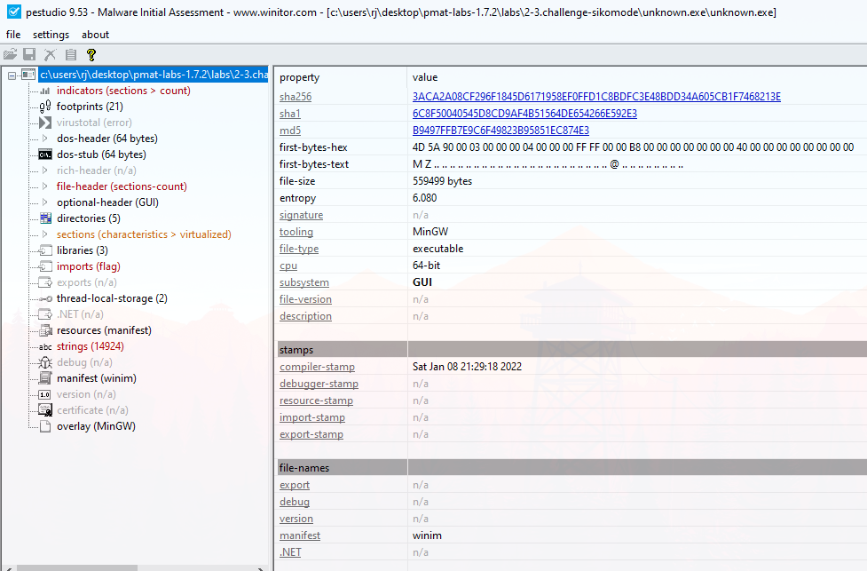
Here we note basic details such as the SHA256 hash and the architecture. We note that the binary has a 64-bit architecture and a hint on the programming language used for the binary: winim.
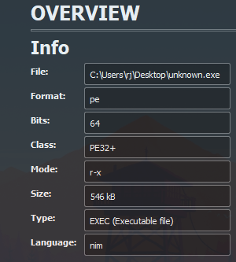
Combined with the information in Cutter we can safely state that the executable is programmed in the [Nim](https://nim-lang.org/) programming language. With this knowledge in mind we can move on to dynamic analysis to ellicit interesting behavior from the binary. 


## Dynamic Analysis
Upon running the binary for the first time, we observe that it deletes itself immediatly after a couple of seconds. Interested in whether the binary makes any network calls, we fire up REMnux and start INetSim to simulate network services such as DNS and HTTP. After doing so, we run the binary again and observe that it doesn't delete itself. The hypothesis here is that the binary deletes itself when it is unable to call back to some domain on the internet. Indeed, if we close INetSim again and rerun the binary, it does not delete itself. 

To peer deeper into the potential connections it makes, we open up Wireshark to check for any requests that might be made by the binary at runtime. 
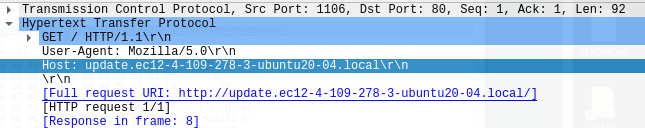
Immediately, we observe that a callback is made to the following domain:
```
https://update.ec12-4-109-278-3-ubuntu20-04.loca
```
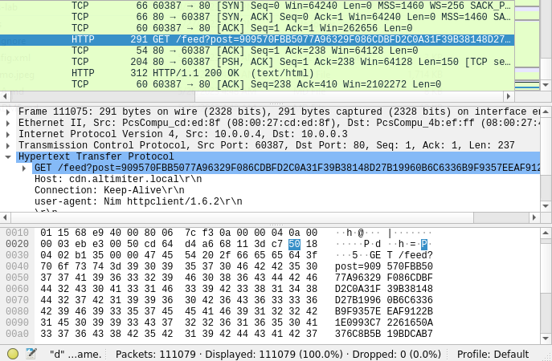
Soon after, multiple GET requests are observed to the following domain:
```
cdn.altimiter.local/feed
```
Given the chunks it seems to post to this URL it seems that exfiltration is being performed of some data. 
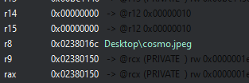
After cutting deeper into the binary with Cutter we observe various functions:

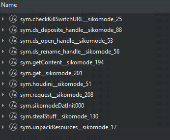
One of which is particularly interesting:
```
sym.stealStuff__sikomode_130
```
Setting breakpoints and picking the function apart leads us to various functions, amongst other a readfile function:
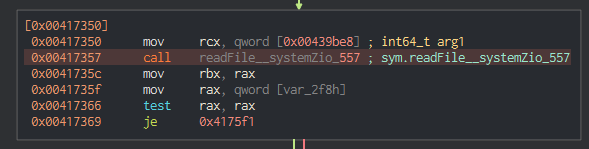
Diving deeper into the function and the arguments that are loaded before the function is called leads us to believe that the following file is being exfiltrated:

Cosmo.jpeg is a picture of a cat:

(Matt Kiely's cat? Who knows :P), but surely this is an asset that must be protected at all costs!

What is further of interest is which encryption algorithm, if any, is used to exfiltrate the data. Stepping through the StealStuff function encountered previously, we reach the following interesting call:
```
sym.toRC4__
```
There we have it, RC4 is being used to encrypt the data before it is exfiltrated!

Now that we know that RC4 is being used, we are interest in finding the key that was used to encrypt the data. Quick investigation into the toRC4 function leads to the following Nim RC4 library:
[https://github.com/OHermesJunior/nimRC4](https://github.com/OHermesJunior/nimRC4) Unsure whether this library is actually used, we still assume that the toRC4() function takes the following arguments:
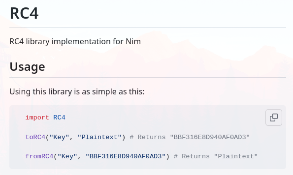 Using Cutter, we check the values for the arguments that are loaded before calling this function, and we observe the password in all its glory:
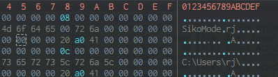

While running this malware, we kept an eye on [Procmon](https://learn.microsoft.com/en-us/sysinternals/downloads/procmon), to check for any interesting connections, file manipulations, or registry edits, as these are indictations of further stager dropping, enabling persistence or other nefarious tasks. 
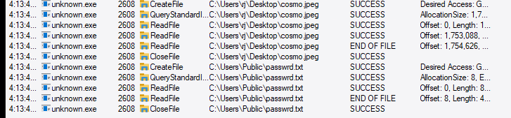
In ProcMon, we observe that file is created:
```
C:\Users\Public\passwrd.txt
```
Opening this file confirms the password used throughout the binary:
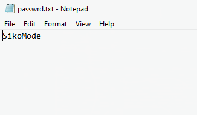 There are no indications of other file creations, or persistence mechanisms. 
## Conclusion
So there we have it, SikoMode is a very interesting challenge and requires a little bit more dynamic analysis in Cutter and other disassemblers/debuggers. Also, the introduction of RC4 in the encryption makes for a worthy challenge. I am looking forward to the next challenge!


