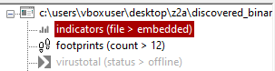
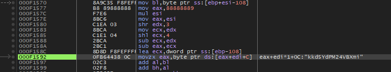

Analyzing the Zero2Automated Course Cruloader custom sample.

## Introduction

After finding out that a sequel existed for the Zero2Hero malware analysis course, I was hooked and wanted to learn more about advanced techniques such as injection, crypto algorithms in malware, writing config extractors, and emulating C2 protocols. Luckily the follow-up course Zero2Automated provides all this content and more. 

Halfway during the course, a custom sample is provided for analysis. In this blogpost I will show how I analyzed this sample. I mainly used x64dbg, Ghidra for this analysis. 

## The Cruloader sample

| File name  | main_bin.exe                                                       |
|------------|------------------------------------------------------------------|
| SHA256     | a0ac02a1e6c908b90173e86c3e321f2bab082ed45236503a21eb7d984de10611 |
| File size  | 168960 bytes                                                   |
| Mime type  | application/x-dosexec                                            |
| Packed     | No                                                               |

Some basic static analysis usually provides some clues as to the working of the malware and possible techniques that are employed. Let's start out with reviewing some details in PEstudio. The sample is written in C++ and one thing that stands out is the fairly high entropy of the file, which suggests some part of the sample might be compressed or encrypted. 

## Stage 1

Looking at the indicators, we observe that some malicious file is seemingly embedded in the file resources. 

Looking at the resources, we indeed observe that one of the sections has particularly high entropy. The hypothesis is that this file will be decrypted and perhaps contains some payload to be used in a later stage. 

After loading the binary into Ghidra, we observe repeated calls to a function for which the parameter seemingly is used righ after in LoadLibraryA and GetProcAddress calls, suggesting that some form of hashing is used. 

Loading up the sample in x64dbg and setting the right breakpoints, we observe these strings in memory which are later decrypted.

By performing dynamic analysis on the sample, we observe which hashes correspond to which actual API functions:

By noting down these resolved API's, we can clean up the code and make it more readable:

Indeed, it seems that a resource is loaded, which is to be injected later into a process. 

Before the resource can be loaded, it likely needs to be decrypted first. Analysing the decompiled code leads us to the following routine which looks strongly like a RC4 key scheduling algorithm. 

By breaking at the right addresses, we can observe the RC4 key that is being used to decrypt the contents of the resource. 

We use this key and test this hypothesis in Cyberchef. Indeed, after decrypting the resource, we observe that it decrypts an executable. 

By following the subsequent calls to VirtualAlloc, we observe that the decrypted binary is loaded into a memory region of the process using Process Hollowing.

Let's move on to analysing this second stage of execution. 
## Stage 2

Now that we know that this executable is decrypted from the resources and injected into a process, we take this executable and see what this second stager does. 

After thrawling through the code we observe anti debug measures in the form of calls to IsDebuggerPresent. Furthermore, we see that this stage iterates through the processes in memory using ProcessFirstW, Process32NextW, searching for CRC32-hashed "bad" programs. It not only uses CRC32 hashes for bad programs, but also to resolve API calls. 

The sample terminates early if it encounters any of the following processes, of which there are four:
- x32dbg.exe
- x64dbg.exe
- processhacker.exe
- wireshark.exe
  

Luckily, the CRC32 hashes for the API calls have previously been calculated and are freely available on Github. By renaming all variables to their correct calls, we can easily understand the calls that it makes in code.

Paying close attention to the code, we see that ultimately an svchost.exe process is started. 

Moreover, we see calls to Pastebin to fetch data:

Which redirects to another URL:

We see that this is a valid PNG when inspecting the header:

Which is ultimately dropped to disk in the users AppData\Local\Temp\cruloader folder:

Ultimately, parts of this PNG file are decoded and XOR'ed with the key 0x61. 

This leads to the next stage binary.

## Stage 3
Dumping the last stage from memory leads us to a very small executable which is injected into a newly spawned svchost.exe process:

This binary seemingly only shows us the following MessageBox:

Since there are no other stages to this sample, this concludes the analysis. 

## Conclusion

This was a very nice challenge which touched upon multiple injection techniques and really reinforced some important concepts for me from the first half of the Zero2Automated course. Dumping the various stages and analyzing the hashing and encryption routines was a lot of fun!