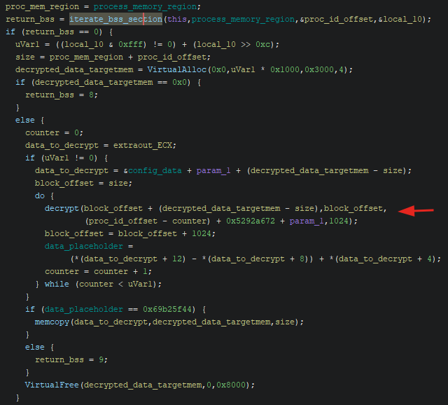

Analyzing the Gozi ISFB banking trojan.

## Introduction

I'm having a blast with the Zero2Automated course so far, the depth of the content is great. 
At the end of this course, there are four challenges that one can choose to analyze further to
really deepen their understanding of reversing and *automation* in particular. This means that
these challenges require you to analyze the binary and the string decryption routines, and to write
a script to automatically extract / decrypt the data by reproducing the algorithms in Python for instance.
In this post I go over how I analyzed the Gozi ISFB binary to uncover the string decryption routines
and the script I wrote to decrypt the encrypted data in the binary.

## The Gozi ISFB sample

| File name  | f28f39ada498d66c378fd59227e0f215.dll                                                      |
|------------|------------------------------------------------------------------|
| SHA256     | 0a66e8376fc6d9283e500c6e774dc0a109656fd457a0ce7dbf40419bc8d50936 |
| File size  | 950'784 bytes                                                 |
| Mime type  | application/x-dosexec                                            |
| Packed     | Yes                                                             |

## Static Analysis
My go-to program for static analysis is PEStudio. However, upon loading the binary, PEStudio directly exits without showing
any useful information. From this and some trials to analyse the binary in IDA/Ghidra, it became clear that the binary
is likely packed. To unpack it, we load the sample into x64dbg and set breakpoints at *VirtualAlloc* and *VirtualProtect* to see
if any executables are written to memory or that any regions of memory are set to executable state (R/W/X). After a couple VirtualAlloc
calls, we hit the VirtualProtect call. Inspecting the region that was allocated shows what seems to be a valid executable:


After dumping and inspecting the file once more in PEStudio / PEBear, we observe that we need to fix the binary and rebase it.
Loading it in PEStudio once more we see a lot more interesting stuff, such as calls to QueueUserAPC (suggesting APC injection)
and a lot of obfuscated strings. 


Additionally, we observe several sections with high entropy, in particular, the .bss section stands out, suggesting it might contain encrypted
data:


Using Ghidra, we observe several interesting functions. Function *FUN_00401308* stands out as it appears to decrypt the .bss section before
performing APC injection. 


After some more analysis, we observe what seems to be a blockwise decryption routine that iterates over blocks in the .bss section:



With the inner decryption function:


Tracing the calls before hitting this function in x64dbg reveals that the key is made up of a particular date value (most likely the date of the campaign initiation):


The key is constructed by adding together the first and second 4 bytes of the campaign date, plus the VirtualAddress of the .bss section, plus a random number
between 0-20, which is always 18 in our case. Using this key, the data is decrypted block by block:


## String Decryption Code

The observed decryption routines are turned into the following code:

```Python
import pefile
import binascii
import struct

path = "gozi_014D0000_unmapped_rebased.dll"
date = b"Apr 26 2022"

file = open(path, "rb").read()

def get_section(section, path):
    pe =  pefile.PE(path)
    for s in pe.sections: 
        if bytes(section, 'utf-8') in s.Name:
            data = file[s.PointerToRawData:s.PointerToRawData+s.SizeOfRawData]
            return data, s.VirtualAddress

def decrypt(data, key):
    counter = 0
    decoded = b""
    for i in range(0, len(data), 4):
        encoded = struct.unpack("I", data[i:i+4])[0]
        if encoded: 
            decoded += struct.pack("I", (counter - key + encoded) & 0xFFFFFFFF) 
            counter = encoded
        else:
            break
    return decoded


section_data, section_va = get_section(".bss", path)
key = struct.unpack("<I", date[0:4])[0] + struct.unpack("<I", date[4:8])[0] + section_va + 18
decrypted = decrypt(section_data, key)
print(decrypted)
```
It's always satisfying to see what's in the encrypted data, going from this:


To this:


## Conclusion

It's always satisfying to see some legible stuff appear after grinding to get your script
to work. Onto the next challenge!