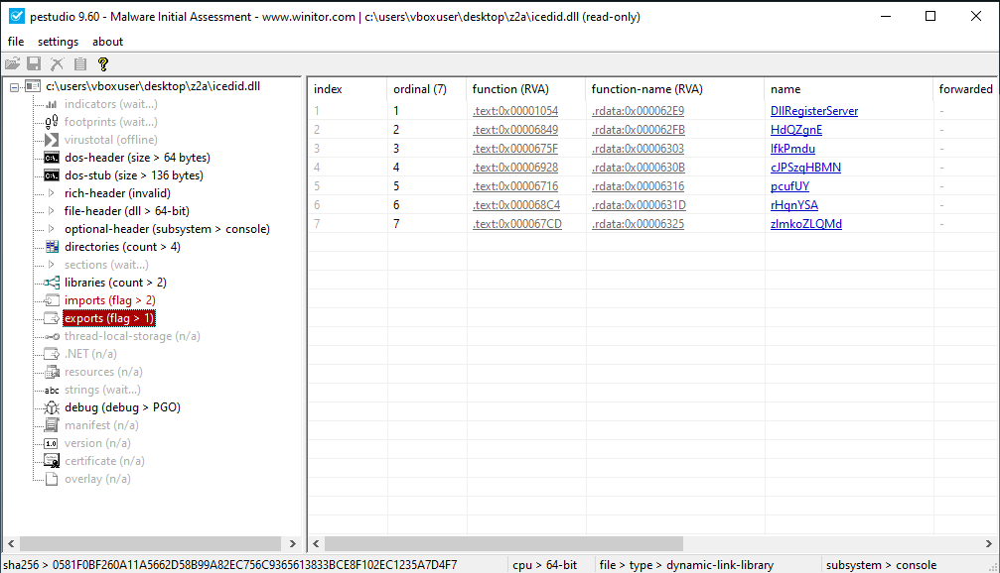
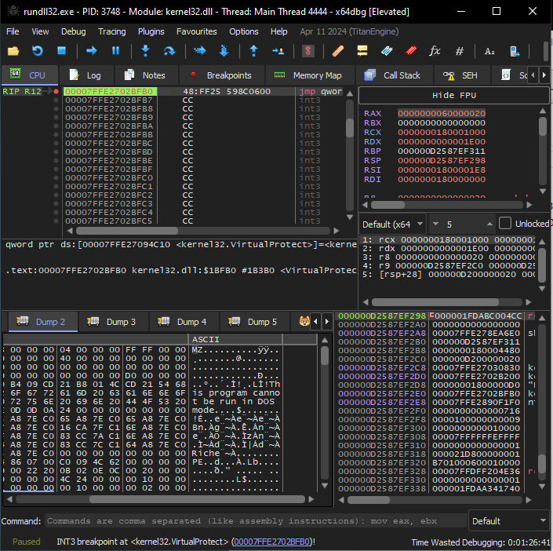
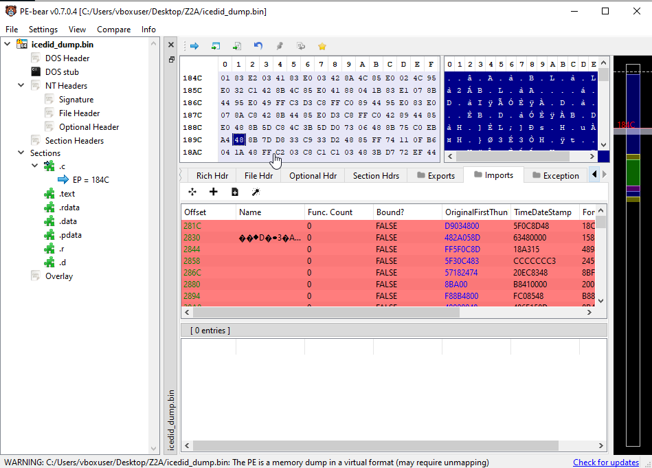
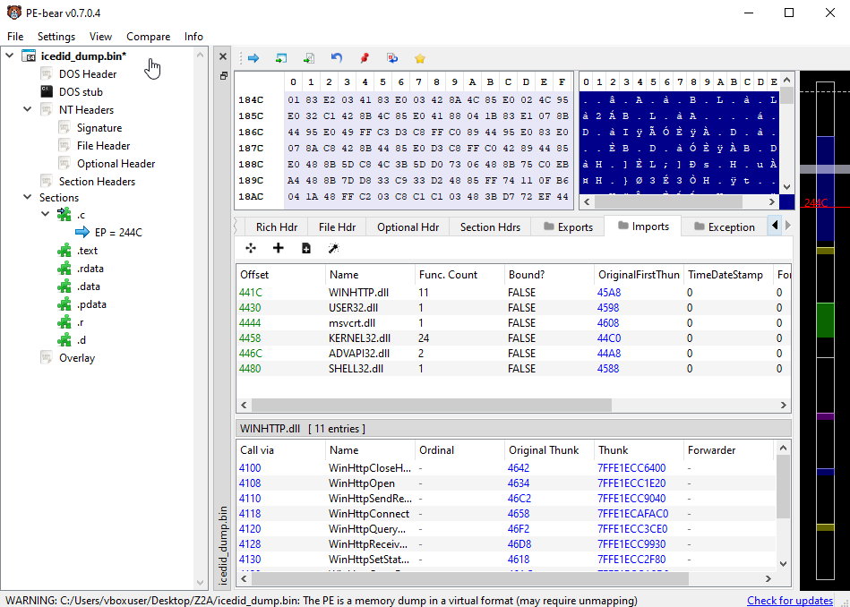
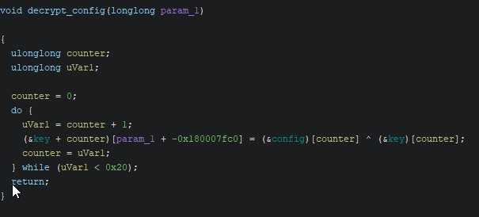
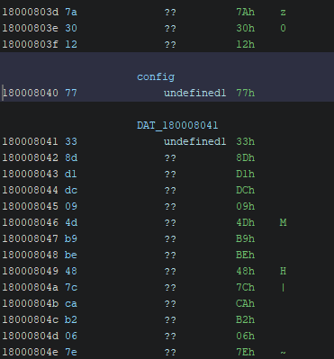
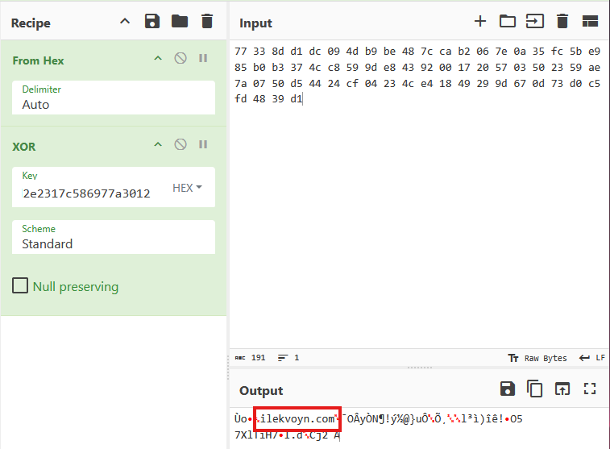
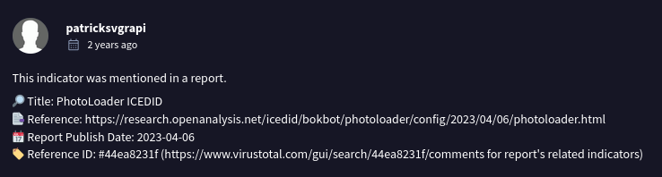
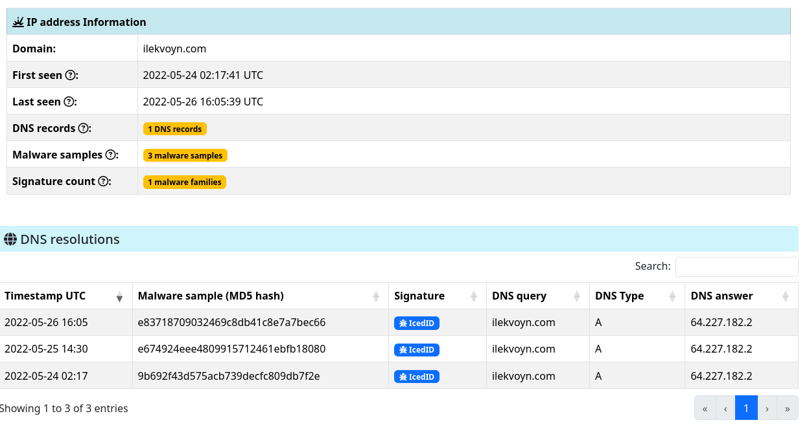

## Introduction

I'm having a blast with the Zero2Automated course so far, the depth of the content is great. 
At the end of this course, there are four challenges that one can choose to analyze further to
really deepen their understanding of reversing and *automation* in particular. This means that
these challenges require you to analyze the binary and the string decryption routines, and to write
a script to automatically extract / decrypt the data by reproducing the algorithms in Python for instance.

In this post I go over how I analyzed the IcedID loader to decrypt the C2 server URL and campaign ID. 

## The IcedID sample

| File name  | J5V5DR.dll                                                    |
|------------|------------------------------------------------------------------|
| SHA256     | 0581f0bf260a11a5662d58b99a82ec756c9365613833bce8f102ec1235a7d4f7 |
| File size  | 	718'848 bytes                                                |
| Mime type  | application/x-dosexec                                            |
| Packed     | Yes                                                             |

## Dynamic Analysis

As the file is a DLL, we use x64dbg, starting *rundll32.exe* and changing the command line to the path of the DLL. 
To see if any code gets allocated, we set breakpoints on *VirtualAlloc* and *VirtualProtect*. At first I failed to hit
these breakpoints, even though it is clearly visible that these functions are called when statically analyzing in Ghidra. 
Luckily, a helpful individual pointed out that the date of the host needs to be set to any date in the year 2022 for these
breakpoints to hit. 

Loading the DLL into PEStudio, only few imports are shown, but we do see some exports. We use this information to call
the *DllRegisterServer* export to run the DLL, as the other random exports are too obvious when called in a real intrusion. 



After hitting VirtualAlloc we observe that an executable is loaded at offset 0x180000000. 



After dumping this executable, we need to unmap the executable and fix the imports by so we go from this:



To this:



## Static Analysis

We continue our analysis with the unmapped executable in Ghidra. Following through the entry function,
we quickly encounter this function that seems to XOR data from two parts of the *.d* section, the first
64 bytes (a key, presumably) and other data what looks like some configuration data. As the bytes from these
data sections are simply XOR'ed together, we put this data into CyberChef to see what we can do with it. 





After copying the config data to CyberChef, and adding an XOR operation with the first 64 bytes, we hit the jackpot
right away!



We observe the C2 domain *ilekvoyn[.]com*, which is malicious and clearly linked to IcedID according to VirusTotal and ThreatFox,
(by the way I really like the new abuse.ch [hunting site](https://hunting.abuse.ch)!). We also observe some other linked IcedID samples. 




As we are sure this domain is indeed the C2 domain, let's write a Python script to automate the process of decrypting the config.

## String Decryption Code

The following quick script has been created to find the offsets to the key and config and to decrypt the C2 domain. 

```Python
import pefile
import struct

path = "icedid_unmapped.dll"

file = open(path, "rb").read()
pe =  pefile.PE(path)

for s in pe.sections:
    if ".d" == s.Name.decode("utf-8").rstrip("\x00"):
        data = s.get_data()
        key = data[:0x40]
        config = data[0x40:]

        decrypted = bytes(k ^ c for k, c in zip(key, config))
        campaign_data = decrypted.split(b"\x00")[0]

        campaign_id = struct.unpack("I", campaign_data[:4])[0]
        c2_domain = campaign_data[4:].decode()

        print(campaign_id)
        print(c2_domain)
       
```

## Conclusion

This one was short and sweet, not nearly as difficult as the first challenge. Thank you for reading!