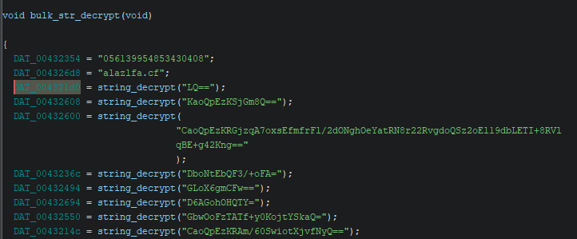

## Introduction

I'm having a blast with the Zero2Automated course so far, the depth of the content is great. 
At the end of this course, there are four challenges that one can choose to analyze further to
really deepen their understanding of reversing and *automation* in particular. This means that
these challenges require you to analyze the binary and the string decryption routines, and to write
a script to automatically extract / decrypt the data by reproducing the algorithms in Python for instance.
In this post I go over how I analyzed the Oski Stealer to uncover the string decryption routines
and the script I wrote to decrypt the encrypted data in the binary.

## The Oski Stealer sample

| File name  | 	triage_dropped_file                                                |
|------------|------------------------------------------------------------------|
| SHA256     | 707adf85c61f5029e14aa27791010f2959e70c0fee182fe968d2eb7f2991797b |
| File size  | 442'368 bytes                                                   |
| Mime type  | application/x-dosexec                                            |
| Packed     | Yes                                                             |

## Unpacking

As a first analysis step, the sample is loaded into PEStudio. Besides
that it is a .NET library, we observe that there are many many imports with
garbled names. Knowing that the Oski Stealer is written in C++, we know that it is likely packed, 
or that it is at the very least loaded by another .NET binary. 

Going through the binary in DNSpy we observe a *.Invoke* call. By digging deeper into the Invoke calls
we aim to find any binaries in memory that are called through these Invoke calls. 


At some point we encounter repeated calls to a function *veMSOMDjV*,
that takes a bytearray as one of its arguments and eventually attempts to invoke it. 
This happens multiple times, we're the first few times we still remain in the 
.NET binary. Finally though, we observe a bytearray that contains a smaller executable.

Dumping these bytearrays a few times, we are now left with a C++ executable. 

We observe several strings that point towards stealer behavior, as well as base64 encoded
strings that aim to obfuscate the binary's workings. 


At this point, we're pretty confident that this is the unpacked Oski stealer binary. 

## Analysis
Loading this binary into Ghidra, we observe an interesting routine in the entry function *___tmainCRTStartup*.

Digging deeper into the subfunctions, we see observe behavior that suggests strings are being decrypted,
libraries are being loaded, as well as the actual stealer routine. 

Seeing repeated calls to a single function that only takes in the obfuscated strings as arguments 
suggests that we are dealing with a bulk string decrypt function, and it was renamed as such. 

But what kind of encryption are we actually dealing with? Loading the binary up into x32dbg and breaking at the right
points in the program, we observe the routines that resemble base64 decoding before feeding into a RC4 decryption routine. 
Just before we enter this routine, we observe a particular value being pushed to the stack every time this
function is invoked. This is the purported RC4 key. A quick check in Cyberchef with some of the data
shows that the value *056139954853430408* is indeed the RC4 key. Diving into the actual
RC4 function shows two loops looping 256 times, a telltale sign that we're dealing with RC4. 


By using this knowledge, a script was created (see next section), to decrypt the strings and replace the associated
data labels with their values for convenience while reversing. Unfortunately, Ghidra doesn't special formatting characters
as label names so we have to strip them out. To counter this, EOL comments are added with the full values. 
We see that reversing is now much simpler:

We also observe another function that clearly handles the loading of various libraries:

And most importantly, an entire routine devoted to stealing stuff, from browsercaches / credentials to 
to local images and data. One example of a cryptowallet stealing routine:


The stealer is actually quite simple and easy to reverse once the strings are 
decrypted. 
## String Decryption Script

The observed decryption routines were turned into the following code which adds labels and EOl comments at the right points in the code. It is a quick and dirty script, 
but it gets the job done. 
```Python
import base64, re
from Crypto.Cipher import ARC4

from ghidra.program.model.symbol import SourceType

key = b"056139954853430408"
name = "str_decrypt" # originally FUN_00422f70

# Find the function calls to the "str_decrypt" routine
funcs = getGlobalFunctions(name)

for func in funcs:
	entryPoint = func.getEntryPoint()

    # iterate over the to-references
	references = getReferencesTo(entryPoint)
	for ref in references:
		lst = currentProgram().getListing()
		addr = ref.getFromAddress()
		instr = lst.getInstructionAt(addr).getPrevious()
		mov_instr = lst.getInstructionAt(addr).getNext().getNext()
        # get data MOV instruction address for renaming
		mov_data_addr = toAddr(str(mov_instr).split(",")[0].split(" ")[1].replace("[", "").replace("]",""))
        # get data address for EOL comments
		data_addr = toAddr(str(instr).split(" ")[1])
		data = lst.getDataAt(data_addr)
		mov_data = lst.getDataAt(mov_data_addr)
		val = data.getValue()

		try:
            # RC4 decrypt data
			b64dec = base64.b64decode(val)
			cipher = ARC4.new(key)
			dec =  cipher.decrypt(b64dec).decode("ascii")
			
            # clean string from special chars, Ghidra doesn't like them
			clean = re.sub('\W+','', dec)

            # set DAT_ label to the cleaned string
			mov_data.getPrimarySymbol().setName(clean, SourceType.USER_DEFINED)

            # add EOL comment with original, uncleaned string
			setEOLComment(addr, dec)
		except:
			pass
```

## Conclusion

This was a fun piece of malware to reverse. I had some trouble unpacking the sample at first because I felt 
that I was repeatedly dumping the same binary, but eventually I dumped out the right one. Reversing the actual unpacked sample luckily wasn't that
hard and it was a lot of fun to come up with a deobfuscation script for this stealer. 